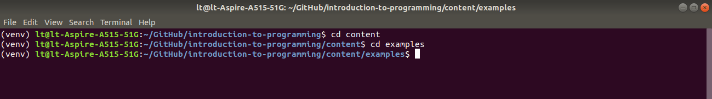
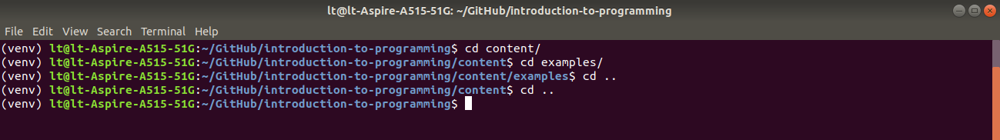
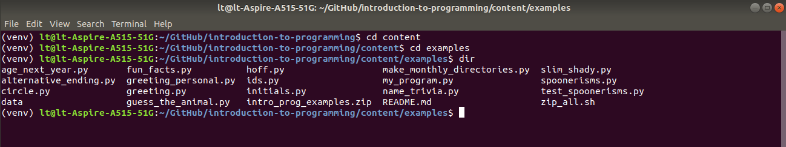
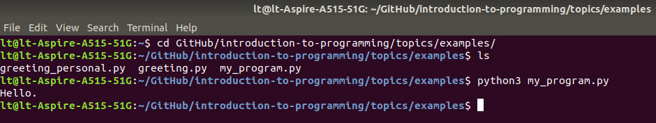

<h1>Contents<span class="tocSkip"></span></h1>
<div class="toc"><ul class="toc-item"><li><span><a href="#Basic-commands" data-toc-modified-id="Basic-commands-1">Basic commands</a></span><ul class="toc-item"><li><span><a href="#cd" data-toc-modified-id="cd-1.1">cd</a></span></li><li><span><a href="#dir" data-toc-modified-id="dir-1.2">dir</a></span></li><li><span><a href="#python" data-toc-modified-id="python-1.3">python</a></span></li></ul></li><li><span><a href="#Spyder" data-toc-modified-id="Spyder-2">Spyder</a></span><ul class="toc-item"><li><span><a href="#IPython" data-toc-modified-id="IPython-2.1">IPython</a></span><ul class="toc-item"><li><span><a href="#Magic" data-toc-modified-id="Magic-2.1.1">Magic</a></span></li></ul></li></ul></li></ul></div>

# The command line

We have now covered all the basics of working with Python: the use of [variables](extras/glossary.md#variable), different [data types](extras/glossary.md#type), various [control statements](extras/glossary.md#control), [exceptions](extras/glossary.md#exception), [functions](extras/glossary.md#function), and the organization of programs as [modules](extras/glossary.md#module). There are still a great many important features of Python to learn, but with what we have covered so far it is already possible to write useful programs. Over the next few lessons we will mostly take a break from Python itself to focus on a few important aspects of software development: the process of building a working computer program.

While learning about software development, we will on a few occasions need to step outside Python and give commands to our computer's operating system more directly. All the major [operating systems](extras/glossary.md#OS) provide a means to accomplish basic tasks by typing in commands instead of clicking on icons or menu options. This is the way that operating systems used to work before they evolved graphical interfaces. The place where we can type in commands for the operating system is variously called the 'command line', 'command prompt', 'console', or 'terminal' (though for die-hard pedants some of these terms refer to subtly different aspects of interaction with the operating system).

The steps needed to find the command line differ slightly across different operating systems. On Linux and macOS, an application called the 'Terminal' provides a command line. It looks like this:


On Windows, a similar-looking application called the 'Command prompt' serves the same function. Alternatively, if you have installed Anaconda as recommended for the class, you can access the command line via an app called 'Anaconda Prompt'. The [online documentation](https://docs.anaconda.com/anaconda/user-guide/getting-started/#open-anaconda-prompt) for Anaconda provides a few more details about this app.

Unfortunately, different operating systems understand different commands. Windows in particular differs from the others. So in order to ensure that the demonstrations work for all of us, we will limit our use of the command line just to what is necessary for the techniques we need to learn, and we will use the command line in a way that is compatible with all the major operating systems.

## Basic commands

Let's take a look at a very few of the most basic commands that we can use in the command line. All of these are compatible with the major operating systems. If you would like to try them out, open up your command line app as described above.

### cd

To interact with Python files from the command line, we will need to make sure that we are working in the [directory](extras/glossary.md#directory) that contains those files. This is the same principle that we encountered when [working with files and folders](standard_library.md#Working-directory) in a Python program.

Usually, the command line itself will display the [path](extras/glossary.md#path) to whatever directory you are currently working in. For example, in the screenshot above, the relative path from my home folder to the current directory is shown as `/GitHub/introduction-to-programming` (with the forward slash `/` as the path [separator](extras/glossary.md#separator)).

To switch to a subdirectory of the current one, enter the command `cd` (which stands for **c**hange **d**irectory), followed by the name of the directory you want to switch into. For example:



To move 'up' one directory in your computer's file system, use `cd` followed by `..` (in file systems, `..` stands for 'the directory that contains the current one'). For example:



### dir

To see the contents of the current directory, use the command `dir`. For example:



### python

If Python is installed on your operating system, you can run Python programs from the command line as well as from Spyder. To do this, simply type `python`, followed by the name of the Python program that you want to run. For example:



Remember that you first need to make sure that you are working inside the directory that contains the Python file that you would like to run.

Beware that if you just type `python`, without specifying a file to run, then you will open a Python console. You can then type in Python commands and see them run immediately, much the same as in the Spyder console. But this is a rather laborious way of interacting with Python, and we won't use it. If you start up Python this way by accident and need to return to the normal command line, use the Python `exit()` function. Like this:


## Spyder

The Spyder console provides a means of sending commands to the operating system. This is quicker and simpler than finding your command line app and then using `cd` to navigate to the directory that you want to work in. If you can make the following example work from Spyder, I recommend using this method of interacting with the command line, as it will save you switching between two different windows.

In the Spyder console, if you place an exclamation mark character (`!`) at the beginning of a command, Spyder will send that command to the operating system's command line, and not to Python. Here is an example:


```python
! dir
```

    command_line.md  functions.md     sequences_mappings.md
    conditions.md    images	     sequences_mappings.md
    conditions.md	    intro.md      standard_library.md
    convert_ipynb.sh    intro.md	     standard_library.md
    examples	    iteration.md  testing.md
    extras		    iteration.md     types.md
    files.md	    modules.md    types.md
    files.md	    modules.md
    functions.md     README.md


There are a couple of important things to note about this way of using the Spyder console. First of all, don't confuse Python commands with commands for the operating system. The operating system does not recognize Python commands, so if you accidentally prefix Python commands with `!`, you will see an error message (the exact content of which will depend on your operating system).


```python
! print('Hello.')
```

    /bin/sh: 1: Syntax error: word unexpected (expecting ")")


Second, don't use '`!`' commands inside a Python *program*. This feature is special to the Spyder console and is not a general aspect of Python. An exclamation mark at the beginning of a line is not valid Python [syntax](extras/glossary.md#syntax). So when writing a full Python program rather than just testing things out in the console, don't use this feature.

### IPython

Why does the Spyder console allow us to type both Python commands and operating system commands? The reason is that the Spyder console in fact makes use of a Python [interpreter](extras/glossary.md#interpreter) that is very slightly different from the standard one.

Each time you have launched Spyder, you may have noticed some information displayed in the console after startup, like this:

```
Python 3.6.9 (default, Nov  7 2019, 10:44:02) 
Type "copyright", "credits" or "license" for more information.

IPython 7.11.1 -- An enhanced Interactive Python.
```

As well as displaying some information about the version of Python that Spyder is using (in my case 3.6.9), this introductory text also mentions something called *IPython*. IPython is an alternative Python interpreter. For all the basic Python commands, such as those we have been using so far, IPython simply passes those commands on to the standard Python interpreter. But IPython also recognizes a few additional commands that are not part of standard Python. The use of the exclamation mark to pass commands on to the operating system is one of these.

#### Magic

There are also a few commands that are special to IPython itself, and are not passed on to either Python or the operating system. These commands all begin with the percent character `%`. The documentation for IPython fancifully refers to these as 'magic' commands. We do not really need to use these magic commands often, or ever, but one or two of them can occasionally be useful as a shortcut when testing things out in the console:

* `%pwd` (an abbreviation of **p**rint **w**orking **d**irectory) will tell you what [directory](xtras/glossary.md#directory) you are currently working in.


```python
%pwd
```


    '/home/lt/GitHub/introduction-to-programming/content'


* `%ls` (an abbreviation of 'list') lists the contents of your current working directory. You can use this to check that you really have the files you want in there.


```python
%ls
```

    command_line.md  functions.md     sequences_mappings.md
    conditions.md    images/          sequences_mappings.md
    conditions.md       intro.md      standard_library.md
    convert_ipynb.sh*   intro.md         standard_library.md
    examples/           iteration.md  testing.md
    extras/             iteration.md     types.md
    files.md         modules.md    types.md
    files.md            modules.md
    functions.md     README.md


You can also use `%ls` together with the name of a subdirectory to see its contents.


```python
%ls examples
```

    age_next_year.py       guess_the_animal.py*         name_trivia.py
    alternative_ending.py  hoff.py                      README.md
    circle.py              ids.py                       slim_shady.py
    data/                  initials.py                  spoonerisms.py
    fun_facts.py           intro_prog_examples.zip      test_spoonerisms.py
    greeting_personal.py   make_monthly_directories.py  zip_all.sh*
    greeting.py            my_program.py


* `%reset` deletes any variables that you have created in the console so far (first asking you to confirm that you want to do this).


```python
%reset
```

    Once deleted, variables cannot be recovered. Proceed (y/[n])? y


Again: Remember that these special commands are only for use in the Spyder console. Don't write them into an actual Python program. They won't work there.

That's all we need to know about the command line for now. In some of the lessons that follow, we will occasionally use the command line to accomplish tasks outside of Python. You can recognize these cases because they will be prefixed with an exclamation mark.
