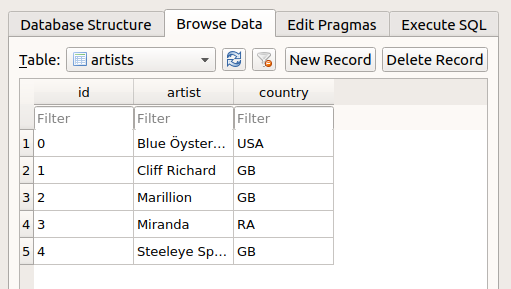
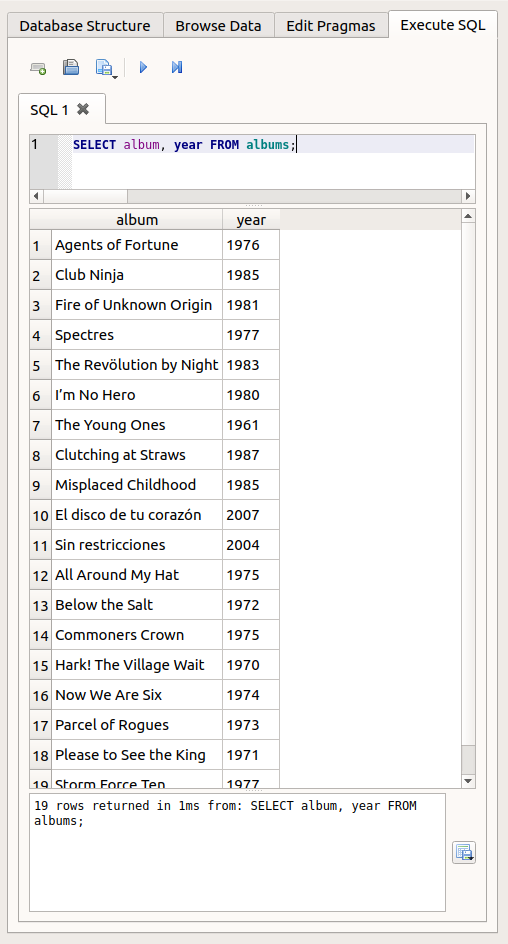

<h1>Contents<span class="tocSkip"></span></h1>
<div class="toc"><ul class="toc-item"><li><span><a href="#Objective" data-toc-modified-id="Objective-1">Objective</a></span></li><li><span><a href="#Long-format" data-toc-modified-id="Long-format-2">Long format</a></span></li><li><span><a href="#Relational-databases" data-toc-modified-id="Relational-databases-3">Relational databases</a></span><ul class="toc-item"><li><span><a href="#Joining" data-toc-modified-id="Joining-3.1">Joining</a></span></li></ul></li><li><span><a href="#Constraints" data-toc-modified-id="Constraints-4">Constraints</a></span></li><li><span><a href="#SQL" data-toc-modified-id="SQL-5">SQL</a></span><ul class="toc-item"><li><span><a href="#Pronunciation" data-toc-modified-id="Pronunciation-5.1">Pronunciation</a></span></li><li><span><a href="#DB-Browser" data-toc-modified-id="DB-Browser-5.2">DB Browser</a></span></li><li><span><a href="#sqlite3" data-toc-modified-id="sqlite3-5.3">sqlite3</a></span></li><li><span><a href="#Queries" data-toc-modified-id="Queries-5.4">Queries</a></span><ul class="toc-item"><li><span><a href="#SELECT" data-toc-modified-id="SELECT-5.4.1">SELECT</a></span></li><li><span><a href="#ORDER-BY" data-toc-modified-id="ORDER-BY-5.4.2">ORDER BY</a></span></li><li><span><a href="#WHERE" data-toc-modified-id="WHERE-5.4.3">WHERE</a></span></li><li><span><a href="#JOIN" data-toc-modified-id="JOIN-5.4.4">JOIN</a></span></li></ul></li><li><span><a href="#Miscellaneous-SQL-syntax" data-toc-modified-id="Miscellaneous-SQL-syntax-5.5">Miscellaneous SQL syntax</a></span><ul class="toc-item"><li><span><a href="#Complex-commands" data-toc-modified-id="Complex-commands-5.5.1">Complex commands</a></span></li><li><span><a href="#Case" data-toc-modified-id="Case-5.5.2">Case</a></span></li><li><span><a href="#Comments" data-toc-modified-id="Comments-5.5.3">Comments</a></span></li></ul></li><li><span><a href="#Creating-tables" data-toc-modified-id="Creating-tables-5.6">Creating tables</a></span></li><li><span><a href="#Adding-data" data-toc-modified-id="Adding-data-5.7">Adding data</a></span><ul class="toc-item"><li><span><a href="#INSERT" data-toc-modified-id="INSERT-5.7.1">INSERT</a></span></li><li><span><a href="#Constraints-again" data-toc-modified-id="Constraints-again-5.7.2">Constraints again</a></span></li><li><span><a href="#Python-variables" data-toc-modified-id="Python-variables-5.7.3">Python variables</a></span></li><li><span><a href="#Foreign-keys" data-toc-modified-id="Foreign-keys-5.7.4">Foreign keys</a></span></li></ul></li><li><span><a href="#SQL-scripts" data-toc-modified-id="SQL-scripts-5.8">SQL scripts</a></span></li><li><span><a href="#SQL-injection" data-toc-modified-id="SQL-injection-5.9">SQL injection</a></span></li></ul></li><li><span><a href="#Exercise" data-toc-modified-id="Exercise-6">Exercise</a></span></li></ul></div>

# Relational databases

In the [lesson on files](files.md) we learned about a few different text formats that we can use to store data. And when we came to learn about [data analysis](data_analysis.md), we focused in particular on the concept of organizing data in a table of rows and columns (or a '[data frame](extras/glossary.md#dataframe)'), which can be accomplished for example in a [csv](extras/glossary.md#csv) file.

## Objective

The csv table format is great for many different data storage tasks. However, it has its limitations. To get an idea of what these limitations are and why they are important, let's set ourselves another toy task.

We would like to create a file that stores information about our favorite songs. The file should store the names of the songs, along with some other information:

* the name of the album that the song is from
* the position of the song in the album
* what year the album was released
* the name of the artist that made the album
* what country the artist is from

We would like to be able to view different columns and subsets of our data file, for example to see all the songs from a particular album, or the earliest album by a particular artist, etc. And because our friends are constantly recommending new music for us, we would also like to be able to keep inserting new songs into the file.

## Long format

We can of course already accomplish this task with a csv file. I have provided one as an example, [songs.csv](examples/data/songs.csv). Let's load it and see what it looks like.


```python
import os
import pandas

songs_df = pandas.read_csv(os.path.join('data', 'songs.csv'))

songs_df[:20]
```


<div>
<style scoped>
    .dataframe tbody tr th:only-of-type {
        vertical-align: middle;
    }

    .dataframe tbody tr th {
        vertical-align: top;
    }

    .dataframe thead th {
        text-align: right;
    }
</style>
<table border="1" class="dataframe">
  <thead>
    <tr style="text-align: right;">
      <th></th>
      <th>Artist</th>
      <th>Country</th>
      <th>Album</th>
      <th>Year</th>
      <th>Song</th>
      <th>Number</th>
    </tr>
  </thead>
  <tbody>
    <tr>
      <th>0</th>
      <td>Blue Öyster Cult</td>
      <td>USA</td>
      <td>Agents of Fortune</td>
      <td>1976</td>
      <td>This Ain’t the Summer of Love</td>
      <td>1</td>
    </tr>
    <tr>
      <th>1</th>
      <td>Blue Öyster Cult</td>
      <td>USA</td>
      <td>Agents of Fortune</td>
      <td>1976</td>
      <td>True Confessions</td>
      <td>2</td>
    </tr>
    <tr>
      <th>2</th>
      <td>Blue Öyster Cult</td>
      <td>USA</td>
      <td>Agents of Fortune</td>
      <td>1976</td>
      <td>(Don’t Fear) The Reaper</td>
      <td>3</td>
    </tr>
    <tr>
      <th>3</th>
      <td>Blue Öyster Cult</td>
      <td>USA</td>
      <td>Agents of Fortune</td>
      <td>1976</td>
      <td>E.T.I. (Extra Terrestrial Intelligence)</td>
      <td>4</td>
    </tr>
    <tr>
      <th>4</th>
      <td>Blue Öyster Cult</td>
      <td>USA</td>
      <td>Agents of Fortune</td>
      <td>1976</td>
      <td>The Revenge of Vera Gemini</td>
      <td>5</td>
    </tr>
    <tr>
      <th>5</th>
      <td>Blue Öyster Cult</td>
      <td>USA</td>
      <td>Agents of Fortune</td>
      <td>1976</td>
      <td>Sinful Love</td>
      <td>6</td>
    </tr>
    <tr>
      <th>6</th>
      <td>Blue Öyster Cult</td>
      <td>USA</td>
      <td>Agents of Fortune</td>
      <td>1976</td>
      <td>Tattoo Vampire</td>
      <td>7</td>
    </tr>
    <tr>
      <th>7</th>
      <td>Blue Öyster Cult</td>
      <td>USA</td>
      <td>Agents of Fortune</td>
      <td>1976</td>
      <td>Morning Final</td>
      <td>8</td>
    </tr>
    <tr>
      <th>8</th>
      <td>Blue Öyster Cult</td>
      <td>USA</td>
      <td>Agents of Fortune</td>
      <td>1976</td>
      <td>Tenderloin</td>
      <td>9</td>
    </tr>
    <tr>
      <th>9</th>
      <td>Blue Öyster Cult</td>
      <td>USA</td>
      <td>Agents of Fortune</td>
      <td>1976</td>
      <td>Debbie Denise</td>
      <td>10</td>
    </tr>
    <tr>
      <th>10</th>
      <td>Blue Öyster Cult</td>
      <td>USA</td>
      <td>Club Ninja</td>
      <td>1985</td>
      <td>White Flags</td>
      <td>1</td>
    </tr>
    <tr>
      <th>11</th>
      <td>Blue Öyster Cult</td>
      <td>USA</td>
      <td>Club Ninja</td>
      <td>1985</td>
      <td>Dancin' in the Ruins</td>
      <td>2</td>
    </tr>
    <tr>
      <th>12</th>
      <td>Blue Öyster Cult</td>
      <td>USA</td>
      <td>Club Ninja</td>
      <td>1985</td>
      <td>Make Rock Not War</td>
      <td>3</td>
    </tr>
    <tr>
      <th>13</th>
      <td>Blue Öyster Cult</td>
      <td>USA</td>
      <td>Club Ninja</td>
      <td>1985</td>
      <td>Perfect Water</td>
      <td>4</td>
    </tr>
    <tr>
      <th>14</th>
      <td>Blue Öyster Cult</td>
      <td>USA</td>
      <td>Club Ninja</td>
      <td>1985</td>
      <td>Spy in the House of the Night</td>
      <td>5</td>
    </tr>
    <tr>
      <th>15</th>
      <td>Blue Öyster Cult</td>
      <td>USA</td>
      <td>Club Ninja</td>
      <td>1985</td>
      <td>Beat 'Em Up</td>
      <td>6</td>
    </tr>
    <tr>
      <th>16</th>
      <td>Blue Öyster Cult</td>
      <td>USA</td>
      <td>Club Ninja</td>
      <td>1985</td>
      <td>When the War Comes</td>
      <td>7</td>
    </tr>
    <tr>
      <th>17</th>
      <td>Blue Öyster Cult</td>
      <td>USA</td>
      <td>Club Ninja</td>
      <td>1985</td>
      <td>Shadow Warrior</td>
      <td>8</td>
    </tr>
    <tr>
      <th>18</th>
      <td>Blue Öyster Cult</td>
      <td>USA</td>
      <td>Club Ninja</td>
      <td>1985</td>
      <td>Madness to the Method</td>
      <td>9</td>
    </tr>
    <tr>
      <th>19</th>
      <td>Blue Öyster Cult</td>
      <td>USA</td>
      <td>Fire of Unknown Origin</td>
      <td>1981</td>
      <td>Fire of Unknown Origin</td>
      <td>1</td>
    </tr>
  </tbody>
</table>
</div>


One minor disadvantage of the csv format may already strike you when you look at the first few rows above: There is a lot of repetition in this file. The first few songs are all from the album 'Agents of Fortune'. In order to associate all these songs with this album and its year of release, there is really no alternative to just repeating the same album information on every row to which it applies. Likewise, the first few albums are all by the legendary rock band 'Blue Öyster Cult', so the name and country of the band must be repeated over many rows.

This format, in which the complete set of information for each observation is contained on every row, even if this means repeating the same combinations of values many times, is sometimes known in data analysis as the 'long format'. Its great advantage is that it ensures that each row is self-contained and complete; one row gives all the information we need about that observation. One of its disadvantages is inefficiency; if the file contains many observations, it will contain a lot of redundant text, taking up storage space unnecessarily, and making it computationally slower to load the file and search in it.

## Relational databases

In order to avoid repeating text unnecessarily, we need multiple tables. We need separate tables for songs, albums, and artists, so that each row in each of these tables contains the information for just one unique song, album, or artist. For each song, we could then just refer to the relevant row in the 'albums' or 'artists' tables when we need this extra information, rather than repeating it throughout the 'songs' table. The repetitive columns in the 'songs' table would be replaced by a single 'album' column that just notes which album in the 'albums' table that song belongs to. Ideally, this 'linking' column should contain compact abbreviations, such as ID numbers for the albums, rather than the full album names.

If you are having trouble imagining what such a data file would look like, just consider the 'sheets' functionality of a spreadsheet program like Microsoft Excel. Most spreadsheet programs allow for multiple tables in the same file, each table stored in a separate sheet. Take a look at the example file [songs.xlsx](examples/data/songs.xlsx). We will load the separate sheets in this file into Python in a moment, but to get an overview of the file's structure it is probably easier to just open it in your preferred spreadsheet program, like Excel or OpenOffice.

Here is the 'songs' sheet:


```python
filepath = os.path.join('data', 'songs.xlsx')
songs = pandas.read_excel(filepath, sheet_name='songs')

songs[:20]
```


<div>
<style scoped>
    .dataframe tbody tr th:only-of-type {
        vertical-align: middle;
    }

    .dataframe tbody tr th {
        vertical-align: top;
    }

    .dataframe thead th {
        text-align: right;
    }
</style>
<table border="1" class="dataframe">
  <thead>
    <tr style="text-align: right;">
      <th></th>
      <th>Song</th>
      <th>Number</th>
      <th>AlbumID</th>
    </tr>
  </thead>
  <tbody>
    <tr>
      <th>0</th>
      <td>This Ain’t the Summer of Love</td>
      <td>1</td>
      <td>0</td>
    </tr>
    <tr>
      <th>1</th>
      <td>True Confessions</td>
      <td>2</td>
      <td>0</td>
    </tr>
    <tr>
      <th>2</th>
      <td>(Don’t Fear) The Reaper</td>
      <td>3</td>
      <td>0</td>
    </tr>
    <tr>
      <th>3</th>
      <td>E.T.I. (Extra Terrestrial Intelligence)</td>
      <td>4</td>
      <td>0</td>
    </tr>
    <tr>
      <th>4</th>
      <td>The Revenge of Vera Gemini</td>
      <td>5</td>
      <td>0</td>
    </tr>
    <tr>
      <th>5</th>
      <td>Sinful Love</td>
      <td>6</td>
      <td>0</td>
    </tr>
    <tr>
      <th>6</th>
      <td>Tattoo Vampire</td>
      <td>7</td>
      <td>0</td>
    </tr>
    <tr>
      <th>7</th>
      <td>Morning Final</td>
      <td>8</td>
      <td>0</td>
    </tr>
    <tr>
      <th>8</th>
      <td>Tenderloin</td>
      <td>9</td>
      <td>0</td>
    </tr>
    <tr>
      <th>9</th>
      <td>Debbie Denise</td>
      <td>10</td>
      <td>0</td>
    </tr>
    <tr>
      <th>10</th>
      <td>White Flags</td>
      <td>1</td>
      <td>1</td>
    </tr>
    <tr>
      <th>11</th>
      <td>Dancin' in the Ruins</td>
      <td>2</td>
      <td>1</td>
    </tr>
    <tr>
      <th>12</th>
      <td>Make Rock Not War</td>
      <td>3</td>
      <td>1</td>
    </tr>
    <tr>
      <th>13</th>
      <td>Perfect Water</td>
      <td>4</td>
      <td>1</td>
    </tr>
    <tr>
      <th>14</th>
      <td>Spy in the House of the Night</td>
      <td>5</td>
      <td>1</td>
    </tr>
    <tr>
      <th>15</th>
      <td>Beat 'Em Up</td>
      <td>6</td>
      <td>1</td>
    </tr>
    <tr>
      <th>16</th>
      <td>When the War Comes</td>
      <td>7</td>
      <td>1</td>
    </tr>
    <tr>
      <th>17</th>
      <td>Shadow Warrior</td>
      <td>8</td>
      <td>1</td>
    </tr>
    <tr>
      <th>18</th>
      <td>Madness to the Method</td>
      <td>9</td>
      <td>1</td>
    </tr>
    <tr>
      <th>19</th>
      <td>Fire of Unknown Origin</td>
      <td>1</td>
      <td>2</td>
    </tr>
  </tbody>
</table>
</div>


The album information for each song has here been replaced by a single 'AlbumID' column. This column states which row in the album table each song comes from, without duplicating all the album information.

The album information is in turn contained in a separate table in which each album appears only once:


```python
albums = pandas.read_excel(filepath, sheet_name='albums')

albums
```


<div>
<style scoped>
    .dataframe tbody tr th:only-of-type {
        vertical-align: middle;
    }

    .dataframe tbody tr th {
        vertical-align: top;
    }

    .dataframe thead th {
        text-align: right;
    }
</style>
<table border="1" class="dataframe">
  <thead>
    <tr style="text-align: right;">
      <th></th>
      <th>Album</th>
      <th>Year</th>
      <th>ArtistID</th>
    </tr>
  </thead>
  <tbody>
    <tr>
      <th>0</th>
      <td>Agents of Fortune</td>
      <td>1976</td>
      <td>0</td>
    </tr>
    <tr>
      <th>1</th>
      <td>Club Ninja</td>
      <td>1985</td>
      <td>0</td>
    </tr>
    <tr>
      <th>2</th>
      <td>Fire of Unknown Origin</td>
      <td>1981</td>
      <td>0</td>
    </tr>
    <tr>
      <th>3</th>
      <td>Spectres</td>
      <td>1977</td>
      <td>0</td>
    </tr>
    <tr>
      <th>4</th>
      <td>The Revölution by Night</td>
      <td>1983</td>
      <td>0</td>
    </tr>
    <tr>
      <th>5</th>
      <td>I’m No Hero</td>
      <td>1980</td>
      <td>1</td>
    </tr>
    <tr>
      <th>6</th>
      <td>The Young Ones</td>
      <td>1961</td>
      <td>1</td>
    </tr>
    <tr>
      <th>7</th>
      <td>Clutching at Straws</td>
      <td>1987</td>
      <td>2</td>
    </tr>
    <tr>
      <th>8</th>
      <td>Misplaced Childhood</td>
      <td>1985</td>
      <td>2</td>
    </tr>
    <tr>
      <th>9</th>
      <td>El disco de tu corazón</td>
      <td>2007</td>
      <td>3</td>
    </tr>
    <tr>
      <th>10</th>
      <td>Sin restricciones</td>
      <td>2004</td>
      <td>3</td>
    </tr>
    <tr>
      <th>11</th>
      <td>All Around My Hat</td>
      <td>1975</td>
      <td>4</td>
    </tr>
    <tr>
      <th>12</th>
      <td>Below the Salt</td>
      <td>1972</td>
      <td>4</td>
    </tr>
    <tr>
      <th>13</th>
      <td>Commoners Crown</td>
      <td>1975</td>
      <td>4</td>
    </tr>
    <tr>
      <th>14</th>
      <td>Hark! The Village Wait</td>
      <td>1970</td>
      <td>4</td>
    </tr>
    <tr>
      <th>15</th>
      <td>Now We Are Six</td>
      <td>1974</td>
      <td>4</td>
    </tr>
    <tr>
      <th>16</th>
      <td>Parcel of Rogues</td>
      <td>1973</td>
      <td>4</td>
    </tr>
    <tr>
      <th>17</th>
      <td>Please to See the King</td>
      <td>1971</td>
      <td>4</td>
    </tr>
    <tr>
      <th>18</th>
      <td>Storm Force Ten</td>
      <td>1977</td>
      <td>4</td>
    </tr>
  </tbody>
</table>
</div>


And finally, the same pattern is repeated in order to link the albums to the information about their respective artists. The 'ArtistID' column in the albums table refers to the corresponding row of the artists table:


```python
artists = pandas.read_excel(filepath, sheet_name='artists')

artists
```


<div>
<style scoped>
    .dataframe tbody tr th:only-of-type {
        vertical-align: middle;
    }

    .dataframe tbody tr th {
        vertical-align: top;
    }

    .dataframe thead th {
        text-align: right;
    }
</style>
<table border="1" class="dataframe">
  <thead>
    <tr style="text-align: right;">
      <th></th>
      <th>Artist</th>
      <th>Country</th>
    </tr>
  </thead>
  <tbody>
    <tr>
      <th>0</th>
      <td>Blue Öyster Cult</td>
      <td>USA</td>
    </tr>
    <tr>
      <th>1</th>
      <td>Cliff Richard</td>
      <td>GB</td>
    </tr>
    <tr>
      <th>2</th>
      <td>Marillion</td>
      <td>GB</td>
    </tr>
    <tr>
      <th>3</th>
      <td>Miranda</td>
      <td>RA</td>
    </tr>
    <tr>
      <th>4</th>
      <td>Steeleye Span</td>
      <td>GB</td>
    </tr>
  </tbody>
</table>
</div>


The basic principle here is that integer row IDs 'relate' the rows in one table to those in one or more other tables. This general concept of multiple linked tables is often called a 'relational database', and it is well suited to cases in which the data have a certain hierarchical or interconnected structure. In our case, we have a hierarchical structure in which songs are grouped within albums, which are grouped within artists.

### Joining

A relational database provides a tidy, efficient way of storing more complex data. However, when we actually come to view the data and work with them, we will often need to 'reunite' the information from multiple tables and get back to a 'long format' table, at least temporarily. For example, we might want to see a table of all the albums by artists from the UK. Since the artists' country of origin is contained in the artists table, we need to put this table together with the albums table before we can select albums by country.

The process of reuniting related information from more than one table in a relational database is known as 'joining' the tables. `pandas.DataFrame`s have a `join()` [method](extras/glossary.md#method) for this operation. The first [argument](extras/glossary.md#argument) is the additional table we want to join, and the `on` argument is the column that specifies which rows in this table relate to which rows in the first table:


```python
albums_artists = albums.join(artists, on='ArtistID')

albums_artists
```


<div>
<style scoped>
    .dataframe tbody tr th:only-of-type {
        vertical-align: middle;
    }

    .dataframe tbody tr th {
        vertical-align: top;
    }

    .dataframe thead th {
        text-align: right;
    }
</style>
<table border="1" class="dataframe">
  <thead>
    <tr style="text-align: right;">
      <th></th>
      <th>Album</th>
      <th>Year</th>
      <th>ArtistID</th>
      <th>Artist</th>
      <th>Country</th>
    </tr>
  </thead>
  <tbody>
    <tr>
      <th>0</th>
      <td>Agents of Fortune</td>
      <td>1976</td>
      <td>0</td>
      <td>Blue Öyster Cult</td>
      <td>USA</td>
    </tr>
    <tr>
      <th>1</th>
      <td>Club Ninja</td>
      <td>1985</td>
      <td>0</td>
      <td>Blue Öyster Cult</td>
      <td>USA</td>
    </tr>
    <tr>
      <th>2</th>
      <td>Fire of Unknown Origin</td>
      <td>1981</td>
      <td>0</td>
      <td>Blue Öyster Cult</td>
      <td>USA</td>
    </tr>
    <tr>
      <th>3</th>
      <td>Spectres</td>
      <td>1977</td>
      <td>0</td>
      <td>Blue Öyster Cult</td>
      <td>USA</td>
    </tr>
    <tr>
      <th>4</th>
      <td>The Revölution by Night</td>
      <td>1983</td>
      <td>0</td>
      <td>Blue Öyster Cult</td>
      <td>USA</td>
    </tr>
    <tr>
      <th>5</th>
      <td>I’m No Hero</td>
      <td>1980</td>
      <td>1</td>
      <td>Cliff Richard</td>
      <td>GB</td>
    </tr>
    <tr>
      <th>6</th>
      <td>The Young Ones</td>
      <td>1961</td>
      <td>1</td>
      <td>Cliff Richard</td>
      <td>GB</td>
    </tr>
    <tr>
      <th>7</th>
      <td>Clutching at Straws</td>
      <td>1987</td>
      <td>2</td>
      <td>Marillion</td>
      <td>GB</td>
    </tr>
    <tr>
      <th>8</th>
      <td>Misplaced Childhood</td>
      <td>1985</td>
      <td>2</td>
      <td>Marillion</td>
      <td>GB</td>
    </tr>
    <tr>
      <th>9</th>
      <td>El disco de tu corazón</td>
      <td>2007</td>
      <td>3</td>
      <td>Miranda</td>
      <td>RA</td>
    </tr>
    <tr>
      <th>10</th>
      <td>Sin restricciones</td>
      <td>2004</td>
      <td>3</td>
      <td>Miranda</td>
      <td>RA</td>
    </tr>
    <tr>
      <th>11</th>
      <td>All Around My Hat</td>
      <td>1975</td>
      <td>4</td>
      <td>Steeleye Span</td>
      <td>GB</td>
    </tr>
    <tr>
      <th>12</th>
      <td>Below the Salt</td>
      <td>1972</td>
      <td>4</td>
      <td>Steeleye Span</td>
      <td>GB</td>
    </tr>
    <tr>
      <th>13</th>
      <td>Commoners Crown</td>
      <td>1975</td>
      <td>4</td>
      <td>Steeleye Span</td>
      <td>GB</td>
    </tr>
    <tr>
      <th>14</th>
      <td>Hark! The Village Wait</td>
      <td>1970</td>
      <td>4</td>
      <td>Steeleye Span</td>
      <td>GB</td>
    </tr>
    <tr>
      <th>15</th>
      <td>Now We Are Six</td>
      <td>1974</td>
      <td>4</td>
      <td>Steeleye Span</td>
      <td>GB</td>
    </tr>
    <tr>
      <th>16</th>
      <td>Parcel of Rogues</td>
      <td>1973</td>
      <td>4</td>
      <td>Steeleye Span</td>
      <td>GB</td>
    </tr>
    <tr>
      <th>17</th>
      <td>Please to See the King</td>
      <td>1971</td>
      <td>4</td>
      <td>Steeleye Span</td>
      <td>GB</td>
    </tr>
    <tr>
      <th>18</th>
      <td>Storm Force Ten</td>
      <td>1977</td>
      <td>4</td>
      <td>Steeleye Span</td>
      <td>GB</td>
    </tr>
  </tbody>
</table>
</div>


And now we can filter the albums by country:


```python
albums_artists[albums_artists['Country']=='GB']
```


<div>
<style scoped>
    .dataframe tbody tr th:only-of-type {
        vertical-align: middle;
    }

    .dataframe tbody tr th {
        vertical-align: top;
    }

    .dataframe thead th {
        text-align: right;
    }
</style>
<table border="1" class="dataframe">
  <thead>
    <tr style="text-align: right;">
      <th></th>
      <th>Album</th>
      <th>Year</th>
      <th>ArtistID</th>
      <th>Artist</th>
      <th>Country</th>
    </tr>
  </thead>
  <tbody>
    <tr>
      <th>5</th>
      <td>I’m No Hero</td>
      <td>1980</td>
      <td>1</td>
      <td>Cliff Richard</td>
      <td>GB</td>
    </tr>
    <tr>
      <th>6</th>
      <td>The Young Ones</td>
      <td>1961</td>
      <td>1</td>
      <td>Cliff Richard</td>
      <td>GB</td>
    </tr>
    <tr>
      <th>7</th>
      <td>Clutching at Straws</td>
      <td>1987</td>
      <td>2</td>
      <td>Marillion</td>
      <td>GB</td>
    </tr>
    <tr>
      <th>8</th>
      <td>Misplaced Childhood</td>
      <td>1985</td>
      <td>2</td>
      <td>Marillion</td>
      <td>GB</td>
    </tr>
    <tr>
      <th>11</th>
      <td>All Around My Hat</td>
      <td>1975</td>
      <td>4</td>
      <td>Steeleye Span</td>
      <td>GB</td>
    </tr>
    <tr>
      <th>12</th>
      <td>Below the Salt</td>
      <td>1972</td>
      <td>4</td>
      <td>Steeleye Span</td>
      <td>GB</td>
    </tr>
    <tr>
      <th>13</th>
      <td>Commoners Crown</td>
      <td>1975</td>
      <td>4</td>
      <td>Steeleye Span</td>
      <td>GB</td>
    </tr>
    <tr>
      <th>14</th>
      <td>Hark! The Village Wait</td>
      <td>1970</td>
      <td>4</td>
      <td>Steeleye Span</td>
      <td>GB</td>
    </tr>
    <tr>
      <th>15</th>
      <td>Now We Are Six</td>
      <td>1974</td>
      <td>4</td>
      <td>Steeleye Span</td>
      <td>GB</td>
    </tr>
    <tr>
      <th>16</th>
      <td>Parcel of Rogues</td>
      <td>1973</td>
      <td>4</td>
      <td>Steeleye Span</td>
      <td>GB</td>
    </tr>
    <tr>
      <th>17</th>
      <td>Please to See the King</td>
      <td>1971</td>
      <td>4</td>
      <td>Steeleye Span</td>
      <td>GB</td>
    </tr>
    <tr>
      <th>18</th>
      <td>Storm Force Ten</td>
      <td>1977</td>
      <td>4</td>
      <td>Steeleye Span</td>
      <td>GB</td>
    </tr>
  </tbody>
</table>
</div>


## Constraints

So a relational database is somewhat like a spreadsheet containing multiple related tables. But please don't tell anyone that I said this. Most programmers who work with relational databases would be horrified at the suggestion of using a Microsoft Excel file as a database. Justifiably so. Microsoft Excel is a spectacularly awful program in lots of very creative ways. There is also one more very desirable feature of a database that neither an Excel spreadsheet nor the collection of [dataframes](extras/glossary.md#dataframe) stored in it fulfills.

To see what this feature is and why it is desirable, let's try adding a new artist to our table of artists. But let's make a deliberate mistake in doing so, and add an artist that is in fact already present. (You can imagine that this sort of mistake is bound to occur eventually in a big database that might be used by more than one member of a team).


```python
new_row = {'Artist':'Blue Öyster Cult', 'Country':'USA'}
artists = artists.append(new_row, ignore_index=True)

artists
```


<div>
<style scoped>
    .dataframe tbody tr th:only-of-type {
        vertical-align: middle;
    }

    .dataframe tbody tr th {
        vertical-align: top;
    }

    .dataframe thead th {
        text-align: right;
    }
</style>
<table border="1" class="dataframe">
  <thead>
    <tr style="text-align: right;">
      <th></th>
      <th>Artist</th>
      <th>Country</th>
    </tr>
  </thead>
  <tbody>
    <tr>
      <th>0</th>
      <td>Blue Öyster Cult</td>
      <td>USA</td>
    </tr>
    <tr>
      <th>1</th>
      <td>Cliff Richard</td>
      <td>GB</td>
    </tr>
    <tr>
      <th>2</th>
      <td>Marillion</td>
      <td>GB</td>
    </tr>
    <tr>
      <th>3</th>
      <td>Miranda</td>
      <td>RA</td>
    </tr>
    <tr>
      <th>4</th>
      <td>Steeleye Span</td>
      <td>GB</td>
    </tr>
    <tr>
      <th>5</th>
      <td>Blue Öyster Cult</td>
      <td>USA</td>
    </tr>
  </tbody>
</table>
</div>


Our table doesn't care about the duplication. Why should it? It's just a dumb table.

Other more subtle mistakes are also possible. For example, we might add a new album to the albums table and accidentally assign it an artist ID that is not one of the rows of the artists table:


```python
new_row = {'Album':'憶蓮', 'Year':1987, 'ArtistID':10}
albums = albums.append(new_row, ignore_index=True)

albums
```


<div>
<style scoped>
    .dataframe tbody tr th:only-of-type {
        vertical-align: middle;
    }

    .dataframe tbody tr th {
        vertical-align: top;
    }

    .dataframe thead th {
        text-align: right;
    }
</style>
<table border="1" class="dataframe">
  <thead>
    <tr style="text-align: right;">
      <th></th>
      <th>Album</th>
      <th>Year</th>
      <th>ArtistID</th>
    </tr>
  </thead>
  <tbody>
    <tr>
      <th>0</th>
      <td>Agents of Fortune</td>
      <td>1976</td>
      <td>0</td>
    </tr>
    <tr>
      <th>1</th>
      <td>Club Ninja</td>
      <td>1985</td>
      <td>0</td>
    </tr>
    <tr>
      <th>2</th>
      <td>Fire of Unknown Origin</td>
      <td>1981</td>
      <td>0</td>
    </tr>
    <tr>
      <th>3</th>
      <td>Spectres</td>
      <td>1977</td>
      <td>0</td>
    </tr>
    <tr>
      <th>4</th>
      <td>The Revölution by Night</td>
      <td>1983</td>
      <td>0</td>
    </tr>
    <tr>
      <th>5</th>
      <td>I’m No Hero</td>
      <td>1980</td>
      <td>1</td>
    </tr>
    <tr>
      <th>6</th>
      <td>The Young Ones</td>
      <td>1961</td>
      <td>1</td>
    </tr>
    <tr>
      <th>7</th>
      <td>Clutching at Straws</td>
      <td>1987</td>
      <td>2</td>
    </tr>
    <tr>
      <th>8</th>
      <td>Misplaced Childhood</td>
      <td>1985</td>
      <td>2</td>
    </tr>
    <tr>
      <th>9</th>
      <td>El disco de tu corazón</td>
      <td>2007</td>
      <td>3</td>
    </tr>
    <tr>
      <th>10</th>
      <td>Sin restricciones</td>
      <td>2004</td>
      <td>3</td>
    </tr>
    <tr>
      <th>11</th>
      <td>All Around My Hat</td>
      <td>1975</td>
      <td>4</td>
    </tr>
    <tr>
      <th>12</th>
      <td>Below the Salt</td>
      <td>1972</td>
      <td>4</td>
    </tr>
    <tr>
      <th>13</th>
      <td>Commoners Crown</td>
      <td>1975</td>
      <td>4</td>
    </tr>
    <tr>
      <th>14</th>
      <td>Hark! The Village Wait</td>
      <td>1970</td>
      <td>4</td>
    </tr>
    <tr>
      <th>15</th>
      <td>Now We Are Six</td>
      <td>1974</td>
      <td>4</td>
    </tr>
    <tr>
      <th>16</th>
      <td>Parcel of Rogues</td>
      <td>1973</td>
      <td>4</td>
    </tr>
    <tr>
      <th>17</th>
      <td>Please to See the King</td>
      <td>1971</td>
      <td>4</td>
    </tr>
    <tr>
      <th>18</th>
      <td>Storm Force Ten</td>
      <td>1977</td>
      <td>4</td>
    </tr>
    <tr>
      <th>19</th>
      <td>憶蓮</td>
      <td>1987</td>
      <td>10</td>
    </tr>
  </tbody>
</table>
</div>


Our table doesn't care about this kind of illogic either.

Of course, we could just try to make sure that we and our colleagues don't make this kind of mistake when working with the database. But we are human beings; trying hard not to make mistakes doesn't usually work out too well for us.

What we would really like from a good database is for it to be a little more than just an inert place of storage. As well as storing our data, it should also store and enforce a set of logical rules that describe how our data are organized. We can then rely on the database to alert us when we accidentally break one of our own rules. Rules about what constitutes a valid entry for a database are often termed 'constraints'.

For our example task, we would like to be able to set the following constraints:

* Every artist name must be unique (i.e. no duplicate artists).
* Every combination of artist and album must be unique (i.e. so that duplicate album names are allowed if they are by different artists, but not the same album for the same artist).
* The name of a song must be unique within the album (i.e. no duplicate songs on the same album).
* The number of a song must be unique within the album (i.e. not two first songs or two second songs on the same album).
* Every artist ID in the albums table must have a corresponding row in the artists table.
* Every album ID in the songs table must have a corresponding row in the albums table.

## SQL

To get a 'proper' relational database that doesn't just store multiple related tables but also implements constraints on their relations, we need to move on from spreadsheets and dataframes. In fact, we need to learn a little bit of a completely new programming language, one that is designed specially for working with relational databases. [SQL](extras/glossary.md#sql) (Structured Query Language) is a programming language that is very widely used in database management.

SQL provides commands that are broadly of three different types:

* Define the relations and constraints that give a database its structure.
* Modify the data in a database, for example by inserting, deleting, or changing information.
* Fetch different combinations of information from a database (usually called 'querying' the database).

### Pronunciation

Some people like to pronounce 'SQL' as 'sequel'. But other less imaginative people, like me, have always just pronounced it by spelling out the letters, 'es queue ell'. Say it however you like and don't let cool people snub you for not saying 'sequel'.

### DB Browser

We will now learn a bit of SQL. We will work our way up to creating our target database, but let's first take a quick look at one I made earlier, so that we know what we are aiming for. You can find it in the file [songs.db](examples/data/songs.db). You may of course wonder how to even open this file. There are a number of ways to interact with an SQL-compatible database file. One of those is of course by running SQL commands, as we will see shortly. But there are also programs that can display database contents in a friendlier clickable interface. The best basic one is the [DB Browser for SQLite](https://sqlitebrowser.org/). It is free to download. If you would like, you can install it and then use it to open up our example database file. You should see something like this:


This 'Database Structure' view lists the tables in the database. Along with each table, you can see the SQL commands that set the structure and constraints of the table. You might already be able to work out what some of this means. SQL is a fairly human-readable programming language.

We will learn about these commands in a moment. For now, just explore the DB Browser app. You can browse the individual tables from the 'Browse Data' tab:



Switch between tables using the drop-down menu, and take a look at the albums table. You will see that it has an 'artist_id' column that refers to the 'id' column in the artists table. Likewise, the songs table has an 'album_id' column that refers to the 'id' column in the albums table.

You can also edit the database from the 'Browse Data' tab, via the 'New Record' button. Try this out. A new row will appear, in which you can enter values, much as in a normal spreadsheet. However, note that if you enter something that violates one of the constraints of the database, you will be suitably admonished:


Great! The database has got us covered if we make stupid mistakes. If you want to see what the warning looks like for one of the other constraints, go to the albums table and try to add an album with an artistID that is not in the artists table.

Also note that nothing you do in the browser will alter the database unless you click the 'Write Changes' button. If you would like to erase any temporary changes you have made in the browser, you can click the 'Revert Changes' button:


Finally, take a look at the 'Execute SQL' tab. This tab provides a text field where you can enter SQL commands, run them, and see the results. Try typing in the following command, and then press the 'Play' (▶) button (we will learn what this command means in a moment):

`SELECT album, year FROM albums;`

Like this:



For the remaining SQL examples, I will abandon the DB browser and instead show how to run SQL commands from within a Python program. You can follow along in Python or if you prefer, you can try some of the SQL commands out in the DB browser 'Execute SQL' tab instead. However, the database file does not appreciate being open both in Python and in the DB Browser, since this could lead to conflicting edits, so you will need to use only one or the other at any one time.

### sqlite3

As usual, we need to [import](extras/glossary.md#import) an additional module for our task.  There are a few third-party [packages](extras/glossary.md#package) that enable us to work with SQL from Python. Some of these are very good, but I will instead show here a very simple one that is already part of the Python [standard library](standard_library.md), called `sqlite3`. This module provides a fairly limited set of functions, and its use mostly involves just sending SQL commands to the database. This simplicity will allow us to focus on learning SQL without introducing too much additional Python complexity.


```python
import sqlite3
```

Let's work with the example finished database first, before we learn how to create a new one. The first step is to 'connect' to the database, with the `connect()` function and the [path](extras/glossary.md#path) to the database file. This is very much like using `open()` to connect to a file as we learned in the [lesson on files](files.md), in the sense that this command merely sets up a channel of communication from our program to the database, and does not yet 'read in' any of its contents.


```python
db_filepath = os.path.join('data', 'songs.db') 

conn = sqlite3.connect(db_filepath)
```

And let's check the [type](extras/glossary.md#type) and [attributes](extras/glossary.md#attribute) of the resulting object:


```python
type(conn)
```


    sqlite3.Connection


```python
dir(conn)
```


    ['DataError',
     'DatabaseError',
     'Error',
     'IntegrityError',
     'InterfaceError',
     'InternalError',
     'NotSupportedError',
     'OperationalError',
     'ProgrammingError',
     'Warning',
     '__call__',
     '__class__',
     '__delattr__',
     '__dir__',
     '__doc__',
     '__enter__',
     '__eq__',
     '__exit__',
     '__format__',
     '__ge__',
     '__getattribute__',
     '__gt__',
     '__hash__',
     '__init__',
     '__init_subclass__',
     '__le__',
     '__lt__',
     '__ne__',
     '__new__',
     '__reduce__',
     '__reduce_ex__',
     '__repr__',
     '__setattr__',
     '__sizeof__',
     '__str__',
     '__subclasshook__',
     'close',
     'commit',
     'create_aggregate',
     'create_collation',
     'create_function',
     'cursor',
     'enable_load_extension',
     'execute',
     'executemany',
     'executescript',
     'in_transaction',
     'interrupt',
     'isolation_level',
     'iterdump',
     'load_extension',
     'rollback',
     'row_factory',
     'set_authorizer',
     'set_progress_handler',
     'set_trace_callback',
     'text_factory',
     'total_changes']


We will work with three main [methods](extras/glossary.md#method) of our `sqlite3.Connection` variable:

* `execute()`: run some SQL commands
* `commit()`: actually write the current changes to the database file (note that this is similar to the sense of [commit](extras/glossary.md#commit) in [version control](extras/glossary.md#versioning))
* `close()`: close the connection to the database

In particular, it is a good idea to have `close()` ready to hand. We can occasionally get into trouble if we leave a connection to a database open. If we are writing a Python program, we should put the `close()` command at the bottom of our program file right from the start, so that each time we run and test our program, the database connection is properly closed before the next time we run the program.

### Queries

#### SELECT

We can begin with the example SQL command that we saw above. This command involves two SQL [keywords](extras/glossary.md): `SELECT` and `FROM`. Thanks to their intuitive names, it is pretty clear what these keywords accomplish: together they select some columns from a table.

There are just two other aspects of SQL [syntax](extras/glossary.md#syntax) on display in this first command:

* Separate multiple names with commas.
* End the command with a semicolon (`;`). This indicates that a command is complete, and does not for example continue on the next line. This is a little different from Python; in Python the end of a line usually also indicates the end of a command, with only some exceptions.

Since SQL commands are not valid Python expressions, we can't simply type them as-is in our Python program. Instead, they need to be contained in a [string](extras/glossary.md#string). This string is then passed in as the [argument](extras/glossary.md#argument) to the `execute()` [method](extras/glossary.md#method) of our database connection variable:


```python
result = conn.execute('SELECT album, year FROM albums;')
```

What did we get from `execute()`?


```python
type(result)
```


    sqlite3.Cursor


```python
dir(result)
```


    ['__class__',
     '__delattr__',
     '__dir__',
     '__doc__',
     '__eq__',
     '__format__',
     '__ge__',
     '__getattribute__',
     '__gt__',
     '__hash__',
     '__init__',
     '__init_subclass__',
     '__iter__',
     '__le__',
     '__lt__',
     '__ne__',
     '__new__',
     '__next__',
     '__reduce__',
     '__reduce_ex__',
     '__repr__',
     '__setattr__',
     '__sizeof__',
     '__str__',
     '__subclasshook__',
     'arraysize',
     'close',
     'connection',
     'description',
     'execute',
     'executemany',
     'executescript',
     'fetchall',
     'fetchmany',
     'fetchone',
     'lastrowid',
     'row_factory',
     'rowcount',
     'setinputsizes',
     'setoutputsize']


We get a somewhat unintuitively-named `Cursor`. The idea here is that the SQL `SELECT` command has inserted a 'cursor' into the database (rather like the cursor in a text editor) such that it is ready to read at the rows we selected.

The `Cursor` is [iterable](exrtas/glossary.md#method). If we iterate through it in a `for` [loop](extras/glossary.md#loop), we get each selected row in turn:


```python
for row in result:
    print(row)
```

    ('Agents of Fortune', 1976)
    ('Club Ninja', 1985)
    ('Fire of Unknown Origin', 1981)
    ('Spectres', 1977)
    ('The Revölution by Night', 1983)
    ('I’m No Hero', 1980)
    ('The Young Ones', 1961)
    ('Clutching at Straws', 1987)
    ('Misplaced Childhood', 1985)
    ('El disco de tu corazón', 2007)
    ('Sin restricciones', 2004)
    ('All Around My Hat', 1975)
    ('Below the Salt', 1972)
    ('Commoners Crown', 1975)
    ('Hark! The Village Wait', 1970)
    ('Now We Are Six', 1974)
    ('Parcel of Rogues', 1973)
    ('Please to See the King', 1971)
    ('Storm Force Ten', 1977)


What Python [data type](extras/glossary.md#type) are the rows that we get? They are [tuples](extras/glossary.md#tuple) (We can see this by checking the final row variable left over from the loop that we just ran above):


```python
type(row)
```


    tuple


The type of each entry in the tuple depends on the type of data stored in the corresponding column of the table in our database:


```python
type(row[0])
```


    str


```python
type(row[1])
```


    int


The order of the entries in each tuple will match the order in which we requested the columns in the original SQL `SELECT` command. So for example if it happened to be convenient to have the year first, we can ask for this column ordering:


```python
for row in conn.execute('SELECT year, album FROM albums;'):
    print(row)
```

    (1976, 'Agents of Fortune')
    (1985, 'Club Ninja')
    (1981, 'Fire of Unknown Origin')
    (1977, 'Spectres')
    (1983, 'The Revölution by Night')
    (1980, 'I’m No Hero')
    (1961, 'The Young Ones')
    (1987, 'Clutching at Straws')
    (1985, 'Misplaced Childhood')
    (2007, 'El disco de tu corazón')
    (2004, 'Sin restricciones')
    (1975, 'All Around My Hat')
    (1972, 'Below the Salt')
    (1975, 'Commoners Crown')
    (1970, 'Hark! The Village Wait')
    (1974, 'Now We Are Six')
    (1973, 'Parcel of Rogues')
    (1971, 'Please to See the King')
    (1977, 'Storm Force Ten')


Alternatively, if we would just like to have all the selected rows at once and work with them as a whole, then the `fetchall()` [method](extras/glossary.md#method) puts them all into a [list](extras/glossary.md#list) of [tuples](extras/glossary.md#tuple):


```python
result = conn.execute('SELECT album, year FROM albums;')
all_albums = result.fetchall()

type(all_albums)
```


    list


```python
all_albums[0]
```


    ('Agents of Fortune', 1976)


If we would simply like all the columns from a table, the [wildcard](extras/glossary.md#wildcard) symbol `*` can stand for 'all columns'.


```python
for row in conn.execute('SELECT * FROM albums;'):
    print(row)
```

    (0, 'Agents of Fortune', 1976, 0)
    (1, 'Club Ninja', 1985, 0)
    (2, 'Fire of Unknown Origin', 1981, 0)
    (3, 'Spectres', 1977, 0)
    (4, 'The Revölution by Night', 1983, 0)
    (5, 'I’m No Hero', 1980, 1)
    (6, 'The Young Ones', 1961, 1)
    (7, 'Clutching at Straws', 1987, 2)
    (8, 'Misplaced Childhood', 1985, 2)
    (9, 'El disco de tu corazón', 2007, 3)
    (10, 'Sin restricciones', 2004, 3)
    (11, 'All Around My Hat', 1975, 4)
    (12, 'Below the Salt', 1972, 4)
    (13, 'Commoners Crown', 1975, 4)
    (14, 'Hark! The Village Wait', 1970, 4)
    (15, 'Now We Are Six', 1974, 4)
    (16, 'Parcel of Rogues', 1973, 4)
    (17, 'Please to See the King', 1971, 4)
    (18, 'Storm Force Ten', 1977, 4)


But it is best to reserve use of `*` for just exploring the database and seeing what columns it contains. When actually working with the data we should explicitly select the columns we want, so that we can be sure of what we are getting.

#### ORDER BY

If we plan on using a [loop](extras/glossary.md#loop) to go through rows one by one, then it sometimes makes sense to state explicitly what order we would like to get them in. The additional SQL [keywords](extras/glossary.md#keyword) `ORDER BY` accomplish this:


```python
for row in conn.execute('SELECT album, year FROM albums ORDER BY year;'):
    print(row)
```

    ('The Young Ones', 1961)
    ('Hark! The Village Wait', 1970)
    ('Please to See the King', 1971)
    ('Below the Salt', 1972)
    ('Parcel of Rogues', 1973)
    ('Now We Are Six', 1974)
    ('All Around My Hat', 1975)
    ('Commoners Crown', 1975)
    ('Agents of Fortune', 1976)
    ('Spectres', 1977)
    ('Storm Force Ten', 1977)
    ('I’m No Hero', 1980)
    ('Fire of Unknown Origin', 1981)
    ('The Revölution by Night', 1983)
    ('Club Ninja', 1985)
    ('Misplaced Childhood', 1985)
    ('Clutching at Straws', 1987)
    ('Sin restricciones', 2004)
    ('El disco de tu corazón', 2007)


The default is ascending order, but we can request descending order with `DESC`:


```python
for row in conn.execute('SELECT album, year FROM albums ORDER BY year DESC;'):
    print(row)
```

    ('El disco de tu corazón', 2007)
    ('Sin restricciones', 2004)
    ('Clutching at Straws', 1987)
    ('Club Ninja', 1985)
    ('Misplaced Childhood', 1985)
    ('The Revölution by Night', 1983)
    ('Fire of Unknown Origin', 1981)
    ('I’m No Hero', 1980)
    ('Spectres', 1977)
    ('Storm Force Ten', 1977)
    ('Agents of Fortune', 1976)
    ('All Around My Hat', 1975)
    ('Commoners Crown', 1975)
    ('Now We Are Six', 1974)
    ('Parcel of Rogues', 1973)
    ('Below the Salt', 1972)
    ('Please to See the King', 1971)
    ('Hark! The Village Wait', 1970)
    ('The Young Ones', 1961)


#### WHERE

What if we want only certain rows? We could use Python [conditions](extras/glossary.md#condition) to get only those that we want:


```python
for row in conn.execute('SELECT album, year FROM albums;'):
    if row[1] == 1977:
        print(row)
```

    ('Spectres', 1977)
    ('Storm Force Ten', 1977)


However, behind the scenes this isn't such an efficient way of applying conditions to a database. Although the details are hidden from us here, deep in the bowels of our computer the above commands result in the database doing some computational work getting certain rows, and then Python doing some additional work separately checking each of those rows.

It is instead a good habit to let the database do as much filtering and organizing as possible first, and then just use Python to work with the finished set of selected data. Since database software has been optimized specially for reading and selecting data, it will almost always be computationally faster and more memory-efficient at these tasks than a general-purpose program like Python. The difference will be imperceptible for a small database and simple condition like this one, but if you one day work with really big quantities of data you may notice that selection with Python is slower than with the database itself.

The SQL `WHERE` keyword applies a condition for selecting only certain rows:


```python
for row in conn.execute('SELECT album, year FROM albums WHERE year=1977;'):
    print(row)
```

    ('Spectres', 1977)
    ('Storm Force Ten', 1977)


If you read the example above carefully, you may have noticed a subtle syntactical difference between Python conditions and SQL conditions. The 'is equal to' [operator](extras/glossary.md#operator) is `==` in Python (because the single `=` is used for [assignment](extras/glossary.md#assignment) instead), but in SQL it is just `=`.

Most other logical conditions are the same in the two languages. For example 'greater than' `>` and 'less than' `<`: 


```python
for row in conn.execute('SELECT album, year FROM albums WHERE year>1977;'):
    print(row)
```

    ('Club Ninja', 1985)
    ('Fire of Unknown Origin', 1981)
    ('The Revölution by Night', 1983)
    ('I’m No Hero', 1980)
    ('Clutching at Straws', 1987)
    ('Misplaced Childhood', 1985)
    ('El disco de tu corazón', 2007)
    ('Sin restricciones', 2004)


#### JOIN

So far we have been selecting data from a single table. We haven't yet made use of one of the key features of a relational database, relations among tables. What if we want information about some of the albums, but we also want the associated artist information from the artists table?

We learned already about the concept of 'joining' related tables above, and we implemented it (somewhat primitively) using just `pandas` [dataframes](extras/glossary.md#dataframe). Now let's see how to do it with an SQL command. The [keyword](extras/glossary.md#keyword) that we need is `JOIN`. If we add a `JOIN` to a `SELECT`, we can select columns from more than one table after the tables have been joined. The slight additional complexity here is that we need to specify which column in one table relates to which column in the other table. Following `JOIN` and the name of the table to join, the `ON` keyword specifies which columns are related. The syntax for this is to link the columns with `=` and to specify the columns as '*table.column*'.

An example is clearer than an explanation. Recall that the artists table has an 'id' column and that the albums table has a corresponding 'artist_id' column:


```python
for row in conn.execute('SELECT album, artist, country FROM albums JOIN artists ON albums.artist_id=artists.id;'):
    print(row)
```

    ('Agents of Fortune', 'Blue Öyster Cult', 'USA')
    ('All Around My Hat', 'Steeleye Span', 'GB')
    ('Below the Salt', 'Steeleye Span', 'GB')
    ('Club Ninja', 'Blue Öyster Cult', 'USA')
    ('Clutching at Straws', 'Marillion', 'GB')
    ('Commoners Crown', 'Steeleye Span', 'GB')
    ('El disco de tu corazón', 'Miranda', 'RA')
    ('Fire of Unknown Origin', 'Blue Öyster Cult', 'USA')
    ('Hark! The Village Wait', 'Steeleye Span', 'GB')
    ('I’m No Hero', 'Cliff Richard', 'GB')
    ('Misplaced Childhood', 'Marillion', 'GB')
    ('Now We Are Six', 'Steeleye Span', 'GB')
    ('Parcel of Rogues', 'Steeleye Span', 'GB')
    ('Please to See the King', 'Steeleye Span', 'GB')
    ('Sin restricciones', 'Miranda', 'RA')
    ('Spectres', 'Blue Öyster Cult', 'USA')
    ('Storm Force Ten', 'Steeleye Span', 'GB')
    ('The Revölution by Night', 'Blue Öyster Cult', 'USA')
    ('The Young Ones', 'Cliff Richard', 'GB')


Nice. Joining is my favorite bit of SQL. I like to imagine a robot saying 'yes, master' in a computery voice and then flying around among the shelves of a medieval library joining up all the requested pages of magical books.

### Miscellaneous SQL syntax

We now know the basics of the 'Q' part of SQL: querying the database for combinations of rows and columns from one or more tables. Before we move on to creating our own new database, let's note a few odds and ends about the structure of SQL.

#### Complex commands

First of all, we may combine multiple keywords for more complex operations. A common combination is a `JOIN` to combine tables plus a `WHERE` to filter to certain rows. For example, to get only the first song from each album, and display its name together with the album name:


```python
for row in conn.execute('SELECT song, album FROM songs JOIN albums ON songs.album_id=albums.id WHERE number=1;'):
    print(row)
```

    ('This Ain’t the Summer of Love', 'Agents of Fortune')
    ('White Flags', 'Club Ninja')
    ('Fire of Unknown Origin', 'Fire of Unknown Origin')
    ('Godzilla', 'Spectres')
    ('Take Me Away', 'The Revölution by Night')
    ('Take Another Look', 'I’m No Hero')
    ('Friday Night', 'The Young Ones')
    ('Hotel Hobbies', 'Clutching at Straws')
    ('Pseudo Silk Kimono', 'Misplaced Childhood')
    ('Prisionero', 'El disco de tu corazón')
    ('Yo te diré', 'Sin restricciones')
    ('Black Jack Davy', 'All Around My Hat')
    ('Spotted Cow', 'Below the Salt')
    ('Little Sir Hugh', 'Commoners Crown')
    ('A Calling-On Song', 'Hark! The Village Wait')
    ('Seven Hundred Elves', 'Now We Are Six')
    ('One Misty Moisty Morning', 'Parcel of Rogues')
    ('The Blacksmith', 'Please to See the King')
    ('Awake Awake', 'Storm Force Ten')


For all but the simplest SQL commands, it can improve the clarity of our program a lot if we put each new keyword on a separate line. If we are running our SQL in a Python program, we can do this with a triple-quoted string, which may span multiple lines:


```python
command = """
SELECT song, artist, album FROM songs
JOIN albums ON songs.album_id=albums.id
JOIN artists ON albums.artist_id=artists.id
WHERE year<1982 AND number=1;
"""

for row in conn.execute(command):
    print(row)
```

    ('This Ain’t the Summer of Love', 'Blue Öyster Cult', 'Agents of Fortune')
    ('Fire of Unknown Origin', 'Blue Öyster Cult', 'Fire of Unknown Origin')
    ('Godzilla', 'Blue Öyster Cult', 'Spectres')
    ('Take Another Look', 'Cliff Richard', 'I’m No Hero')
    ('Friday Night', 'Cliff Richard', 'The Young Ones')
    ('Black Jack Davy', 'Steeleye Span', 'All Around My Hat')
    ('Spotted Cow', 'Steeleye Span', 'Below the Salt')
    ('Little Sir Hugh', 'Steeleye Span', 'Commoners Crown')
    ('A Calling-On Song', 'Steeleye Span', 'Hark! The Village Wait')
    ('Seven Hundred Elves', 'Steeleye Span', 'Now We Are Six')
    ('One Misty Moisty Morning', 'Steeleye Span', 'Parcel of Rogues')
    ('The Blacksmith', 'Steeleye Span', 'Please to See the King')
    ('Awake Awake', 'Steeleye Span', 'Storm Force Ten')


In multi-line SQL commands like this one we can see the importance of the semicolon rule to indicate that the whole command is finished. In SQL, each new keyword in the command just adds on one more refinement to our query, so the computer needs some way of knowing when we are done adding refinements.

(In fact, Python's `sqlite3` module lets you get away with omitting the semicolon, since it assumes that the end of the command [string](extras/glossary.md#string) must be the end of the command. But this is special to `sqlite3`. If you use SQL in other contexts, you must end commands with the semicolon, so you might as well get used to it in Python as well.)

#### Case

Unlike in Python, SQL keywords are not case-sensitive. We can in fact write them in lowercase and the result is the same:


```python
for row in conn.execute('select album, year from albums;'):
    print(row)
```

    ('Agents of Fortune', 1976)
    ('Club Ninja', 1985)
    ('Fire of Unknown Origin', 1981)
    ('Spectres', 1977)
    ('The Revölution by Night', 1983)
    ('I’m No Hero', 1980)
    ('The Young Ones', 1961)
    ('Clutching at Straws', 1987)
    ('Misplaced Childhood', 1985)
    ('El disco de tu corazón', 2007)
    ('Sin restricciones', 2004)
    ('All Around My Hat', 1975)
    ('Below the Salt', 1972)
    ('Commoners Crown', 1975)
    ('Hark! The Village Wait', 1970)
    ('Now We Are Six', 1974)
    ('Parcel of Rogues', 1973)
    ('Please to See the King', 1971)
    ('Storm Force Ten', 1977)


However, it is a widespread convention to write SQL keywords in UPPERCASE. This helps to visually distinguish them from the names of tables and columns. I personally like this style convention, because SQL does not have so many other syntactical features to mark out the components of its commands, but not everybody agrees so be prepared for the occasional angry pedant to explain to you *at great length* why it is not necessary to write SQL keywords in uppercase (they will probably also be chanting 'sequel, sequel, sequel' at you).

#### Comments

Finally, [comments](extras/glossary.md#comment) are possible in SQL, as they are in Python. SQL comments are preceded by two dashes (`--`) rather than the Python hash symbol (`#`). If you are just writing SQL commands in a Python program, you won't really need comments within your SQL, since you can just put them in your Python program instead. But you can also put SQL commands in their own text files, and in this case you might want to add some explanatory comments for yourself or for your collaborators.

Let's close the example database since we have finished with it for now:


```python
conn.close()
```

### Creating tables

Now let's create our own new database. To keep the example brief, we will start by just creating the artists and albums tables. This should give you enough examples for your to be able to finish the songs table yourself as an exercise afterwards if you wish.

The first step is to connect to a new database file, one that does not yet exist:


```python
conn = sqlite3.connect('example.db')
```

Now we want to create our tables in the new database. Let's start with the artists table. Believe it or not, the command we need is `CREATE TABLE`.

However, there is a bit more that we will need to add to the `CREATE TABLE` command. We need to specify the following things for our new table:

* what columns it should contain
* what data type each column should contain (e.g. text, numbers, or something else like a date)
* what constraints should apply to the table (e.g. what duplicate values are not allowed)

Following `CREATE TABLE` and the name of the new table, in parentheses we place the column names, followed by their types, and possibly further information about the column.

Let's see the full command for creating the artists table, then go through it line by line.


```python
create_artists = """
CREATE TABLE artists
(id INTEGER PRIMARY KEY,
artist TEXT UNIQUE,
country TEXT);
"""
```

The first column we have called 'id'. This column will store an identifying number for each artist. The `INTEGER` keyword states that this column will contain [integers](extras/glossary.md#integer) (the names of most [data types](extras/glossary.md#type) in SQL are easily understandable). The `PRIMARY KEY` statement is a bit more cryptic. These keywords together state that this column should be used as the main 'ID' column for the table. Telling our database explicitly that one of the columns is the `PRIMARY KEY` column has two main advantages. First, the database will ensure automatically that the numbers in this column are never duplicated, so that each artist row has a unique ID number. Second, when we add new artists, the database will automatically assign them an ID number in this column, without us having to decide on ID numbers ourselves.

The second column we have called 'artist'. Since this column is for the name of the artist, we have made it of type `TEXT`. In addition, we have used the `UNIQUE` keyword to apply the constraint that no duplicate artist names are allowed.

Finally, the third column is the name of the artist's country of origin. This too is of type `TEXT`. We have not added a `UNIQUE` constraint here, since more than one artist may come from the same country, so duplicate countries are allowed.

Let's run our command with the connection to the new database:


```python
conn.execute(create_artists)
```


    <sqlite3.Cursor at 0x7f016be3fd50>


As you can see from the output of our `execute()` command, we get a `Cursor` back from a `CREATE TABLE` operation too, just as we do from a `SELECT` operation. But we don't want to read anything this time, so there is no need for us to [assign](extras/glossary.md#assignment) it into a variable and then work with it as we did after a `SELECT`.

Before we move on and add data to our new table, let's also create the albums table, to see a few more useful bits of SQL:


```python
create_albums = """
CREATE TABLE albums
(id INTEGER PRIMARY KEY,
album TEXT,
year INTEGER,
artist_id INTEGER,
UNIQUE(album, artist_id),
FOREIGN KEY(artist_id) REFERENCES artists(id));
"""

conn.execute(create_albums)
```


    <sqlite3.Cursor at 0x7f016be3ff10>


The first few lines of this `CREATE TABLE` command should be clear given what we already saw when we created the artists table. The albums table too has a `PRIMARY KEY`, and it has some `INTEGER` and `TEXT` columns.

There are two new features of SQL here. The first is that in this table we have a `UNIQUE` constraint that refers to a *combination* of columns rather than a single column. We want to allow for the possibility that two different artists have albums with the same name (for example '[Smile](https://en.wikipedia.org/wiki/Smile_(disambiguation)#Albums)'), but prevent the same artist from having two albums in the database with the same name. So it is the combination of values in the 'album' and 'artist_id' columns that must be unique. For this, we place the `UNIQUE` constraint on its own line, followed by the combination of columns, in parentheses and separated by commas.

The second new feature is the final line, containing the keywords `FOREIGN KEY` and `REFERENCES`. This line declares that the numbers in the 'artist_id' column refer to the 'id' column in the artists table. A column that links to another table is known as a 'foreign key' ('foreign' because it refers to something outside the current table). The name of the linking column in the current table is in the first set of parentheses, and the name of the 'foreign' table, along with the name of its corresponding linking column, follows the `REFERENCES` keyword.

We have created our first two tables. To make any changes to a database actually take effect, we need to '[commit](extras/glossary.md#commit)' them to the database.


```python
conn.commit()
```

Then let's also close the connection to the database file, so that we are free to go and open it in the DB Browser program.


```python
conn.close()
```

If you now head to the DB Browser and open the new file there, you should see the new tables. They will of course be empty of data, since we haven't added any rows to the tables yet. You can try adding some manually, by going to the 'Browse Data' tab and clicking 'New Record' (in the vocabulary of relational databases, rows are often called 'records'). Test out some of the constraints that we set, for example by trying to add two artists with the same name. You should see that a warning window prevents you from doing so.

### Adding data

Make sure you close the DB Browser if you opened it, because we now want to open our database file again in Python so that we can add data to it.


```python
conn = sqlite3.connect('example.db')
```

#### INSERT

To put new rows into a table, we need to specify what values should go into what columns. For our artists table, this means that we need to specify a value for the artist's name and for their country of origin (remember that the 'id' column is a `PRIMARY KEY`, so the database will generate values for this column automatically).

The keywords we need are `INSERT INTO`. Then we need:

* the name of the table to put the row into
* the column names, in parentheses and separated by commas
* the keyword `VALUES`, followed by the values to insert into those columns, also in parentheses and separated by commas
  * The order of the values should correspond to the order that we used for the columns.
  * `TEXT` values should be enclosed in quote marks (`''`), just as for text in Python.

Like this:


```python
conn.execute("INSERT INTO artists (artist, country) VALUES('Blue Öyster Cult', 'USA');")
```


    <sqlite3.Cursor at 0x7f016be99a40>


Let's check the result with a `SELECT`:


```python
for row in conn.execute('SELECT id, artist, country FROM artists;'):
    print(row)
```

    (1, 'Blue Öyster Cult', 'USA')


Notice that we got a value for the 'id' `PRIMARY KEY` column without specifying it explicitly. More importantly, note that when we specify the values, their order must match the order of the column names *as given in our SQL INSERT command*, not their order *in the table*. For example:


```python
conn.execute("INSERT INTO artists (country, artist) VALUES('HK', '林憶蓮');")

for row in conn.execute('SELECT * FROM artists;'):
    print(row)
```

    (1, 'Blue Öyster Cult', 'USA')
    (2, '林憶蓮', 'HK')


#### Constraints again

`INSERT` commands are subject to the constraints that we set when we created the tables in the database. If we try an `INSERT` that violates one of these constraints, we get an [exception](extras/glossary.md#exception), and the accompanying error message is fairly clear:


```python
conn.execute("INSERT INTO artists (artist, country) VALUES('Blue Öyster Cult', 'USA');")
```


    ---------------------------------------------------------------------------

    IntegrityError                            Traceback (most recent call last)

    <ipython-input-45-88f83c01b347> in <module>
    ----> 1 conn.execute("INSERT INTO artists (artist, country) VALUES('Blue Öyster Cult', 'USA');")
    

    IntegrityError: UNIQUE constraint failed: artists.artist


We can handle these exceptions with a `try` and `except` [control statement](extras/glossary.md#control), as we learned in the [lesson on conditions](conditions.md). Since the `IntegrityError` exception that we want to catch comes from the `sqlite3` module, we need to specify that it is to be found in the `sqlite3` [namespace](extras/glossary.md#namespace), using the 'dot' syntax (which we learned about in the [lesson on modules](modules.md#namespaces):


```python
try:
    conn.execute("INSERT INTO artists (artist, country) VALUES('Blue Öyster Cult', 'USA');")
except sqlite3.IntegrityError:
    print('That one is already in the database.')
```

    That one is already in the database.


Alternatively, SQL provides an `OR IGNORE` option for `INSERT`, which either inserts a new row or just silently ignores our request to do so if the `INSERT` violates a constraint:


```python
conn.execute("INSERT OR IGNORE INTO artists (artist, country) VALUES('Blue Öyster Cult', 'USA');")
```


    <sqlite3.Cursor at 0x7f016bd7b1f0>


#### Python variables

A Python program for interacting with a database is not going to be very useful if it can only execute fixed SQL commands that are already written explicitly in the Python code, like in the two `INSERT` examples above. More often we will want to get some information from elsewhere, for example from a file, from the internet, or from the human user of the program, and then `INSERT` this information into our database, whatever it happens to be.

The `sqlite3` module of course allows us to do this. After the [string](extras/glossary.md#string) containing the SQL command, the second [argument](extras/glossary.md#argument) to `execute()` can be a [tuple](extras/glossary.md#tuple) of values. These will be inserted into the SQL command wherever the placeholder `'?'` character appears.

Like this:


```python
new_artist = 'سيد خليفة'
country = 'SUD'

conn.execute('INSERT INTO artists (artist, country) VALUES(?, ?);', (new_artist, country))

for row in conn.execute('SELECT * FROM artists;'):
    print(row)
```

    (1, 'Blue Öyster Cult', 'USA')
    (2, '林憶蓮', 'HK')
    (3, 'سيد خليفة', 'SUD')


The variables in the tuple can for example come from user input, possibly followed by some checking or modification, for example:


```python
new_artist = input('Name an artist to add to the database: ')
new_artist = new_artist.title()

if new_artist == 'Kanye West':
    print('No.')
else:
    country = input('What country does that artist come from? ')
    conn.execute('INSERT INTO artists (artist, country) VALUES(?, ?);', (new_artist, country))

for row in conn.execute('SELECT * FROM artists;'):
    print(row)
```

    Name an artist to add to the database: Dexys Midnight Runners
    What country does that artist come from? GB
    (1, 'Blue Öyster Cult', 'USA')
    (2, '林憶蓮', 'HK')
    (3, 'سيد خليفة', 'SUD')
    (4, 'Dexys Midnight Runners', 'GB')


#### Foreign keys

Now we would like to add a new album for one of our new artists. This is very slightly trickier, because we need first to find out what artist ID number the database has assigned the artist in the artists table, so that we can put this ID number into the 'artist_id' column of the albums table.

We can find out the artist ID number for an existing artist by using an SQL `SELECT` to get that artist from the artists table. In this case, we know that our `SELECT` is only going to get one row, so we can use the `fetchone()` method rather than a loop or `fetchall()`:


```python
result = conn.execute("SELECT id, artist FROM artists WHERE artist='林憶蓮';")
artist_row = result.fetchone()

print(artist_row)
```

    (2, '林憶蓮')


And now we can put just the artist ID number into a Python variable:


```python
artist_id = artist_row[0]
```

And use it for the 'artist_id' column in an `INSERT` into the albums table:


```python
new_album = '憶蓮'
year = 1987

conn.execute('INSERT INTO albums (album, year, artist_id) VALUES(?, ?, ?);', (new_album, year, artist_id))

for row in conn.execute('SELECT * FROM albums;'):
    print(row)
```

    (1, '憶蓮', 1987, 2)


To make sure, let's just check that we really fetched the correct artist ID. We can confirm this by trying to use it in a `JOIN`:


```python
for row in conn.execute('SELECT album, artist FROM albums JOIN artists ON albums.artist_id=artists.id;'):
    print(row)
```

    ('憶蓮', '林憶蓮')


Great.

Inserting new rows for which we might need to first fetch the right foreign keys from other tables is a bit tedious. If we are writing a program that will need to do this sequence of operations often, it is a good idea to put it into a [function](extras/glossary.md#function):


```python
def insert_new_album(connection, album, artist, year):
    """Inserts a new album into the albums table.
    
    Arguments:
        connection: sqlite3.Connection to the database
        album: str album name
        artist: str artist name
        year: int album release year
    """
    
    artists_result = connection.execute('SELECT id FROM artists WHERE artist=?;', (artist,))
    artist_id = artists_result.fetchone()[0]
    album_values = (album, year, artist_id)
    connection.execute('INSERT INTO albums (album, year, artist_id) VALUES(?, ?, ?);', album_values)
```

Then we can use the function to add many new albums without having to repeat all the SQL commands in our program every time:


```python
insert_new_album(conn, album='Cultösaurus Erectus', artist='Blue Öyster Cult', year=1980)
insert_new_album(conn, album='Imaginos', artist='Blue Öyster Cult', year=1988)
insert_new_album(conn, album='野花', artist='林憶蓮', year=1991)

for row in conn.execute('SELECT album, artist FROM albums JOIN artists ON albums.artist_id=artists.id;'):
    print(row)
```

    ('Cultösaurus Erectus', 'Blue Öyster Cult')
    ('Imaginos', 'Blue Öyster Cult')
    ('憶蓮', '林憶蓮')
    ('野花', '林憶蓮')


### SQL scripts

That covers everything we need to know in order to write a Python program that creates our target database file and allows us to write new data into it. We haven't yet created the songs table or added any songs, but this can be accomplished by adapting some of the SQL examples from above. If you would like to try writing SQL commands to create the songs table and to add a new song, you can try it out now as an exercise.

If you want to see the final `CREATE TABLE` command for the songs table, you can find it in the file [songs_tables.sql](examples/songs_tables.sql), along with the commands for the other two tables. This file is a complete SQL [script](extras/glossary.md#script), i.e. a text file containing commands intended to be run one after the other. We can create script files for SQL just as we can for Python.

If we have a series of fairly long SQL commands that we would like to use in a Python program (or indeed some other program), then we can store them in a separate script file and run this file when necessary. Let's see this in action. First we read in the commands in *songs_tables.sql*, using Python's functions for reading files as we learned about in the [lesson on files](files.md):


```python
create_tables = open('songs_tables.sql').read()
```

To check it, let's look only at the first `CREATE TABLE` command, so as not to spoil the fun if you want to try writing the one for the songs table yourself:


```python
for line in create_tables.splitlines():
    if line == '-- albums:':
        break
    print(line)
```

    -- SQL script for creating the tables in the 'songs.db' database.
    
    -- artists:
    -- no duplicate artist names
    CREATE TABLE IF NOT EXISTS artists
    (id INTEGER PRIMARY KEY,
    artist TEXT UNIQUE,
    country TEXT);
    


We can see some SQL [comments](extras/glossary.md#comment), preceded by `--`. There is also one other tiny new flourish here. The self-explanatory `IF NOT EXISTS` keywords ensure that a table is only created if it does not already exist in the database. This is sometimes useful in a program that could be either connecting to an existing database or to a new one, depending on when and where we are running the program.

We can run the commands we just loaded from the SQL script file using the `executescript()` [method](extras/glossary.md#method) of our database `Connection`.


```python
conn.executescript(create_tables)
```


    <sqlite3.Cursor at 0x7f016bd303b0>


And now the songs table has been created (the other two tables exist already as a result of our earlier commands and so their `CREATE TABLE` commands were ignored). We can go ahead and insert a new song (not forgetting that we need to first fetch the corresponding album ID number from the albums table):


```python
new_song = '激情'
number = 6
album = '憶蓮'

result = conn.execute('SELECT id FROM albums WHERE album=?;', (album,))
album_id = result.fetchone()[0]
conn.execute('INSERT INTO songs (song, number, album_id) VALUES(?, ?, ?);', (new_song, number, album_id))

command = """
SELECT song, album, artist FROM songs
JOIN albums ON songs.album_id=albums.id
JOIN artists ON albums.artist_id=artists.id;
"""

for row in conn.execute(command):
    print(row)
```

    ('激情', '憶蓮', '林憶蓮')


Of course, this too would be better turned into a function, like the one we created above for inserting a new album. Another exercise for you.

We have made quite a few changes to our new database since we last opened it, so let's commit the changes:


```python
conn.commit()
```

### SQL injection

Something might be bothering you about many of the examples above. Why does `sqlite` have its own 'placeholder' character (the `'?'`) for inserting values into SQL commands? Why not just use the existing Python [string](extras/glossary.md#srting) [method](extras/glossary.md#method) `format()` with its `'{}'` placeholder?

For example, we could insert Python variables into an SQL command with string formatting like this instead:


```python
command = "INSERT INTO songs (song, number, album_id) VALUES('{}', {}, {});".format(new_song, number, album_id)

print(command)
```

    INSERT INTO songs (song, number, album_id) VALUES('激情', 6, 1);


This works. But there is a reason that `sqlite` provides its own way of inserting variables into SQL commands, and there is a good reason not to do it with standard Python string formatting instead.

The reason is that the variables that we insert won't necessarily always come from trusted sources. If they come from unknown users, for example people entering them in an online form on our website, then someone could make mischief by entering *an SQL command* instead of whatever value we expect them to enter. If our program just inserts the user's input and runs the resulting SQL without checking it, then it is allowing anyone to just run their own SQL commands with our database.

Let's make this more concrete with an example:


```python
new_artist = input('Name an artist to add to the database: ')
country = input('What country does that artist come from? ')

command = "INSERT INTO artists (artist, country) VALUES('{}', '{}');".format(new_artist, country)
conn.executescript(command)
```

    Name an artist to add to the database: foo
    What country does that artist come from? foo'); DROP TABLE artists; CREATE TABLE artists (name TEXT); INSERT INTO artists (name) VALUES ('Kanye West'), ('Kanye West'), ('Kanye West'), ('Kanye West'), ('Kanye West'); --


    <sqlite3.Cursor at 0x7f016bd7bea0>


That user's input looked a bit suspicious. Let's see the SQL command that resulted from inserting their input into our SQL string:


```python
print(command)
```

    INSERT INTO artists (artist, country) VALUES('foo', 'foo'); DROP TABLE artists; CREATE TABLE artists (name TEXT); INSERT INTO artists (name) VALUES ('Kanye West'), ('Kanye West'), ('Kanye West'), ('Kanye West'), ('Kanye West'); --');


This naughty user made use of a few features of SQL syntax to insert some new commands into our string of SQL. First, they used the semicolon to prematurely end our intended SQL command. As we have seen, the semicolon marks the end of a command in SQL. Then at the end of their input, the naughty user placed the [comment](extras/glossary.md#comment) characters `--` to prevent the remainder of our SQL from being run. In between these two things, the user inserted some of their own SQL commands.

This method of hacking someone else's database is known as 'SQL injection'. In this particular case, the attacker has deleted our artists table, created one of their own, and filled it with 'Kanye West':


```python
for row in conn.execute('SELECT * FROM artists;'):
    print(row)
```

    ('Kanye West',)
    ('Kanye West',)
    ('Kanye West',)
    ('Kanye West',)
    ('Kanye West',)


But in more serious cases, attackers could fetch private data such as passwords or billing information, erase particular data, or change the constraints set on the database so as to allow other malicious activity. You can see a humorous example of SQL injection in [this famous xkccd comic](https://xkcd.com/327).

Behind the scenes, a decent SQL package like `sqlite3` has its own checks for SQL injection. Whenever possible, we should use whatever method the package documentation recommends for inserting values from Python variables, rather than try to do it directly by formatting or [concatenating](extras/glossary.md#concatenate) strings into SQL commands.

On that note, we are done with SQL. Try an exercise.

## Exercise

Open the example database file [songs.db](examples/data/songs.db) in the DB Browser program. Go to the 'Execute SQL' tab and run SQL commands there for each of the following tasks:

* Insert a new artist called Я́нка, from Russia ('RUS').
* Show all the artists and their countries of origin.
* Show the names of the first three songs from every album.
* Show the names of all the albums by Steeleye Span, ordered from oldest to newest.
* Show the names of all the songs by Blue Öyster Cult from albums before 1975.

As an extension, you can also try writing a Python program that opens the database, runs the same commands, then commits the changes and closes the database.
