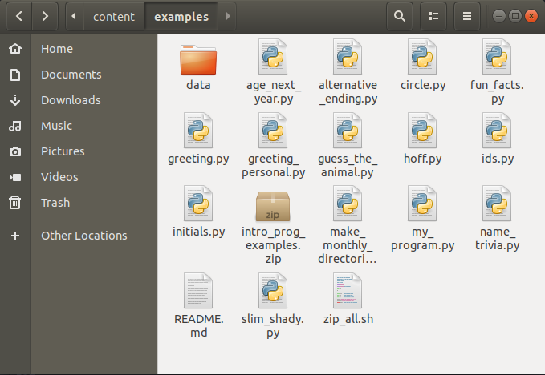

<h1>Contents<span class="tocSkip"></span></h1>
<div class="toc"><ul class="toc-item"><li><span><a href="#Plain-text" data-toc-modified-id="Plain-text-1">Plain text</a></span><ul class="toc-item"><li><span><a href="#Reading" data-toc-modified-id="Reading-1.1">Reading</a></span></li><li><span><a href="#Writing" data-toc-modified-id="Writing-1.2">Writing</a></span></li><li><span><a href="#Appending" data-toc-modified-id="Appending-1.3">Appending</a></span></li><li><span><a href="#Escape-characters" data-toc-modified-id="Escape-characters-1.4">Escape characters</a></span></li><li><span><a href="#Context-managers" data-toc-modified-id="Context-managers-1.5">Context managers</a></span><ul class="toc-item"><li><span><a href="#Special-methods-again" data-toc-modified-id="Special-methods-again-1.5.1">Special methods again</a></span></li></ul></li></ul></li><li><span><a href="#Encodings" data-toc-modified-id="Encodings-2">Encodings</a></span><ul class="toc-item"><li><span><a href="#ASCII" data-toc-modified-id="ASCII-2.1">ASCII</a></span></li><li><span><a href="#UTF-8" data-toc-modified-id="UTF-8-2.2">UTF-8</a></span></li><li><span><a href="#Locales" data-toc-modified-id="Locales-2.3">Locales</a></span></li></ul></li><li><span><a href="#Delimited-text" data-toc-modified-id="Delimited-text-3">Delimited text</a></span><ul class="toc-item"><li><span><a href="#Locales-again" data-toc-modified-id="Locales-again-3.1">Locales again</a></span></li><li><span><a href="#pandas" data-toc-modified-id="pandas-3.2">pandas</a></span></li></ul></li><li><span><a href="#JSON" data-toc-modified-id="JSON-4">JSON</a></span><ul class="toc-item"><li><span><a href="#Reading" data-toc-modified-id="Reading-4.1">Reading</a></span></li><li><span><a href="#Writing" data-toc-modified-id="Writing-4.2">Writing</a></span></li></ul></li><li><span><a href="#Exercises" data-toc-modified-id="Exercises-5">Exercises</a></span><ul class="toc-item"><li><span><a href="#1" data-toc-modified-id="1-5.1">1</a></span></li><li><span><a href="#2" data-toc-modified-id="2-5.2">2</a></span></li></ul></li></ul></div>

# Files

Thus far, our programs have interacted with the wider world only via the `input()` function, for getting information from a human being, and via the `print()` function, for displaying text results on the screen. By now you will probably be fairly tired of this pattern. Maybe more than once you have run your program, then forgotten that it requires you to type some input into the console, and so spent several minutes idly wondering why nothing is happening. Or you have repeatedly hit the wrong keys on your keyboard by accident and been treated to some infuriating error messages. So you will be glad to hear that we are (mostly) going to leave the `input()` function behind from now on. We have really mainly been using `input()` as a crutch, a simple form of interactivity to get us started with programming. Most real programs don't use `input()` at all, or only sparingly. Instead, they have other methods for getting hold of external data. The first of these methods that we will learn about is reading in data from a file stored on our computer. We will also learn a bit about how to write the results of our programs into new files.

There are lots of different file formats, each of which stores information in different ways. For example, Microsoft Word *docx* files store text along with various additional pieces of information about how that text is to be displayed, *jpg* image files store information about the colors of the pixels of an image, and some files, such as *exe* files, store entire programs in a form that it is not feasible for a human being to read and interpret. When working with files, we will need to be aware of the nature of the particular file format we are dealing with, and instruct Python to read or write it appropriately.

We will consider here files that store data in the form of text, and come to non-text file formats in later lessons when they become relevant.

## Plain text

Let's start with a file format that is fairly easy to deal with: plain text. Plain text files just store text characters (although as we will see, there are some subtleties to consider even here). We can open plain text files and view their contents in a normal text editor.

If you want to follow along with the examples in this lesson, make sure you have first downloaded the [example programs and data files](examples/data/intro_prog_examples.zip) for the class and that you have unzipped this file in your working directory so that 'data' is a subdirectory of your working directory. Like this:



Now find the example text file [melville-moby_dick.txt](examples/data/melville-moby_dick.txt). The *txt* extension indicates that this file should contain plain text. It contains the full text of the novel *Moby Dick* by Herman Melville.

(Note that one of the many profoundly stupid default options in Windows is that file extensions such as *.py*, *.txt*, etc. are not displayed, so the file may appear only as *melville-moby_dick* in your file explorer, but its name is still *melville-moby_dick.txt*, and this is how Python and other programs will want you to refer to it. See [here](https://fileinfo.com/help/windows_10_show_file_extensions) for how to change this option if you would prefer to be able to see file extensions.)

You can open a plain text file in your preferred text editor. Since the editor in Spyder is just a fancy text editor, you can open it there if you like. This might even be the most convenient way to view it, since you will have it open just next to the Spyder console and will be able to see its contents as you try out the example commands below for opening and reading the file.

### Reading

Let's now open the file from within a Python program. There is a [built-in](extras/glossary.md#builtin) function for this, called simply `open()`. The input argument is a string containing the [path](extras/glossary.md#path) to the file we want to open. If the file is located in the same directory as our program, then the path is simply the name of the file. But in this case, the file is located in a directory called 'data', so we need to put this together with the file name to build the full path (Take a look back at the use of `os.path` [in the previous lesson](standard_library.md#Paths) if you need to remind yourself how this works).

We should [assign](extras/glossary.md#assignment) the result of calling the `open()` function into a new variable, so that we can then work with it in the rest of our program. If we are working with just a single file, `f` is a convenient choice of variable name. We will use that. But note that if we were working with multiple files it would be better for the clarity of our program if we chose a variable name that says something about which particular file we have opened.


```python
import os

filepath = os.path.join('data', 'melville-moby_dick.txt')

print(filepath)
```

    data/melville-moby_dick.txt


```python
f = open(filepath)
```

Note that if `open()` cannot find the requested file, it [raises](extras/glossary.md#raise) a `FileNotFoundError`, which looks like this:


```python
open('nonexistent_file.txt')
```


    ---------------------------------------------------------------------------

    FileNotFoundError                         Traceback (most recent call last)

    <ipython-input-4-cc7db0881b62> in <module>
    ----> 1 open('nonexistent_file.txt')
    

    FileNotFoundError: [Errno 2] No such file or directory: 'nonexistent_file.txt'


If you see this error message, check the following:

* Did you first follow the steps for downloading the file?
* Have you got the name of the file right?
* Is the file in a subdirectory called 'data'?
* Is the 'data' subdirectory in your current working directory? (Try `os.getcwd()` at the Spyder console to see the path to your current working directory.)
* Did you use `os.path.join()` correctly? (Check the output of `print(filepath)` after the `os.path.join()` command above.)

So what [type](extras/glossary.md#type) does the `open()` function [return](extras/glossary.md#return)?


```python
type(f)
```


    _io.TextIOWrapper


If you were hoping it would just be a [string](extras/glossary.md#string) containing the contents of the file, you will be disappointed. As is sometimes the case, an intermediate step lies between us and our seemingly simple goal. First we open the file, *then* we read in its contents.

`type()` tells us that `open()` has [returned](extras/glossary.md#return) a `TextIOWrapper`. The 'IO' part stands for [Input/Output](extras/glossary.md#io). This abbreviation is used quite broadly in computing to refer to any process that involves getting or sending information from or to some resource that is external to the computer program, such as a human being, the internet, or a file. The `TextIOWrapper` is a data type specifically for connecting to text files, then reading from and writing to them.

This entity (which we have now stored in our `f` variable) is more commonly and more simply referred to as a 'file object'. A file object has [methods](extras/glossary.md#method) for reading and writing, as we can see if we apply the `dir()` function:


```python
dir(f)
```


    ['_CHUNK_SIZE',
     '__class__',
     '__del__',
     '__delattr__',
     '__dict__',
     '__dir__',
     '__doc__',
     '__enter__',
     '__eq__',
     '__exit__',
     '__format__',
     '__ge__',
     '__getattribute__',
     '__getstate__',
     '__gt__',
     '__hash__',
     '__init__',
     '__init_subclass__',
     '__iter__',
     '__le__',
     '__lt__',
     '__ne__',
     '__new__',
     '__next__',
     '__reduce__',
     '__reduce_ex__',
     '__repr__',
     '__setattr__',
     '__sizeof__',
     '__str__',
     '__subclasshook__',
     '_checkClosed',
     '_checkReadable',
     '_checkSeekable',
     '_checkWritable',
     '_finalizing',
     'buffer',
     'close',
     'closed',
     'detach',
     'encoding',
     'errors',
     'fileno',
     'flush',
     'isatty',
     'line_buffering',
     'mode',
     'name',
     'newlines',
     'read',
     'readable',
     'readline',
     'readlines',
     'seek',
     'seekable',
     'tell',
     'truncate',
     'writable',
     'write',
     'writelines']


The `read()` method returns the contents of the text file as a string (remember [how to use methods](types.md#Methods)).


```python
text = f.read()

type(text)
```


    str


Famously, the opening line of *Moby Dick* is 'Call me Ishmael.' But as we can see from printing out the first few hundred characters, this isn't quite true:


```python
print(text[:433])
```

    [Moby Dick by Herman Melville 1851]
    
    
    ETYMOLOGY.
    
    (Supplied by a Late Consumptive Usher to a Grammar School)
    
    The pale Usher--threadbare in coat, heart, body, and brain; I see him
    now.  He was ever dusting his old lexicons and grammars, with a queer
    handkerchief, mockingly embellished with all the gay flags of all the
    known nations of the world.  He loved to dust his old grammars; it
    somehow mildly reminded him of his mortality.
    


Chapter 1 of the novel proper does begin with the famous opener, but it is preceded by a preamble in which two other narrators, the 'pale Usher' and the 'sub-librarian' discuss the etymology of the word 'whale' and various extracts from other books on the subject of whales. This piece of trivia, along with your Python programming skills, is something that you can seriously impress your friends and colleagues with.

So, now that we have the string text of the novel, we can do all the various things that we know how to do with strings, such as count the number of words, count the occurrences of a particular word, and so on. For example:


```python
target_word = 'whale'
n_occurrences = text.lower().count(target_word)

print(n_occurrences)
```

    1685


If you are unable to rein in your excitement at this point, take a moment to go to the Spyder console and try out lots of fun things with the text of *Moby Dick* until you have calmed down. Processing and analyzing natural language texts is the topic of a future lesson; for now we will stick to the technical drudgery of handling files.

The first question we may reasonably ask is: Why did we have to first use a function to open the file and get a 'file object', and only then read in the contents of the file? If the only thing we want to do with the file is to read in its entire contents, then this intermediate step is indeed superfluous, and we can simplify our program a little by applying the `read()` method directly to the result of [calling](extras/glossary.md#call) the `open()` function.

The syntax for this perhaps looks a little strange, but has its logic:


```python
text = open(filepath).read()
```

When all we want to do is to read in the entire contents of a text file, we can stick to this one-liner combination of `open()` and `read()`. But when would we not want to read in the entire contents of the file? One such situation is if we want to search in the file until we find something that we are looking for, and then stop. For example, imagine that we want to find the first line in *Moby Dick* that contains the word 'whale'.

One way to do this would be to just read in the entire file and then search in the resulting string. We could for example split the entire string into lines, go through them in a [loop](extras/glossary.md#loop), then `break` out of the loop when we find a line containing `'whale'`. Like this:


```python
lines = text.splitlines()

for line in lines:
    if target_word in line.lower():
        break

msg = "The first line containing '{}' is: [...] {}"
print(msg.format(target_word, line))
```

    The first line containing 'whale' is: [...] name a whale-fish is to be called in our tongue leaving out, through


A different way to do this would be to read in the contents of the file only one line at a time, then stop reading when we find the line we are searching for. File objects are [iterable](extras/glossary.md#iterable). If we loop through a file object, each run of the loop gives us the next line from the file. (Take a look back at the [lesson on iteration](iteration.md#Iterables) if you need to remind yourself about iterable types.)

So we could also find the first line containing `'whale'` like this:


```python
f = open(filepath)

for line in f:
    if target_word in line.lower():
        break

print(msg.format(target_word, line))
```

    The first line containing 'whale' is: [...] name a whale-fish is to be called in our tongue leaving out, through
    


Whether we first read in the entire file and then search in its contents, or whether we read the file line-by-line, the result is the same. The difference behind the scenes is that the former method loads the entire contents of the file into our computer's temporary memory, whereas the second method only ever holds one line in memory at any one time, and therefore uses less of the computer's memory. In almost all cases, this difference will not be important, but here are some instances in which it might matter:

* The file we are reading is absolutely colossal (multiple squigabytes) and wouldn't all fit in our computer's temporary memory at once. In this case we have no choice but to read it in parts.
* The file is still very large (a squigabyte or two), so although it can be read in its entirety, the process of doing so slows down our program unacceptably. In this case, reading line-by-line may be faster if the line we are searching for could occur near the beginning of the file.

### Writing

Next we might ask: Can we write new text to the file? After all, when we `dir()` the file object, we see a `write()` method.

Let's just try it. What's the worst that could happen (other than accidentally overwriting the entire file and having to download it again)?


```python
f = open(filepath)

f.write('And then I woke up and it was all a dream.')
```


    ---------------------------------------------------------------------------

    UnsupportedOperation                      Traceback (most recent call last)

    <ipython-input-13-d3350b3ebd2d> in <module>
          1 f = open(filepath)
          2 
    ----> 3 f.write('And then I woke up and it was all a dream.')
    

    UnsupportedOperation: not writable


We see an error message informing us that our file is not writable. This is in fact fortunate here, as otherwise the result of the `write()` command above would have been to overwrite the entire contents of the file.

There is an additional [keyword argument](functions.md#Keyword-arguments) to `open()` called `mode`, which specifies what 'mode' we want to open the file in. You can see a list of the possible modes at the [Python documentation page for `open()`](https://docs.python.org/3/library/functions.html#open), and you will also see there what the default value of `mode` is.

Above, we used `open()` without specifying anything for `mode`, so the default value was applied, and the default value happens to be `'r'`, meaning 'read only'. If we instead ask for `'w'` mode, we get a writable file object. We won't do this for the *Moby Dick* file, since we don't want to overwrite it. Instead, we will create our own new file and write some text into it. For example:


```python
filename = 'my_new_file.txt'

f = open(filename, mode='w')
f.write('Writing your first text file is a truly exhilarating experience!')
```


    64


If you enter the two commands above into the Spyder console and then you go and look at your working directory, you should see that the new file has appeared there.

However, if you click on the new file to open it in a text editor, you might not see the text that you wrote with the `write()` method. Depending on some behind-the-scenes details that may occasionally vary, Python does not necessarily write to a file immediately. Writing data to the computer's permanent memory is by computer standards a slow operation, and can be done more efficiently by waiting until there is plenty to write, then writing everything in one go. So Python waits until we write a lot of data or until we definitely stop writing.

We can signal that we have finished writing by closing the file with the `close()` method.


```python
f.close()
```

Now you should be able to open the file in a text editor and see the finished result of any `write()` commands that you have run.

Or you can also use Python to read in and print the contents of the new file:


```python
print(open(filename).read())
```

    Writing your first text file is a truly exhilarating experience!


The `'w'` file mode creates a new blank file for fresh writing. If we call `open()` in `'w'` mode again with the same file name, then the existing content is overwritten with whatever we write this time:


```python
f = open(filename, mode='w')
f.write('Writing your second text file is less exciting.')
f.close()
```

Notice that when we read the file again for confirmation, the first piece of text that we wrote above has gone:


```python
print(open(filename).read())
```

    Writing your second text file is less exciting.


So we should be careful with `'w'` mode if there is a possibility that we will overwrite an important file, for example a great work of literature like *Moby Dick*. There is a safer mode for such cases, `'x'`. This mode is the same as `'w'`, but if the requested file already exists, `open()` [raises an exception](extras/glossary.md#exception) instead of overwriting the existing file:


```python
f = open(filepath, mode='x')
```


    ---------------------------------------------------------------------------

    FileExistsError                           Traceback (most recent call last)

    <ipython-input-19-6b84d940cf48> in <module>
    ----> 1 f = open(filepath, mode='x')
    

    FileExistsError: [Errno 17] File exists: 'data/melville-moby_dick.txt'


### Appending

Both `'w'` and `'x'` modes create an entirely new file. But what if we want to add to an existing file? There is a file mode for that too. `'a'` mode appends new text to the end of an existing text file.

Here is an example, appending to the end of the example file we wrote above:


```python
f = open(filename, mode='a')
f.write('The excitement returns when you discover appending!')
f.close()

print(open(filename).read())
```

    Writing your second text file is less exciting.The excitement returns when you discover appending!


### Escape characters

Oops. Can you spot the small punctuation mistake that our appending introduced into the file? How would you avoid this?


```python
print('SPOILER ALERT ' * 100)
```

    SPOILER ALERT SPOILER ALERT SPOILER ALERT SPOILER ALERT SPOILER ALERT SPOILER ALERT SPOILER ALERT SPOILER ALERT SPOILER ALERT SPOILER ALERT SPOILER ALERT SPOILER ALERT SPOILER ALERT SPOILER ALERT SPOILER ALERT SPOILER ALERT SPOILER ALERT SPOILER ALERT SPOILER ALERT SPOILER ALERT SPOILER ALERT SPOILER ALERT SPOILER ALERT SPOILER ALERT SPOILER ALERT SPOILER ALERT SPOILER ALERT SPOILER ALERT SPOILER ALERT SPOILER ALERT SPOILER ALERT SPOILER ALERT SPOILER ALERT SPOILER ALERT SPOILER ALERT SPOILER ALERT SPOILER ALERT SPOILER ALERT SPOILER ALERT SPOILER ALERT SPOILER ALERT SPOILER ALERT SPOILER ALERT SPOILER ALERT SPOILER ALERT SPOILER ALERT SPOILER ALERT SPOILER ALERT SPOILER ALERT SPOILER ALERT SPOILER ALERT SPOILER ALERT SPOILER ALERT SPOILER ALERT SPOILER ALERT SPOILER ALERT SPOILER ALERT SPOILER ALERT SPOILER ALERT SPOILER ALERT SPOILER ALERT SPOILER ALERT SPOILER ALERT SPOILER ALERT SPOILER ALERT SPOILER ALERT SPOILER ALERT SPOILER ALERT SPOILER ALERT SPOILER ALERT SPOILER ALERT SPOILER ALERT SPOILER ALERT SPOILER ALERT SPOILER ALERT SPOILER ALERT SPOILER ALERT SPOILER ALERT SPOILER ALERT SPOILER ALERT SPOILER ALERT SPOILER ALERT SPOILER ALERT SPOILER ALERT SPOILER ALERT SPOILER ALERT SPOILER ALERT SPOILER ALERT SPOILER ALERT SPOILER ALERT SPOILER ALERT SPOILER ALERT SPOILER ALERT SPOILER ALERT SPOILER ALERT SPOILER ALERT SPOILER ALERT SPOILER ALERT SPOILER ALERT SPOILER ALERT 


That's right; when we write new text to a file, the writing starts immediately after the end of the existing text. No space or line break is added to separate the newly written text from the existing text. If we want a space or if we want the new text to start on a fresh line, then we need to include the space or line break explicitly.

Let's append to our file once more, this time using the special [newline](extras/glossary.md#newline) character combination `'\n'` to put the appended text on a new line:


```python
f = open(filename, mode='a')
f.write('\nThough the excitement may be dampened if you forget about newlines.')
f.close()

print(open(filename).read())
```

    Writing your second text file is less exciting.The excitement returns when you discover appending!
    Though the excitement may be dampened if you forget about newlines.


What is the deal with that newline character combination? We have met it on a few occasions so far.

In Python, and in many other programming languages, the backslash character `'\'` is used to modify the computer's interpretation of the subsequent characters. This allows programmers to write certain features into a piece of text that might otherwise be difficult to write literally, such as new lines, tab spaces, accented characters, emojis, and so on. A character that is not interpreted literally but instead modifies the interpretation of subsequent characters is sometimes termed an 'escape character'.

The character combination `'\n'` in a [string](extras/glossary.md#string) is interpreted as the start of a new line in text. The new line takes effect whenever the string is printed or written to a file. For example:


```python
print('Line1\nLine2\nLine3')
```

    Line1
    Line2
    Line3


A common pattern in a program is to use a [loop](extras/glossary.md#loop) to write multiple lines to a file. And a common mistake is to forget the newline character when writing:


```python
shopping = ['eggs', 'bacon', 'black pudding', 'sausages']

f = open(filename, mode='w')

for index, item in enumerate(shopping):
    f.write('{}: {}'.format(index, item))

f.close()

print(open(filename).read())
```

    0: eggs1: bacon2: black pudding3: sausages


Here is the example above again but with one small change:


```python
f = open(filename, mode='w')

for index, item in enumerate(shopping):
    f.write('{}: {}\n'.format(index, item))

f.close()

print(open(filename).read())
```

    0: eggs
    1: bacon
    2: black pudding
    3: sausages
    


There are many other special character sequences that Python recognizes, for example the tab space `'\t'` (i.e. what you get when you press the '↹' key in a word processor), but the newline is really the only one that is useful for common tasks.

Python even provides an option that allows us to avoid using the newline character combination. If we want to create a [string](extras/glossary.md#string) that spans multiple lines, we can write the new lines as explicit line breaks, as long as we enclose the string text in triple quotes (`""" """`). The triple quotes indicate to Python that line breaks inside this string are to be interpreted just as text line breaks, and not for example as the start of a new Python command.

A common use of multi-line strings is to define a format for a neatly printed output:


```python
results_msg = """
****** Shopping summary ******
items : {}
first item : {}
last item : {}
******************************
"""

f = open(filename, mode='w')
f.write(results_msg.format(len(shopping), shopping[0], shopping[-1]))
f.close()

print(open(filename).read())
```

    
    ****** Shopping summary ******
    items : 4
    first item : eggs
    last item : sausages
    ******************************
    


### Context managers

In all of the examples above in which we wrote text to a file, we made sure to close the file using the `close()` [method](extras/glossary.md#method) once we had finished writing. This is a good idea. Behind the scenes, it makes some difference to our computer whether a connection to a file is open or not. An open file connection takes up some of the computer's available memory, particularly if we are in the process of writing a large amount of text, and this memory may be sorely needed by viruses and malware. In addition, some [operating systems](extras/glossary.md#os) set a limit to the number of files that may be open at any one time.

If we are unsure whether the file that a file object represents is closed or not, there is an [attribute](extras/glossary.md#attribute) of the file object, called `closed`, that tells us. We can access this attribute using the same `.` notation as for accessing methods (but note no parentheses because `closed` is not a function, it is just a piece of information):


```python
f = open(filename, mode='w')
f.closed
```


    False


```python
f.close()
f.closed
```


    True


Using `close()` is fine for basic purposes, but let's look at one subtle problem that might arise once we start writing more complex programs. What if we write a program that opens a file for writing, does some writing, then closes the file, but then when we run the program it happens to encounter an [error](extras/glossary.md#error) in between the opening and closing steps.

Here is a trivial example, in which our program tries to write something that is not a string:


```python
variable_that_we_think_is_a_string_but_is_not = 10

f = open(filename, mode='w')
f.write(variable_that_we_think_is_a_string_but_is_not)
f.close()
```


    ---------------------------------------------------------------------------

    TypeError                                 Traceback (most recent call last)

    <ipython-input-29-c7cb4e663efb> in <module>
          2 
          3 f = open(filename, mode='w')
    ----> 4 f.write(variable_that_we_think_is_a_string_but_is_not)
          5 f.close()


    TypeError: write() argument must be str, not int


Now let's check the final status of the file:


```python
f.closed
```


    False


Remember that errors stop a program from continuing. So the occurrence of an error on line 4 above means that Python does not reach line 5, on which the file is closed.

We have left a file open. This is still not really such a big deal unless our program is part of some other more complex program that needs the resources that our unfinished file is taking up. But as with so many such subtleties, it is a good idea to get into the habit of avoiding this problem if we can.

How do we avoid leaving a file open if an error occurs before it can be closed? Just when you thought that we had learned all the [control statements](extras/glossary.md#control) that there could possibly be, here is one more. The `with` and `as` [keywords](extras/glossary.md#keyword) start a control statement that says to Python 'do the following with this variable under this name, and then clean up once you have finished *whether you finish as planned or you finish because you encountered an error*'. The English-language instruction is quite a mouthful, but the Python control statement for this is more succinct. Here it is, applied to our example above:


```python
with open(filename, mode='w') as f:
    f.write(variable_that_we_think_is_a_string_but_is_not)
```


    ---------------------------------------------------------------------------

    TypeError                                 Traceback (most recent call last)

    <ipython-input-31-33ad52407139> in <module>
          1 with open(filename, mode='w') as f:
    ----> 2     f.write(variable_that_we_think_is_a_string_but_is_not)
    

    TypeError: write() argument must be str, not int


The error occurs as before, but now if we check the status of the file, it has been closed despite the error:


```python
f.closed
```


    True


And note that the file is also closed after the end of the `with` section in the case that the requested actions succeed without producing an error:


```python
with open(filename, mode='w') as f:
    f.write('Hello my name is Mildred.')

f.closed
```


    True


```python
print(open(filename).read())
```

    Hello my name is Mildred.


Take a look at the example '`with` statements' above. We are by now familiar with the general syntax of control statements. As usual, we have a statement containing keywords and ending in a colon, and there is [indentation](extras/glossary.md#indentation) to mark which lines belong to the control statement, in this case just the single line applying the `write()` method to the file object.

The nature of the control statement in this case is to make the indented block of commands into a 'context' for a variable. Following the `with` keyword is a [call](extras/glossary.md#call) to the function that creates the variable (in this case the `open()` function). Then the `as` keyword just gives the variable a name (in this case we have chosen `f`). This variable name can then use in the indented block of commands.

The `with` statement then takes care of any 'cleaning up' that needs to be done with the variable once we have finished with it. In this case the cleaning up includes closing the file. We indicate that we have finished with the variable in the same way that we indicate the end of other control statements: we stop indenting.

#### Special methods again

An astute question to ask at this point is: How does Python know what cleaning up steps need to be carried out? After all, nowhere in the examples above do we write something like 'And once the `with` part has finished, please run the command `f.close()`'.

If you were wondering this, then you may congratulate yourself on having asked an astute question.

The answer is that behind the scenes, the [type](extras/glossary.md#type) of the variable that is created in the `with` statement determines what cleaning up it does when the statement ends. Python looks at the variable and runs one of its hidden 'special methods'. Remember what we learned about these special methods back [in the lesson on modules](modules.md#Special-methods). They are [methods](extras/glossary.md#method) that are not intended to be used directly, but that determine a type's behavior in different situations.

Let's look again at what methods a file object has, this time taking a look at the special methods enclosed in double underscores `__ __`. We can use the *Moby Dick* file again:


```python
f = open(filepath)

dir(f)
```


    ['_CHUNK_SIZE',
     '__class__',
     '__del__',
     '__delattr__',
     '__dict__',
     '__dir__',
     '__doc__',
     '__enter__',
     '__eq__',
     '__exit__',
     '__format__',
     '__ge__',
     '__getattribute__',
     '__getstate__',
     '__gt__',
     '__hash__',
     '__init__',
     '__init_subclass__',
     '__iter__',
     '__le__',
     '__lt__',
     '__ne__',
     '__new__',
     '__next__',
     '__reduce__',
     '__reduce_ex__',
     '__repr__',
     '__setattr__',
     '__sizeof__',
     '__str__',
     '__subclasshook__',
     '_checkClosed',
     '_checkReadable',
     '_checkSeekable',
     '_checkWritable',
     '_finalizing',
     'buffer',
     'close',
     'closed',
     'detach',
     'encoding',
     'errors',
     'fileno',
     'flush',
     'isatty',
     'line_buffering',
     'mode',
     'name',
     'newlines',
     'read',
     'readable',
     'readline',
     'readlines',
     'seek',
     'seekable',
     'tell',
     'truncate',
     'writable',
     'write',
     'writelines']


The two special methods that determine a type's behavior in a `with` statement are `__enter__()` and `__exit__()`. Any type that has these two methods can be used in a `with` statement. As you can probably guess, the `__enter__()` method is called when the `with` statement begins (we 'enter' the 'context'), and the `__exit__()` method is called when the block of indented commands following `with` has finished (we 'exit' the 'context'). And as you can probably also guess, the `__exit__()` method for a file object includes a command to close the file.

Any variable type that has `__enter__()` and `__exit__()` methods can be used in a `with` statement. In the terminology, we say that it can be used as a 'context manager'.

So the next astute question that might occur to you is: 'Apart from file objects, are there any other types that can be used in a `with` statement?' There are, but they are much less commonly used for general programming tasks.

For now, if the last few paragraphs seemed a little abstract to you, the take-home message is that it is a good habit to use `with` statements for writing to files. This ensures that the file is closed once you have finished, whatever happens.

## Encodings

We are not done with text files yet. Before we move on to consider a few special kinds of text file, we need to learn about something that is a little tedious but is very important: File encodings. Not knowing about file encodings can be the source of a great deal of frustration when working with text data. To understand what file encodings are, we need to take a very brief aside to consider a tiny bit of the history of computing.

As you are probably aware, a computer does not actually just store text characters as characters the way they appear on the screen. Computers have no built-in concept of letters or characters and they do not somehow 'draw' the letters anywhere in their memory. Instead, computers store everything as numbers. (Even this is something of a simplification; computers store sequences of signals that are either 'on' or 'off', and intermediate systems can interpret combinations of these signals as numbers. But this is more detail than we need for now.) So in order to store text, a computer needs some way of translating each text character into a unique number. A system for translating text characters into numbers is known as a text [encoding](extras/glossary.md#encoding), because it turns text into a computer 'code'.

Translating text characters back and forth into numbers for our computer each time we write or read text data should be no problem, so long as it is always clear which numbers stand for which characters, in other words, which encoding we should use. When reading a text file, we just need to make sure to read it using the same encoding as was used to write it.

### ASCII

Fortunately, a standard encoding was agreed upon in the early days of computerized data exchange, so that everybody could save their bawdy jokes to a magnetic tape or floppy disk and mail it to their friends, sure in the knowledge that other computers would translate the computer code into text correctly. This standard encoding is commonly known as the American Standard Code for Information Interchange, or [ASCII](https://en.wikipedia.org/wiki/ASCII).

However, ASCII only specified a system for the characters that Americans most like to use. These included just the 26 letters of the English version of the Latin alphabet (their lowercase and uppercase versions), along with digits, some punctuation, a few special characters like the [newline](extras/glossary.md#newline) that we learned about above, and the cheeseburger emoji.

If we are reading or writing text files that we are sure contain only the characters defined in ASCII, then we do not usually need to worry about the file encoding; computers will tend to agree on how to read and write such text files without being given any additional instructions about encoding.

### UTF-8

ASCII is a bit restrictive when it comes to handling text in general. It doesn't even include accented characters, and even in an English-language text we might occasionally want to use these, for example if we are being pretentious and slipping in a few French phrases like *trompe-l'œil* or *ouh là là*, or writing about someone with a non-English name, like the singer Michael Bublé.

Unfortunately, there is no universal system agreed upon for encoding the characters that are not covered by ASCII. As computers became more common outside the English-speaking world, each group of users that wanted to exchange text containing non-English characters went ahead and developed their own encodings. The result is that today there are various different ways of storing text on a computer if that text contains non-ASCII characters.

There has since been some movement towards standardization, but it is incomplete. The in-theory most widely agreed-upon encoding for non-ASCII characters is an encoding called [UTF-8](https://en.wikipedia.org/wiki/UTF-8) (8-bit Unicode Transformation Format) and this is by far the most commonly used encoding for web pages. However, some of the most popular [operating systems](extras/glossary.md#os), Windows and macOS, do not use UTF-8 by default when reading or writing text files. Instead, they use a variety of other encodings.

### Locales

How does Python know which encoding to use when we read and write text files? As you may have noticed when we looked at the [Python documentation page for `open()`](https://docs.python.org/3/library/functions.html#open), there is an `encoding` [argument](extras/glossary.md#argument) to the `open()` function. We can use this to ensure that `open()` uses a particular encoding when reading or writing a file. But in the examples above we didn't enter anything for the `encoding` argument. So what encoding did `open()` use by default? It uses whatever the computer's [operating system](extras/glossary.md#os) says is the current user's preferred encoding.

You might not be aware that you have a preferred encoding, but your computer will almost certainly have chosen one for you when you set your preferred language. Your computer stores this and other preferences concerning language and location together in a bundle of information often termed your [locale](extras/glossary.md#locale). Your user locale usually contains information about your time zone, language, and so on, and various programs may make use of the information in your locale to customize your user experience.

The `locale` module from Python's [standard library](standard_library.md) allows you to access this information from within a Python program. The `getpreferredencoding()` function will tell you what encoding your computer thinks you prefer:


```python
import locale

locale.getpreferredencoding()
```


    'UTF-8'


As you can see from the output above, the locale for my user account includes a preference for UTF-8 encoding. But if you enter the two commands above into your Spyder console, you may get a different answer.

When I ran the examples for reading and writing text files above, I was implicitly using UTF-8 encoding. If you ran some of the examples yourself on your own computer, Python may have been using a different encoding behind the scenes. This is very unlikely to have made any practical difference. As we noted a moment ago, for the limited set of characters defined in ASCII, all commonly-used encodings agree on how they should be stored. All of the examples above used only ASCII characters (the *Moby Dick* file also contains only ASCII characters).

But let's now see some examples in which encoding is important. We will try to read a text file that contains some French and German accented letters, which are not among those defined in ASCII. This file contains someone's five favorite bands.


```python
filepath = os.path.join('data', 'top_5_bands_LATIN1.txt')

open(filepath).read()
```


    ---------------------------------------------------------------------------

    UnicodeDecodeError                        Traceback (most recent call last)

    <ipython-input-37-2db62b47f006> in <module>
          1 filepath = os.path.join('data', 'top_5_bands_LATIN1.txt')
          2 
    ----> 3 open(filepath).read()
    

    ~/GitHub/introduction-to-programming/venv/lib/python3.6/codecs.py in decode(self, input, final)
        319         # decode input (taking the buffer into account)
        320         data = self.buffer + input
    --> 321         (result, consumed) = self._buffer_decode(data, self.errors, final)
        322         # keep undecoded input until the next call
        323         self.buffer = data[consumed:]


    UnicodeDecodeError: 'utf-8' codec can't decode byte 0xd6 in position 5: invalid continuation byte


I get an error message telling me that the file could not be decoded using UTF-8. Curiously, if you are using a Windows computer you might not see the same error message if you try the above two lines. You might just see the correct contents of the file. This is because this particular file was not written using UTF-8 but using another encoding that is compatible with the default encoding on English-language Windows. The encoding that was used to write this file goes by various names but is often called 'latin-1'.

If I want to read this file correctly, then I must specify this encoding:


```python
bands = open(filepath, encoding='latin-1').read()

print(bands)
```

    Blue Öyster Cult
    Die Ärzte
    Héroes del Silencio
    Michael Bublé
    Motörhead
    


The 'latin-1' encoding and others similar to it are widely used in Western Europe and the Americas because they define codes for most of the accented characters that appear in Western European languages. They do not, however, define codes for characters from other alphabets.

Note that the result of using the wrong encoding is not always an error. If the file contains numbers that mean one thing for one encoding, and are still valid *but have a different meaning* for another encoding, then some parts of the text will simply be substituted with the wrong characters.

This happens, for example, if we try to read a UTF-8 encoded version of the *top 5 bands* file using the 'latin-1' encoding:


```python
filepath = os.path.join('data', 'top_5_bands_UTF8.txt')
bands = open(filepath, encoding='latin-1').read()

print(bands)
```

    Blue Öyster Cult
    Die Ärzte
    Héroes del Silencio
    Michael Bublé
    Motörhead
    


You can see here that relying on the locale to choose the encoding when we read a file is not a good idea, at least if we are reading a file that contains (or might contain) non-ASCII characters. Our program might read a file entirely correctly on our computer, but fail to do so on a colleague's computer, either giving them an error, or worse, happily reading in the file as gibberish. So if our program includes text data files it is a good idea to explicitly specify the file encoding when we use `open()` to read them. This ensures that our program is reproducible for others.

What about writing files? For writing, too, Python will use the locale's preferred encoding. So you should be aware that if you write non-ASCII characters to a text file without specifying an encoding then you may be writing them using an encoding that is different from the one that someone else's computer will try to use to read that file. If you write any non-ASCII characters then you should specify the encoding when you use `open()` to create the file, so that you can be sure of what you are getting.

If you are unsure which encoding you should use for writing files, UTF-8 is generally a good choice. It is considered a basic standard for the internet, and it defines codes for characters in more or less every writing system in the world, including for emojis.

For example, you can use UTF-8 to encode Arabic characters:


```python
msg = 'اسمي ميلدريد'
file_encoding = 'utf-8'

with open(filename, mode='w', encoding=file_encoding) as f:
    f.write(msg)

open(filename, encoding=file_encoding).read()
```


    'اسمي ميلدريد'


Which you cannot do at all with some other encoding systems:


```python
file_encoding = 'latin-1'

with open(filename, mode='w', encoding=file_encoding) as f:
    f.write(msg)
```


    ---------------------------------------------------------------------------

    UnicodeEncodeError                        Traceback (most recent call last)

    <ipython-input-41-951ff0eca922> in <module>
          2 
          3 with open(filename, mode='w', encoding=file_encoding) as f:
    ----> 4     f.write(msg)
    

    UnicodeEncodeError: 'latin-1' codec can't encode characters in position 0-3: ordinal not in range(256)


The only important omission from UTF-8's set of defined characters is the [symbol for the artist formerly known as Prince](https://parkerhiggins.net/2013/01/writing-the-prince-symbol-in-unicode/).


```python
filepath = os.path.join('data', 'top_10_bands.txt')

bands = open(filepath, encoding='utf-8').read()

print(bands)
```

    Blue Öyster Cult
    Die Ärzte
    Héroes del Silencio
    Mate Matišić
    Michael Bublé
    Motörhead
    Я́нка
    سيد خليفة
    林憶蓮
    The Artist Formerly Known as Prince
    


That covers the essentials for working with text files. If you would like to see them in action in an example program, you can take a look at [alternative_ending.py](examples/alternative_ending.py).

To finish, we will look at a couple of special text file formats. These are still just text files, but they store text in a structured way.

## Delimited text

A common arrangement for structured data is as a table. A table has rows, each of which represents one 'observation', which might be a customer, a purchase, a trial in an experiment, etc., and it has columns, each of which records one piece of information about that observation, such as a name, a price, a physical measurement, etc. The columns typically, but not always, have names that indicate what piece of information is recorded in the column. In everyday office work, we typically work with tables via a spreadsheet program such as Microsoft Excel.

Because of their simple structure, tables can be represented in plain text. The rows of the table can be written simply as lines in a text file, and if the columns have names, these can be given in the very first line of the file. The only slightly tricky question is how to deal with the columns. A typical solution is to reserve one character as a [separator](extras/glossary.md#separator) to mark the division between columns on each row. An alternative term for 'separator' is 'delimiter', so such files are sometimes called 'delimited text' files.

What a delimited text file looks like in practice is easiest to see by means of an example. So let's read one in. The file *penguins.csv* contains a table in the form of delimited text, recording the heart rates of penguins during dives of varying depth and duration.

We can use the `readline()` method of the file object to read just the first few lines, since it is a fairly long file.


```python
filepath = os.path.join('data', 'penguins.csv')

with open(filepath) as f:
    for linenum in range(6):
        print(f.readline(), end='')
```

    Bird,HeartRate,Depth,Duration
    EP19,88.8,5,1.05
    EP19,103.4,9,1.1833333
    EP19,97.4,22,1.9166667
    EP19,85.3,25.5,3.4666667
    EP19,60.6,30.5,7.0833333


The [separator](extras/glossary.md#separator) (or delimiter) character for this file is the comma. It is for this reason that the file extension is *csv*, which stands for 'comma separated values'.

In its raw text form, the table of data is a little difficult to discern. The file has named columns, and the column names are given in the first line, with the comma separator between them. Each subsequent line contains a row of values for each column, also separated by commas. So for example the first row of data records that bird 'EP19' had a heart rate of 88.8 beats per minute on a dive that went to 5 meters and lasted 1.05 minutes.

It is important to note that there is nothing special about this format for Python. When we read in a delimited text file, all that Python sees is text. But other programs may interpret delimited text files as tables. For example, if you try to open *penguins.csv* in Microsoft Excel or another spreadsheet program on your computer, then you might see the rows and columns neatly arranged in the resulting spreadsheet. Possibly, the spreadsheet program may ask you first to specify what separator is used in the file, like this:


### Locales again

If the default language on your computer is not English, you might not see the table displayed correctly if you try to open it with your spreadsheet program. This is because some languages use the comma as the decimal separator for non-whole numbers (for example *1,618* instead of *1.618*), and therefore need to use some other character as a separator for delimited text files. The alternative column separator in this case is usually the semicolon ( *;* ).

If you didn't see the table displayed correctly when you opened *penguins.csv* in your spreadsheet program, you can try *penguins_DE.csv* and see whether that works for you. This file contains the same table, but with a semicolon as the column separator and the comma as the decimal separator:


```python
filepath = os.path.join('data', 'penguins_DE.csv')

with open(filepath) as f:
    for linenum in range(6):
        print(f.readline(), end='')
```

    Bird;HeartRate;Depth;Duration
    EP19;88,8;5;1,05
    EP19;103,4;9;1,1833333
    EP19;97,4;22;1,9166667
    EP19;85,3;25,5;3,4666667
    EP19;60,6;30,5;7,0833333


The fact that your spreadsheet program opens one or other of these two file formats correctly by default is another example of your [locale](extras/glossary.md#locale) determining the default behavior of programs. If you create or edit delimited text files using your spreadsheet program, or if you need to open a file that someone else has sent you, you should be aware that you may be reading or writing the file in a different format from that used by your colleagues. If in doubt, open the file in a plain text editor first, to see what the literal text contents look like.

### pandas

We could process comma-separated tables using basic Python string methods, but this would be tedious. There are instead additional [packages](extras/glossary.md#packages) for Python that provide functions for reading delimited text files as tables of data. The most popular of these is a package called [`pandas`](https://pandas.pydata.org/). `pandas` is not part of the Python [standard library](standard_library.md), but it is very widely used, and it is provided as part of the Anaconda Python installation, so you probably already have it installed.

The `pandas` function `read_csv()` reads a comma-separated file, but instead of just reading it as plain text it interprets the structure of the file to produce a table of data (`pandas` refers to an object storing table-format data as a [dataframe](extras/glossary.md#dataframe)).


```python
import pandas

filepath = os.path.join('data', 'penguins.csv')
penguins_data = pandas.read_csv(filepath)

type(penguins_data)
```


    pandas.core.frame.DataFrame


```python
print(penguins_data)
```

           Bird  HeartRate  Depth   Duration
    0      EP19       88.8    5.0   1.050000
    1      EP19      103.4    9.0   1.183333
    2      EP19       97.4   22.0   1.916667
    3      EP19       85.3   25.5   3.466667
    4      EP19       60.6   30.5   7.083333
    ..      ...        ...    ...        ...
    120  EP3901       48.4  170.0  11.533333
    121  EP3901       50.8   37.0   8.216667
    122  EP3901       49.6  160.0  11.300000
    123  EP3901       56.4  180.0  10.283333
    124  EP3901       55.2  170.0  10.366667
    
    [125 rows x 4 columns]


The `read_csv()` function has an [argument](extras/glossary.md#argument) called `sep`, which allows us to specify what character is used as the [separator](extras/glossary.md#separator). If we [look at the documentation](https://pandas.pydata.org/pandas-docs/stable/reference/api/pandas.read_csv.html) we see that the default value for `sep` is `','`.

There is also an argument called `decimal`, for specifying the decimal separator. Its default is `'.'`.

If we want to read a delimited text file with a semicolon separator, we can specify the appropriate characters for these two arguments:


```python
filepath = os.path.join('data', 'penguins_DE.csv')
penguins_data = pandas.read_csv(filepath, sep=';', decimal=',')

print(penguins_data)
```

           Bird  HeartRate  Depth   Duration
    0      EP19       88.8    5.0   1.050000
    1      EP19      103.4    9.0   1.183333
    2      EP19       97.4   22.0   1.916667
    3      EP19       85.3   25.5   3.466667
    4      EP19       60.6   30.5   7.083333
    ..      ...        ...    ...        ...
    120  EP3901       48.4  170.0  11.533333
    121  EP3901       50.8   37.0   8.216667
    122  EP3901       49.6  160.0  11.300000
    123  EP3901       56.4  180.0  10.283333
    124  EP3901       55.2  170.0  10.366667
    
    [125 rows x 4 columns]


As well as just providing a neater display format, `pandas`' interpretation of delimited text files as tables allows us to analyze and manipulate the data more easily than as raw text. For example, the `pandas.DataFrame` has a method `describe()` for producing a statistical summary of the data:


```python
print(penguins_data.describe())
```

            HeartRate      Depth    Duration
    count  125.000000  125.00000  125.000000
    mean    56.924000   56.79936    7.311231
    std     26.343033   47.75013    4.074564
    min     22.800000    5.00000    1.050000
    25%     36.300000   30.56000    3.299983
    50%     48.400000   40.87000    8.100000
    75%     76.600000   56.15000   10.500000
    max    134.000000  225.00000   18.150000


And it allows us to select columns using a list of column names as an [index](extras/glossary.md#index) (Note the double square parentheses, one set for indexing, and one set to indicate that the indices take the form of a [list](extras/glossary.md#list)):


```python
print(penguins_data[['Depth', 'Duration']])
```

         Depth   Duration
    0      5.0   1.050000
    1      9.0   1.183333
    2     22.0   1.916667
    3     25.5   3.466667
    4     30.5   7.083333
    ..     ...        ...
    120  170.0  11.533333
    121   37.0   8.216667
    122  160.0  11.300000
    123  180.0  10.283333
    124  170.0  10.366667
    
    [125 rows x 2 columns]


We will set `pandas` aside for now, but we will come back to it in more detail when we learn about using Python for data analysis.

## JSON

Let's take a look at a text file that has a very different structure. The file *guardian_taramasalata.json* contains information on 10 articles published on the [Guardian online](https://www.theguardian.co.uk) that mention the Greek dish taramasalata. The first few lines of the data look like this:


```python
filepath = os.path.join('data', 'guardian_taramasalata.json')

with open(filepath) as f:
    for linenum in range(27):
        print(f.readline(), end='')
```

    {
      "response": {
        "status": "ok",
        "userTier": "developer",
        "total": 140,
        "startIndex": 1,
        "pageSize": 10,
        "currentPage": 1,
        "pages": 14,
        "orderBy": "relevance",
        "results": [
          {
            "id": "food/2019/nov/30/scallop-roe-alternative-use-taramasalata-recipe-waste-not-tom-hunt",
            "type": "article",
            "sectionId": "food",
            "sectionName": "Food",
            "webPublicationDate": "2019-11-30T06:00:28Z",
            "webTitle": "An alternative use for scallop roe",
            "webUrl": "https://www.theguardian.com/food/2019/nov/30/scallop-roe-alternative-use-taramasalata-recipe-waste-not-tom-hunt",
            "apiUrl": "https://content.guardianapis.com/food/2019/nov/30/scallop-roe-alternative-use-taramasalata-recipe-waste-not-tom-hunt",
            "fields": {
              "headline": "An alternative use for scallop roe",
              "standfirst": "<p>Diver-caught scallops are fresher, less environmentally harmful, and include the best bit many fishmongers leave out, the roe</p>",
              "trailText": "Diver-caught scallops are fresher, less environmentally harmful, and include the best bit many fishmongers leave out, the roe",
              "byline": "Tom Hunt",
              "main": "<figure class=\"element element-image\" data-media-id=\"8cf85b4edc5cb600a3585166df4831306f2e7d33\">  <figcaption> <span class=\"element-image__caption\">Tom Hunt\u2019s scallop roe taramasalata.</span> <span class=\"element-image__credit\">Photograph: Tom Hunt/The Guardian</span> </figcaption> </figure>",
              "body": "<p>Cream-coloured scallops with their bright coral roes are an exquisite treat to be savoured in their entirety. Some fishmongers sell them shelled and without the roe, but if possible avoid buying these, because not only are they missing the best bit, they\u2019re likely dredged, too, which ploughs up the sea bed. Diver-caught scallops may be pricey, but they are picked selectively by hand, so preserving other oceanic species and avoiding unnecessary waste. They\u2019re usually sold live in the shell, too, so you know they\u2019re fresh. </p> <p>Ignore daft recipes that call for only the meaty, white flesh and add the roe anyway \u2013 it won\u2019t affect the dish. Even the frill is edible, incidentally, and is delicious minced and fried. If you do, however, find yourself with roes to use up, whip up this smoky tarama.</p> <h2>Scallop roe taramasalata</h2> <p>If you like seafood and mayonnaise, this is the recipe for you. Homemade taramasalata is an entirely different beast from the ultra-processed, pink gloop you find in supermarkets. Smoked roes are blended with oil in a similar way to mayonnaise, making a fresh and powerful, umami-flavoured dip. A fishmonger might even sell you roes separately, though I\u2019d recommend using the whole scallop.</p> <p><strong>50g scallop roes or whole scallops</strong> (diver-caught, ideally)<br><strong>1 tsp fine sea salt<br>1 tsp tea leaves<br>30g slice stale wholemeal bread</strong>, cut into cubes<br><strong>1 dash </strong><strong>whole milk<br>1 small garlic clove</strong>, peeled<br><strong>50-80ml extra-virgin olive oil<br>\u00bc unwaxed lemon</strong>, zested and juiced<br><strong>\u00bd tsp smoked paprika</strong></p> <p>Salt the scallop roes (or scallops) with a teaspoon of fine sea salt, leave for 15 minutes, then rinse and pat dry. Put the tea leaves in an old saucepan, put a metal sieve on top, pop in the scallop and cover with a lid. Place on a medium heat and, once you see smoke, leave cook for three minutes. Turn off the heat and leave until the smoke stops.</p> <p>To make the taramasalata, soak the bread in a dash of milk until it softens, squeeze out any excess milk, then put the bread in a small blender with the smoked scallop, garlic, 50ml of the oil and the lemon zest and juice. Blend smooth, then check the consistency; add more oil to make it thicker, if necessary. Serve with toast or crudit\u00e9s, and keep in the fridge for up to five days.</p>",


These data too look rather messy when read as raw text. The structure of the text is not as simple as in the delimited text files, but aspects of it may look familiar.

For example, notice that the text file begins with an opening 'curly brace' ( *{* ), the same as is used in Python for [creating a dictionary](sequences_mappings.md#Dictionaries). The similarity to the dictionary syntax continues, with what look like pairs of [keys](extras/glossary.md#key) and their associated values separated by the colon character ( *:* ). Further down the file we can also see an opening square parenthesis, as if to [create a list](types.md#List).

This file stores information in the form of nested lists and dictionaries that contain strings and numbers, using the same syntax as in a Python program. This format is known as [JSON](extras/glossary.md#json), which stands for JavaScript Object Notation. As the name suggests, this file format was inspired by the JavaScript programming language, but this language uses a syntax for basic data types that is essentially the same as Python's, and is similar to that of many other programming languages.

### Reading

Like the delimited text format, there is nothing special for Python about the JSON format when we read it as plain text, but if we instruct Python to read it as JSON instead of just as text, then we can interact with the data that it contains much more easily.

There is a module in the Python [standard library](standard_library.md) for reading JSON files. It provides a `load()` function for loading JSON data. This function requires a file object as its first [argument](extras/glossary.md#argument), so we must first open the file with `open()` as usual.


```python
import json

guardian_data = json.load(open(filepath))

type(guardian_data)
```


    dict


We get a dictionary. We won't always get a dictionary from loading a JSON file. The reason we get a dictionary in this case is because, as we saw above, the file begins with an opening curly brace, which is the syntax for creating a dictionary. If a JSON file begins with an opening square parenthesis, then we will get a list instead.

Now that we have loaded the JSON data, we can interact with it just as with a normal dictionary. For example we can see what [keys](extras/glossary.md#key) it contains:


```python
guardian_data.keys()
```


    dict_keys(['response'])


It contains just a single key. Let's see what value this key contains:


```python
response = guardian_data['response']

type(response)
```


    dict


```python
response.keys()
```


    dict_keys(['status', 'userTier', 'total', 'startIndex', 'pageSize', 'currentPage', 'pages', 'orderBy', 'results'])


It contains yet another dictionary, which contains a key called `'results'`, which sounds promising.


```python
results = response['results']

type(results)
```


    list


```python
len(results)
```


    10


It is here that we find the list of the 10 Guardian articles that have been published on the subject of taramasalata. As it turns out, each of these contains a further dictionary with various keys storing information about the article, such as the title, publication date, etc. 


```python
results[0].keys()
```


    dict_keys(['id', 'type', 'sectionId', 'sectionName', 'webPublicationDate', 'webTitle', 'webUrl', 'apiUrl', 'fields', 'isHosted', 'pillarId', 'pillarName'])


This sort of multiply nested structure is common for data obtained by querying a database via the internet.

### Writing

We can of course also write data from our program to a JSON file. If we have [nested data](sequences_mappings.md#Nested-data-representations), such as a list of dictionaries or dictionary of lists, that cannot easily be represented in a table, then we can save our data to a JSON file.

Somewhat unintuitively, the function for writing data to a JSON file is not called `save()` or `write()` but `dump()`, as if our program is rather unceremoniously taking a 'data dump'. The first argument to `json.dump()` is the Python variable that we want to store, and the second is the file object to store it to.

Here is a simple example:


```python
todos = {'shopping':['eggs', 'bacon', 'black pudding'],
         'chores':['washing up', 'polish silver'],
         'reading':['Moby Dick', 'The Hound of the Baskervilles', 'Python for Everybody']}

filename = 'my_new_json_file.json'

json.dump(todos, open(filename, mode='w'))

print(open(filename).read())
```

    {"shopping": ["eggs", "bacon", "black pudding"], "chores": ["washing up", "polish silver"], "reading": ["Moby Dick", "The Hound of the Baskervilles", "Python for Everybody"]}


By default, `json.dump()` writes the data all on one single line. This is the most compact option and will result in the file taking up the least space. But if we want to be able to view the JSON file in a text editor, it is difficult to read one long line. The additional `indent` argument to `json.dump()` can be used to write each item of the lists and dictionaries on a new line indented with a certain number of spaces, so that they are more clearly distinguishable.


```python
json.dump(todos, open(filename, mode='w'), indent=2)

print(open(filename).read())
```

    {
      "shopping": [
        "eggs",
        "bacon",
        "black pudding"
      ],
      "chores": [
        "washing up",
        "polish silver"
      ],
      "reading": [
        "Moby Dick",
        "The Hound of the Baskervilles",
        "Python for Everybody"
      ]
    }


The extra spaces mean that the file takes up slightly more space, but this is only usually a concern for really huge collections of data.

That's it for JSON, and for text files in general. Try some exercises.

## Exercises

### 1

Write a short program to convert the latin-1-encoded file [top_5_bands_LATIN1.txt](examples/data/top_5_bands_LATIN1.txt) into a UTF-8 encoded version. This means that you will need to read the file using one encoding, but then write the contents out to a new file using a different encoding. Write the UTF-8 version to a new file so that you don't overwrite the original.

At the bottom of your program file include a short test that checks whether the program has worked. It will need to read in the new file using the UTF-8 encoding and print out the contents as a check that they are displayed correctly.

### 2

As is common for data obtained from the internet, the JSON file [guardian_taramasalata.json](examples/data/guardian_taramasalata.json) has a fairly complex nested structure. Imagine that we are interested only in the actual text of the 10 Guardian articles contained in the file. Write a program that loads the data from the original file, gets just the `'bodyText'` of each article, puts these texts into a list, and then saves the list to a new JSON file.

You will need to explore the structure of the original file first, using the dictionary method `keys()` repeatedly to see what is in each part of the file.
