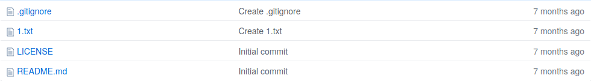

<h1>Contents<span class="tocSkip"></span></h1>
<div class="toc"><ul class="toc-item"><li><span><a href="#Version-control" data-toc-modified-id="Version-control-1">Version control</a></span><ul class="toc-item"><li><span><a href="#git" data-toc-modified-id="git-1.1">git</a></span><ul class="toc-item"><li><span><a href="#Installation" data-toc-modified-id="Installation-1.1.1">Installation</a></span></li><li><span><a href="#Configuration" data-toc-modified-id="Configuration-1.1.2">Configuration</a></span></li><li><span><a href="#Cloning" data-toc-modified-id="Cloning-1.1.3">Cloning</a></span></li></ul></li></ul></li></ul></div>

# GitHub

When we start to write 'real' programs that other people will actually want to use, we will need to clean up our act a bit and adopt a more organized way of working. In particular, if we have to collaborate with other programmers, there are some important things that we will need to organize to avoid getting into a sticky mess:

* **A [repository](extras/glossary.md#repository)**. We would like a single central location where the current version of our program is stored and available to others, instead of just storing our program on our own computer and emailing it to people then emailing them again when we correct a mistake and then emailing them a third time when we forget the attachment.
* **[Version control](extras/glossary.md#versioning)**. We would also like to keep track of different versions of our program. We may need to work on some changes provisionally, until we are confident that they are correct, or we may need to undo some changes once we discover that they have completely broken everything.
* **Documentation**. We should organize and make available some documents that explain to others how to use our program or how it works. Ideally these should be a little bit prettier than just plain text [docstrings](extras/glossary.md#docstring).
* **Communication**. We would like to provide our users and collaborators with a channel through which they can notify us of all the embarrassing mistakes that they have discovered in the program, or request unnecessarily complex new features that they would urgently like the program to have.
* **Collaboration**. We may eventually be lucky enough to have assistants or kind mentors helping us write the program. We should let them know clearly what their tasks are (and are not).

[GitHub](https://github.com/about) is a web platform that makes all of these things possible. We can store our computer programs on the GitHub website, track successive versions as we make changes, add attractive documentation, get notifications from others who comment on our project, and so on. GitHub isn't the only platform that provides these services, but it is one of the most widely used, and is relatively easy to navigate. In this lesson we will learn the basics of using GitHub to manage programming projects.

## Version control

'Version control', or simply 'versioning', broadly refers to the practice of tracking multiple versions of something. That something needn't especially be a computer program. You have probably practiced version control at some point in your career, for example with an essay or thesis that you wrote at college when you created a series of documents called *thesis_v2.docx*, *thesis_v3.docx*, *thesis_final.docx*, *thesis_final_adviser_corrections.docx*, *thesis_really_final.docx*, and so on.

Version control is particularly important for computer programs. In part this is because they often span more than a single file (for example a main [script](extras/glossary.md#script) along with one or more [modules](extras/glossary.md#module)), and in part because they are fragile; small mistakes can break them entirely, and changes to one part of the program need to be carefully tested to make sure that they are compatible with existing parts.

For these reasons, version control for computer programs is often automated; a version control program monitors our changes continuously in the background, records them, and later allows us to review, undo, or redo them in various combinations. An automated version control program is essential to any moderately large programming project. Imagine the hassle and the mistakes you could make if you had to manually name and store all the separate versions of all the files in your computer program in the same way as for a college thesis.

### git

There are various automatic version control programs available, but by far the most widely used is called *git*. git is a program that monitors changes to groups of files, and records those changes.

git and GitHub are two separate things, but they work together. git is a program on our computer that does the job of recording our changes locally and offline, whereas GitHub is a website on which to store the records that a git program makes. In a very loose analogy, you can think of git as being like the 'track changes' feature of a word processor program, and GitHub as being the equivalent of Dropbox or GoogleDrive, where you can store and view documents and changes to documents.

So to follow along with the examples in this lesson, you will need both an online account at the GitHub site (it's free and you can sign up [here](https://github.com/join)) and you will need to have git installed on your computer.

(And in case you are wondering why git is called the way it is, there are a few speculations [on Wikipedia](https://en.wikipedia.org/wiki/Git#Naming).)

#### Installation

Various data science or software development-related tools make use of git. So it is possible that you have already indirectly installed git on your computer in the process of installing some other program. To check, try `git` as a command line command at the Spyder console (don't forget the `!`). For example, you can ask git what version it is:


```python
! git --version
```

    git version 2.17.1


If you see a response like the one above (don't worry if you get a slightly different version number), then git is already installed. If instead the response is something like 'not found' or 'not recognized', then you will need to install git if you want to follow along with all of the examples in this lesson. The simplest way to do this is via Anaconda. The command line command `conda install` instructs Anaconda to install new packages (see the [online documentation for Anaconda](https://docs.anaconda.com/anaconda/packages/pkg-docs/#anaconda-package-lists)). So try it as a command line command at the Spyder console:

> `! conda install git`

You should see some printed output as git is downloaded and installed.

**Linux**: If you happen to be on Linux Ubuntu instead of macOS or Windows and you are not using Anaconda as your Python [package manager](extras/glossary.md#package), then you will instead need to go to the terminal (*not Spyder*) and enter `sudo apt-get install git` instead. You will be prompted to enter your password before installing.

#### Configuration

In order to synchronize programming projects on your own computer with your online storage at the GitHub website, git needs to know who you are on GitHub. To achieve this, you can configure git so that it knows your GitHub username and email. The command `git config`, together with the `--global` option, sets the global configuration for git on your computer ('global' in the sense that it applies across all of the git projects that you work on, and is not special to just one project).

Use it to set the `user.name` and `user.email` options. Like this:


```python
! git config --global user.name 'luketudge'
! git config --global user.email 'luketudge@gmail.com'
```

Make sure that the username and email that you enter are the same ones you used when you signed up for a GitHub account.

You can check that these commands have taken effect correctly using the `--list` option for `git config` to list your full global configuration:


```python
! git config --global --list
```

    user.name=luketudge
    user.email=luketudge@gmail.com


A few more details about configuring git are given at the [git website](https://git-scm.com/book/en/Getting-Started-First-Time-Git-Setup), but the configuration steps shown above are the only ones you are likely to ever need for basic use.

#### Cloning

There are a few different ways of starting a new programming project with git. One of these is to copy an existing online [repository](extras/glossary.md#repository) from GitHub onto your computer. This is known as 'cloning' the repository. Let's see an example.

I have created an example project at the GitHub website. This project is there just for demonstrating the use of git; it does not in fact contain any Python files or indeed many files at all. This means that you should be able to clone it to your computer reasonably quickly without having to wait for a lot of files to download.

Go to the main page of the example project [here](https://github.com/luketudge/example_repo). The main page lists all the files contained in the project. There are just four small text files:



Now look for the button marked 'Clone or download'. It looks like this:


You can use this button to just download all the project files as a *zip* archive file in the normal way. But don't do this. If we just do this, we will get the files, but git won't recognize them as something to track. Instead, copy the URL that is shown inside a text box when you click on the button. It will look like this:

`https://github.com/luketudge/example_repo.git`

Note that it has the file extension '*.git*'. This indicates that we are downloading something that git will recognize and will track changes to.

Use this URL with git's `clone` command to clone the repository to your computer:


```python
! git clone https://github.com/luketudge/example_repo.git
```

    Cloning into 'example_repo'...
    remote: Enumerating objects: 10, done.
    remote: Counting objects: 100% (10/10), done.
    remote: Compressing objects: 100% (8/8), done.
    remote: Total 10 (delta 1), reused 0 (delta 0), pack-reused 0
    Unpacking objects: 100% (10/10), done.


If you go to your file explorer, you should now see a new directory called 'example_repo' inside whatever working directory you were in when you ran the command above. (If you are not sure what directory you are in, remember that you can use Spyder's `%pwd` command to check.)


```python
%pwd
```


    '/home/lt/GitHub/introduction-to-programming/content'


You can go and check the new directory in your file explorer to verify that it has worked. You should see the same four text files that are listed on the main page of the GitHub repository. We won't look at the content of these files now. They aren't particularly interesting; this is just a demonstration of how `git clone` works.

If you see only three text files, this is probably because one of them, '.gitignore', has a name beginning with a dot, which on most file systems indicates a file that is intended to be 'hidden' (i.e. not shown by default).

If you are already feeling nostalgic for Python after all this command line work, you could try a Python command to verify that the hidden file is there. For example with the `listdir()` function from the `os` module:


```python
import os

os.listdir('example_repo')
```


    ['LICENSE', '.gitignore', '.git', 'README.md', '1.txt']


Alternatively, if you would like to be able to see hidden files in general on your computer (something that can often be useful if you go further with programming), then you can tell your file explorer to show them. Follow the instructions for your operating system:

* [Windows](https://support.microsoft.com/en-us/help/14201/windows-show-hidden-files)
* [macOS](http://osxdaily.com/2018/02/12/show-hidden-files-mac-keyboard-shortcut/)

Sometimes you may wish to clone a repository into a directory with a different name, for example if its name conflicts with the name of an existing directory on your computer or if you just don't like its name. You can add the name of the directory to clone *into* at the end of the `git clone` command:


```python
! git clone https://github.com/luketudge/example_repo.git my_fabulous_repo
```

    Cloning into 'my_fabulous_repo'...
    remote: Enumerating objects: 10, done.
    remote: Counting objects: 100% (10/10), done.
    remote: Compressing objects: 100% (8/8), done.
    remote: Total 10 (delta 1), reused 0 (delta 0), pack-reused 0
    Unpacking objects: 100% (10/10), done.


Once we have cloned a repository to our computer, git is aware of it, and will track changes that we make to the files. We can also use git to update our copies of the files if the online repository changes.

We will learn how to do these things in a moment, but for now you can delete the directories that you have just created if you tried out the example `git clone` commands above. A directory containing a git project can safely be deleted in the normal way. Just go to your file explorer and delete them. git then forgets about them.

If you like, you can now use `git clone` to download the materials for the *introduction to Programming* class to your computer. You can find the GitHub page for the class [here](https://github.com/luketudge/introduction-to-programming). The advantage of doing this rather than just downloading the class notes individually or as a *zip* file is that you will be able to update your local copy with a single click or git command whenever you want to make sure you have the latest version.
