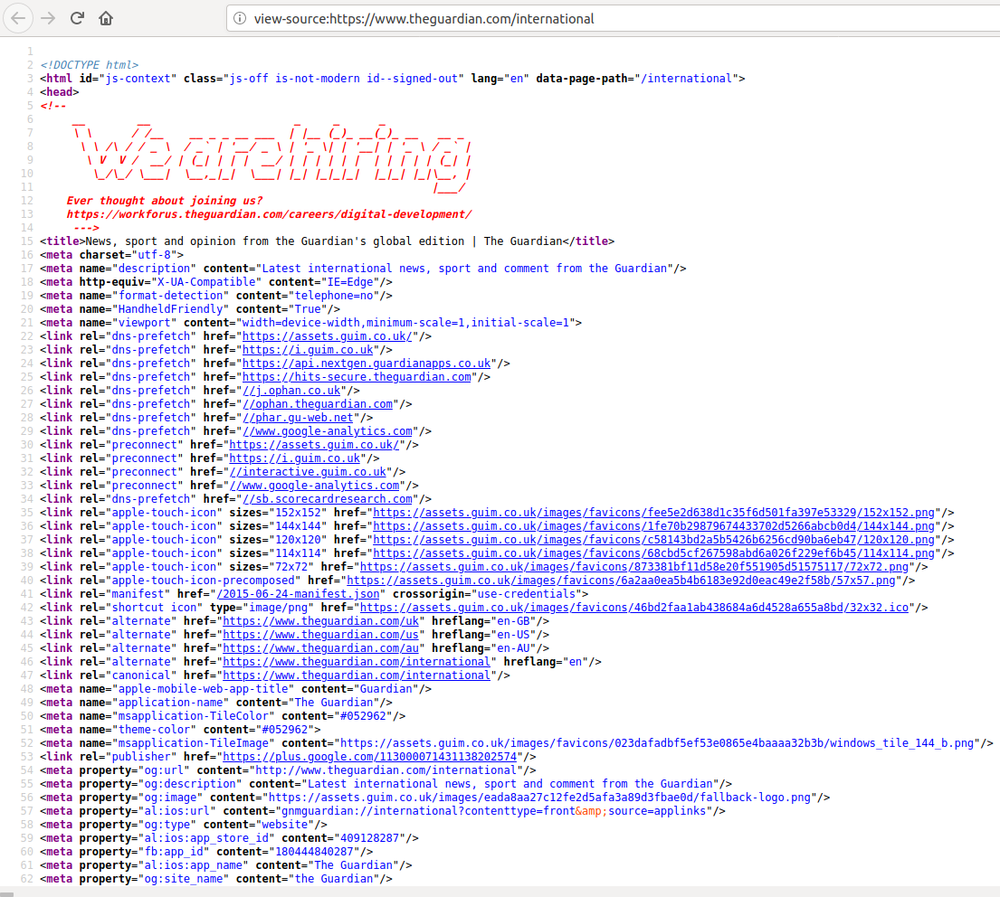

<h1>Contents<span class="tocSkip"></span></h1>
<div class="toc"><ul class="toc-item"><li><span><a href="#Objective" data-toc-modified-id="Objective-1">Objective</a></span></li><li><span><a href="#requests" data-toc-modified-id="requests-2">requests</a></span></li><li><span><a href="#HTTP" data-toc-modified-id="HTTP-3">HTTP</a></span></li><li><span><a href="#HTML" data-toc-modified-id="HTML-4">HTML</a></span><ul class="toc-item"><li><span><a href="#Tags" data-toc-modified-id="Tags-4.1">Tags</a></span></li><li><span><a href="#Comments" data-toc-modified-id="Comments-4.2">Comments</a></span></li><li><span><a href="#Hyperlinks" data-toc-modified-id="Hyperlinks-4.3">Hyperlinks</a></span></li><li><span><a href="#Attributes" data-toc-modified-id="Attributes-4.4">Attributes</a></span></li></ul></li><li><span><a href="#Parsing-HTML" data-toc-modified-id="Parsing-HTML-5">Parsing HTML</a></span><ul class="toc-item"><li><span><a href="#Beautiful-Soup" data-toc-modified-id="Beautiful-Soup-5.1">Beautiful Soup</a></span><ul class="toc-item"><li><span><a href="#Finding-tags" data-toc-modified-id="Finding-tags-5.1.1">Finding tags</a></span><ul class="toc-item"><li><span><a href="#Finding-tags-within-tags" data-toc-modified-id="Finding-tags-within-tags-5.1.1.1">Finding tags within tags</a></span></li></ul></li><li><span><a href="#Getting-attributes" data-toc-modified-id="Getting-attributes-5.1.2">Getting attributes</a></span></li></ul></li></ul></li><li><span><a href="#APIs" data-toc-modified-id="APIs-6">APIs</a></span><ul class="toc-item"><li><span><a href="#API-keys" data-toc-modified-id="API-keys-6.1">API keys</a></span></li></ul></li><li><span><a href="#Exercise" data-toc-modified-id="Exercise-7">Exercise</a></span></li></ul></div>

# The internet

The internet contains a vast wealth of information, and some of it is even useful. In this lesson we will learn how to retrieve information from the internet in a Python program.

## Objective

Let's set ourselves a fairly simple task. We would like to automatically retrieve and print out the text of the headline article on a news website. In addition, we would like to find any hyperlinks contained in the article text, and show where those links point to.

As an example website, let's use the international edition of [The Guardian](https://www.theguardian.com/international), a mainstream online newspaper. Our first step is to [assign](extras/glossary.md#assignment) a [string](extras/glossary.md#string) variable containing the [URL](extras/glossary.md#url) (more commonly called 'web address') that points to the main page of the site:


```python
url = 'https://www.theguardian.com/international'
```

Copy this URL into your web browser and navigate to the page. Keep it open so that you can refer to it and compare what you see in the browser to what you see happening in the Spyder console as you try out the example commands below.

## requests

You might already have guessed what the next step is. That's right, we need to [import](extras/glossary.md#import) an additional [package](extras/glossary.md#package) containing some new [functions](extras/glossary.md#function). For retrieving data from the internet, the standard most popular package is one called `requests`. It isn't part of the Python [standard library](standard_library.md), but it is very widely used and is included in the default Anaconda installation.


```python
import requests
```

The most important function in the `requests` package, and often the only one we will need, is called `get()`. As the name suggests, it gets the content of a web page. The [argument](extras/glossary.md#argument) is the URL of the page, which in our case we have already stored in a variable:


```python
response = requests.get(url)
```

So what did we get?


```python
type(response)
```


    requests.models.Response


We get a `Response` object. This variable contains the content of the webpage (assuming that the URL we entered was a valid one), along with some other information.

If you haven't yet had the occasion to learn about how the internet and webpages are structured, you might want to pause for a moment and think about what you are expecting to find once we work out how to get the content of the webpage out of the `Response` object. Will we get an image showing what the webpage looks like when viewed? Or just the plain text content of the page? Or something else?

## HTTP

To understand what we get from `requests.get()` and how it is organized, let's look very briefly at what happens behind the scenes when an application on our computer, for example a web browser, gets some information, for example a web page, from the internet.

When we open a web page in our browser, we just see the content of the page, as if our computer is looking down a tube into the internet and viewing parts of it. But of course what actually happens is rather different. When we navigate to a new web page in our browser, our browser sends out a 'request' for that page. The request is sent via various intermediate computers until reaching a computer on which the page is stored. This computer then sends back a response. In this setup, we say that our browser is the [client](extras/glossary.md#client) program, and the other computer on the internet that controls access to the web page is the [server](extras/glossary.md#server).

HTTP (HyperText Transfer Protocol) is a standard procedure prescribing how requests and responses over the internet should be formulated and transmitted. We do not need to know about the details of HTTP. When we surf the web in our browser, the browser handles implementing the requirements of HTTP. And when we get data from the web in a Python program, `requests` handles this. This is one of the benefits of using a well-written pre-made [package](extras/glossary.md#package) like `requests`; it hides away unnecessary complexity inside [functions](extras/glossary.md#function) that allow us to control just a few important aspects of a task. (The slogan for the `requests` project is '[HTTP for Humans](https://requests.readthedocs.io/en/master/)'.)

The only thing that we need to know about the details of HTTP is that it prescribes certain 'response status codes'. These codes are short three-digit numbers, each of which has a particular meaning concerning our request. For example, the status code '200' means that our request was successful. This code is contained at the start of the response that we receive from the server. The `requests` package places it in an [attribute](extras/glossary.md#attribute) of the `Response` object called `status_code`.


```python
print(response.status_code)
```

    200


The '200' we see here means that the Guardian's server was able to fulfill our request, and has sent us the web page that we wanted.

There are various [other HTTP response codes](https://en.wikipedia.org/wiki/List_of_HTTP_status_codes), but you will commonly encounter only a few of them. There is one in particular that you might be familiar with already, having seen it displayed occasionally in your web browser. It occurs if we request a page that the server does not have.


```python
response2 = requests.get('https://www.theguardian.com/top_secret_prince_philip_sex_tape')
print(response2.status_code)
```

    404


'404' means 'not found'.

In fact, the `requests` package goes the extra mile for us and also stores an [attribute](extras/glossary.md#attribute) in the `Response` that gives the human-readable meaning of the status code:


```python
print(response.reason)
```

    OK


```python
print(response2.reason)
```

    Not Found


A nice simple flourish that we can add to this first part of our program is a printout confirming the URL of our request (in case we typed it wrong), and the status of our request:


```python
print(response.status_code, response.reason, url)
```

    200 OK https://www.theguardian.com/international


## HTML

As long as our request was successful, the `Reponse` object will also contain the web page or other data that we requested. We can get it as a [string](extras/glossary.md#string) from the `text` [attribute](extras/glossary.md#attribute).

Since the web page will probably be quite big, we won't print it all out. Let's instead first assign it into a new variable for convenience, and check how long it is:


```python
page = response.text

len(page)
```


    969427


Let's just print out the first thousand characters to see the top of the web page:


```python
print(page[:1000])
```

    
    <!DOCTYPE html>
    <html id="js-context" class="js-off is-not-modern id--signed-out" lang="en" data-page-path="/international">
    <head>
    <!--
         __        __                      _     _      _
         \ \      / /__    __ _ _ __ ___  | |__ (_)_ __(_)_ __   __ _
          \ \ /\ / / _ \  / _` | '__/ _ \ | '_ \| | '__| | '_ \ / _` |
           \ V  V /  __/ | (_| | | |  __/ | | | | | |  | | | | | (_| |
            \_/\_/ \___|  \__,_|_|  \___| |_| |_|_|_|  |_|_| |_|\__, |
                                                                |___/
        Ever thought about joining us?
        https://workforus.theguardian.com/careers/digital-development/
         --->
    <title>News, sport and opinion from the Guardian's global edition | The Guardian</title>
    <meta charset="utf-8">
    <meta name="description" content="Latest international news, sport and comment from the Guardian"/>
    <meta http-equiv="X-UA-Compatible" content="IE=Edge"/>
    <meta name="format-detection" content="telephone=no"/>
    <meta name="HandheldFriendly" content="Tr


Go back to your web browser and compare this with what you see there. It is of course completely different. This is because the web browser displays web pages in a prettified format. The ugly plain text that we are looking at here in Python is what our web browser initially receives from the Guardian server. This text is a set of instructions about how the web page is to be displayed. The browser then implements these instructions, putting colors here, images there, highlighting or linking some of the text, and so on, and then shows us the result. The process of implementing a set of instructions for displaying something is often called 'rendering', and the pretty finished version of the webpage is called the 'rendered' version.

That things should be this way makes a certain amount of sense. It would be horribly inefficient for web pages to be stored online as complete, pixel-by-pixel images of the page content, all in color and already laid out. Not only would this require sending very large files across the internet every time someone requested a web page, it would also make web pages inflexible, since they would look the same on any computer or device, no matter the dimensions of its screen or the preferences of its human user. Instead, web pages are stored as fairly minimal instructions about how to display the content of a web page, and it is then up to the web browser program to implement those instructions, and even to ignore or modify some of them in order to adapt the display to a particular device or user, for example making the interface less crowded on a mobile phone, or making the text bigger for a visually-impaired user.

So the content of a web page is behind the scenes really like a set of instructions for a web browser. Instructions for a computer must be written in a programming language of some sort. So what programming language are web pages written in? Not Python unfortunately for us, but a new one, called HTML (HyperText Markup Language).

Let's take a look at the HTML content of the Guardian web page, and see how the HTML language is structured. The Guardian webpage is a complex one, and the HTML instructions for it are very long, so it would be a bit unwieldy to print it all out in the Python console. Fortunately you can also view the underlying HTML of a web page in your web browser. Go to the Guardian page that you have opened in your browser and try one of the following (which one works will depend on which web browser you are using, but some variant should work in any major browser):

* Find a blank area of the web page and click on it with the right button of your mouse. From the menu that appears, select the option 'View Page Source' or something similar-sounding.
* If that doesn't work, go to the toolbar of your browser. Click on the main menu button (often at the top right). Select the option 'Page Source' or something similar sounding. This option may be contained in a sub-menu called something like 'Web Developer' or 'Developer Tools'.

This should open a separate panel or a whole new tab displaying the plain text HTML of the web page. Something like this:



If you can't make this work, then you can use the following commands in your Spyder console to save the HTML text that we just got into a text file, then you can go and open the text file:


```python
with open('page_source.html', mode='w', encoding='utf-8') as f:
    f.write(page)
```

But beware that if you just click on this text file in your file explorer it will most probably open in your web browser and show you the rendered webpage! To see the HTML, open it in a text editor instead.

### Tags

So what is the general [syntax](extras/glossary.md#syntax) of HTML? The 'M' in HTML stands for 'markup', and a [markup language](extras/glossary.md#markup) is a language that consists mainly of normal human-readable text. In a markup language, the text is 'marked up', that is it is decorated with various surrounding instructions that tell a computer various things about how to display the text. For example, there are instructions for specifying the color and size of the text, for turning text into a clickable link, for inserting images, and so on.

In HTML, these additional instructions take the form of 'tags'. Tags mark up some part of the text by enclosing it in an opening tag and a closing tag. An opening tag begins and with the character `<` and ends with `>`. Between these characters is the name of the tag, and possibly some further information. The information in the opening tag says something about how to treat the text that follows. A closing tag also begins and ends with `<` and `>`, but between these characters comes a `/`, followed by the name of the tag that is being closed.

For example, on line 15 of the HTML for the Guardian front page there is some text enclosed in opening and closing 'title' tags:

> `<title>News, sport and opinion from the Guardian's global edition | The Guardian</title>`

These tags say merely 'this text is the title of the document'; they do not in themselves say anything about how to treat that title. Typically, web browsers display the title in the header of the browser window and/or in the tab in which the web page is open. But in principle it is entirely up to the web browser program what to do with tagged text. If we were writing our own web browser app, we could instead write it such that text tagged as 'title' is displayed in massive overlaid letters across the middle of the screen, or is fed into a text-to-speech algorithm and then auto-tuned to the melody of a popular light opera and sung out of the speakers.

In the example HTML file [html_examples.html](examples/html_examples.html) you can see some other common HTML tags in action. Remember, if you just download this file and open it, it will probably open in your web browser and show you the rendered web page. To see the underlying text HTML, open the file in a text editor instead.

Let's look briefly at a few features of HTML syntax.

### Comments

Like Python, the HTML language allows for [comments](extras/glossary.md#comment), pieces of text that have no effect on the computer and are there only for human readers. Python comments are simple; any line beginning with the hash symbol `#` is a comment. HTML comments are slightly more complex. HTML marks both the start and the end of a comment. A comment begins with the character combination `<!--` and ends with the combination `--->`. Anything between these two groups of characters is ignored by the web browser.

On the Guardian page, you can see a comment near the top of the page containing a recruitment advertisement for web developers.

### Hyperlinks

One of the most important features of HTML is that it can specify links from one document to another (hyperlinks). Somewhat confusingly, it is not the `<link>` tag that turns a piece of text into a clickable hyperlink (this tag has another role that we will not go into here). Instead it is the `<a>` tag. The 'a' here stands for 'anchor', in the sense of a position in a text being an 'anchor point' that other documents may link to, and that may vice versa link to other documents.

So in HTML to turn the piece of plain text 'Complaints & Corrections' into a clickable link, it would be enclosed in tags like this:

> `<a>Complaints & corrections</a>`

The result looks like this:

<a>Complaints & corrections</a>

### Attributes

Some HTML tags need to specify additional information. For example the `<a>` tag isn't much use without specifying where the hyperlink should point to. On its own, enclosing text in `<a></a>` makes a piece of text behave a bit like a hyperlink (it is highlighted and responds to the mouse hovering over it, and so on), but when the text is clicked nothing happens.

To specify additional things about how a piece of tagged text is to be treated, the opening tag may contain one or more 'attributes'. These attributes have specific names and control further details relevant to that type of tag. The syntax for an attribute is to write the attribute name, followed by the equals sign `=`, followed by some value for the attribute. This is syntactically just like [assignment](extras/glossary.md#assignment) in Python, but don't confuse the two; the `=` does not assign a variable in HTML.

The 'href' attribute (an abbreviation of 'hypertext reference') of an `<a>` tag specifies the [URL](extras/glossary.md#url) of the page that the link should point to. So the link to the Guardian's complaints page looks something like this in the underlying HTML:

> `<a href="https://www.theguardian.com/info/complaints-and-corrections">Complaints & corrections</a>`

And now the link on the resulting web page actually points somewhere:

<a href="https://www.theguardian.com/info/complaints-and-corrections">Complaints & corrections</a>

## Parsing HTML

We now have the HTML content of our target web page, and we know a little bit about HTML. Our next task is to extract the part of the page that we are interested in. The HTML of real-world web pages is often very convoluted and full of all sorts of irrelevant technical and filler information. If you scroll through the HTML of the Guardian front page for example, you will see lots and lots of incomprehensible tags and comments before you get to anything that looks like an article headline.

We are looking for a link to the main headline article. The first step in finding it is to find out whether there is a particular recognizable tag or combination of tags that will lead us to this link. For this, it is easiest to use the web browser first, before we do anything in our Python program.

Take a look at the rendered webpage in the web browser, and look for the text of the main headline. It will be at the top of a section called 'Headlines', which itself will be near the top of the page). Way back when I wrote this tutorial, the main headline was 'King Henry to divorce Kate of Aragon. Pope says NO!' but of course by the time you come to try out the task the headline will have changed.

The headline text will also appear in the HTML somewhere. So make a mental note or copy the text of the headline and head now to the HTML page source. Use your browser's 'find' tool to search for this text. Once you have found the headline text in the HTML, you should see that it appears on a fairly long line of HTML, enclosed in multiple tags. The line will look a bit like this (though I have abbreviated it here somewhat in order to focus on its most important characteristics):

> `<h3 class="fc-item__title"><a href="https://www.theguardian.com/uk-news/1527/Queen_Kate_divorce_pope_no_no_no" class="fc-item__link" data-link-name="article"><span class="js-headline-text">King Henry to divorce Kate of Aragon. Pope says NO!</span></a></h3>`

HTML allows tags to be 'nested' inside one another. This is what we see here. The text of the main headline is enclosed within a `<span>` tag, within an `<a>` tag, within an `<h3>` tag (or when you view the site the structure of this line may be yet more complex; there are variants depending on the type of the article).

For our example task, it is the `<a>` tag that we are ultimately interested in, since its 'href' attribute provides the URL for the link to the actual article page. So let's begin by searching for `<a>` tags in the HTML text of the article that we got from `requests.get()`.

### Beautiful Soup

How do we go about searching for tags in HTML? We could of course use [string](extras/glossary.md#string) [methods](extras/glossary.md#method) such as `find()` or `index()`. If you have some extra time on your hands and you would like a challenge, you could give this a go. But you will quickly discover that it is very tedious, and you will probably make some mistakes. When we come up against a task that is tedious to accomplish with basic Python and yet is probably a task that many people have had to do already, then we should ask ourselves: Is there a Python [package](extras/glossary.md#package) out there that can do this already?

Indeed there is. The most widely-used package for searching in and manipulating HTML is one called 'Beautiful Soup'. This package can chop up an HTML document into its constituent tags and then let us pull out specific tags, their attributes, their enclosed text, and so on. The process of chopping up structured text into its constituent parts is known as [parsing](extras/glossary.md#parse) the text. Beautiful Soup is a package for parsing HTML. The name 'Beautiful Soup' is based on imagining messy 'raw' HTML being turned into a nice tasty 'soup'.

For brevity, the actual name of the Beautiful Soup package within Python is `bs4`. Let's [import](extras/glossary.md#import) it. (And yes, `bs4` too is part of the default Anaconda installation).


```python
import bs4
```

The main function that we want from `bs4` is called simply `BeautifulSoup()` (note the uppercase letters). The [argument](extras/glossary.md#argument) is a [string](extras/glossary.md#string) containing the contents of an HTML document. This is what we got from `requests` earlier.


```python
soup = bs4.BeautifulSoup(page)
```

As usual, let's check the [type](extras/glossary.md#type) of the resulting variable:


```python
type(soup)
```


    bs4.BeautifulSoup


This new `BeautifulSoup` object contains our HTML, but with many useful [methods](extras/glossary.md#method) added for picking out specific tags. The methods that we will need all begin with `find_`, so let's look just at these:


```python
for meth in dir(soup):
    if meth.startswith('find_'):
        print(meth)
```

    find_all
    find_all_next
    find_all_previous
    find_next
    find_next_sibling
    find_next_siblings
    find_parent
    find_parents
    find_previous
    find_previous_sibling
    find_previous_siblings


#### Finding tags

For most simple tasks, the one that we want is `find_all()`. We can use this to find all the tags of a particular kind. The first [argument](extras/glossary.md#argument) is the name of the tag we are looking for, just as a plain string, without the `< >` characters. For example, all the `<a>` tags:


```python
a_tags = soup.find_all('a')
```

So how many `<a>` tags did we get from the HTML of our Guardian page?


```python
len(a_tags)
```


    403


Clearly we need to refine our search if we want to pick out just the `<a>` tag for the link to the main headline article. The main way of refining a search for tags is to specify what attributes the tag must have. The additional `attrs` [argument](extras/glossary.md#argument) to `find_all()` can be a [dictionary](extras/glossary.md#dictionary) whose keys are the names of the desired attributes, and whose corresponding values specify what the content of each attribute must be.

If you take a look at the HTML, you will see that our target `<a>` tag has two additional attributes 'class' and 'data-link-name':

> `<a href="..." class="fc-item__link" data-link-name="article">`

So we can narrow our search to tags with these attributes like this:


```python
target_attributes = {'class':'fc-item__link', 'data-link-name':'article'}
a_tags = soup.find_all('a', attrs=target_attributes)

len(a_tags)
```


    95


That has narrowed it down considerably, but we still get a lot more than just our one target tag.

##### Finding tags within tags

If we find that an HTML document contains too many tags that look like the one we want, then often the next step is to start looking *outside* our target tag. An HTML document is usually divided up into sections containing different parts of the text content. You can see this already on the rendered Guardian page; there is a 'Headlines' section, and 'Opinion' section, 'Sport', and so on. So a good option for us here is to search first for the relevant section, and then search within it for the tag we want.

A section in HTML is nothing more than a tag. There are tow main tags that are used to mark sections:

* `<div>` ('divider') is a very general-purpose division into sections of all kinds. Its effects on the rendered webpage are very varied depending on context.
* `<section>` is a surprisingly intuitively-named marker for an actual visual section of a page. At least in most cases.

Often these tags may enclose a large chunk of the page content. You may for example see an opening `<div>` tag on one line of the HTML, then see its corresponding closing `</div>` tag only many hundreds of lines later.

When looking for a section that encloses the part of the page that we are interested in, we may need to experiment a little and make some initial guesses. Go back to the source of the Guardian page and start carefully scrolling upwards from the line on which our target `<a>` tag appears. You should look for either a `<div>` or a `<section>` tag that has an attribute that looks as though it might be unique to the 'Headlines' section. Eventually you will find one that looks very promising:

> `<section id="headlines" ...>`

This tag is particularly likely to be the one that marks only the 'Headlines' section because by convention the 'id' attribute of an HTML tag is kept unique. The 'id' attribute is one that the developers of a web page, and our web browser, can use to pick out one specific part of a page and treat it differently if necessary. So if the Guardian's web developers know what they are doing, then there should be only one `<section>` tag with 'id' 'headlines'.


```python
headlines = soup.find_all('section', attrs={'id':'headlines'})

len(headlines)
```


    1


Success! Although some of the Guardian's journalists have yet to master the English language, its web developers at least get the HTML right.

If we are sure that there is only one instance of the kind of tag that we are looking for, or if we anyway only want the first one, then we can switch to the `find()` method. This method [returns](extras/glossary.md#return) just one tag instead of a [list](extras/glossary.md#list):


```python
headlines = soup.find('section', attrs={'id':'headlines'})

type(headlines)
```


    bs4.element.Tag


Now we have a variable that contains only the part of the document that is enclosed within this `<section>` tag. Searching within this part of the document is as simple as just applying the same `find_` methods to this new variable instead of to the whole 'soup'.

So let's see how many article links we now find:


```python
a_tags = headlines.find_all('a', attrs=target_attributes)

len(a_tags)
```


    10


Much better. As a check, let's go through this shorter list of links and take a look at them all:


```python
for tag in a_tags:
    print(tag)
```

    <a class="fc-item__link" data-link-name="article" href="https://www.theguardian.com/politics/2020/mar/02/uk-says-it-will-not-lower-standards-to-strike-trade-deal-with-trump"><span class="fc-item__kicker">Brexit</span> <span class="u-faux-block-link__cta fc-item__headline"> <span class="js-headline-text">British economy 'to grow 0.16% at best under US trade deal'</span></span> </a>
    <a class="fc-item__link" data-link-name="article" href="https://www.theguardian.com/world/2020/mar/02/child-dies-as-boat-carrying-migrants-capsizes-off-lesbos"><span class="fc-item__kicker">Lesbos</span> <span class="u-faux-block-link__cta fc-item__headline"> <span class="js-headline-text">Child dies as boat carrying migrants capsizes</span></span> </a>
    <a class="fc-item__link" data-link-name="article" href="https://www.theguardian.com/us-news/2020/mar/02/pete-buttigieg-drops-out-of-20202-race-to-be-democratic-presidential-nominee"><span class="fc-item__kicker">US election</span> <span class="u-faux-block-link__cta fc-item__headline"> <span class="js-headline-text">Pete Buttigieg drops out of 2020 race </span></span> </a>
    <a class="fc-item__link" data-link-name="article" href="https://www.theguardian.com/technology/2020/mar/02/youtube-accused-of-being-organ-of-radicalisation"><span class="fc-item__kicker">YouTube</span> <span class="u-faux-block-link__cta fc-item__headline"> <span class="js-headline-text">Platform accused of being 'organ of radicalisation'</span></span> </a>
    <a class="fc-item__link" data-link-name="article" href="https://www.theguardian.com/world/2020/mar/02/trial-begins-salzburg-austria-retired-colonel-accused-spying-russia"><span class="fc-item__kicker">Austria</span> <span class="u-faux-block-link__cta fc-item__headline"> <span class="js-headline-text">Trial begins of retired colonel accused of spying for Russia</span></span> </a>
    <a class="fc-item__link" data-link-name="article" href="https://www.theguardian.com/world/2020/mar/02/china-new-internet-censorship-rules-raise-fears-of-renewed-crackdown"><span class="fc-item__kicker">China</span> <span class="u-faux-block-link__cta fc-item__headline"> <span class="js-headline-text">New internet censorship rules target 'sexual innuendo'</span></span> </a>
    <a class="fc-item__link" data-link-name="article" href="https://www.theguardian.com/uk-news/2020/mar/02/un-above-average-temperatures-without-el-nino"><span class="fc-item__kicker">Environment</span> <span class="u-faux-block-link__cta fc-item__headline"> <span class="js-headline-text">UN predicts above-average temperatures even without El Niño</span></span> </a>
    <a class="fc-item__link" data-link-name="article" href="https://www.theguardian.com/us-news/2020/mar/02/oklahoma-college-recruiter-fired-students-line-up-skin-color"><span class="fc-item__kicker">US</span> <span class="u-faux-block-link__cta fc-item__headline"> <span class="js-headline-text">Oklahoma college recruiter fired after telling students to line up by skin color</span></span> </a>
    <a class="fc-item__link" data-link-name="article" href="https://www.theguardian.com/technology/2020/mar/02/nandos-inspired-code-words-for-sex-used-by-girls-as-young-as-10"><span class="fc-item__kicker">Technology</span> <span class="u-faux-block-link__cta fc-item__headline"> <span class="js-headline-text">Nando's-inspired sex slang used by girls as young as 10</span></span> </a>
    <a class="fc-item__link" data-link-name="article" href="https://www.theguardian.com/music/2020/mar/02/public-enemy-fire-flavor-flav-clash-bernie-sanders"><span class="fc-item__kicker">Public Enemy</span> <span class="u-faux-block-link__cta fc-item__headline"> <span class="js-headline-text">Flavor Flav fired after clash over Bernie Sanders rally</span></span> </a>


This is a bit of a mess and not easy to read, because we are seeing the full HTML of each tag, including the tags within the tag, and all the tag attributes.

In Beautiful Soup, a tag has a `get_text()` [method](extras/glossary.md#method) that gives us just the plain text that is enclosed in the tag. This can be useful for more easily checking the human-readable part of the HTML:


```python
for tag in a_tags:
    print(tag.get_text())
```

    Brexit  British economy 'to grow 0.16% at best under US trade deal' 
    Lesbos  Child dies as boat carrying migrants capsizes 
    US election  Pete Buttigieg drops out of 2020 race  
    YouTube  Platform accused of being 'organ of radicalisation' 
    Austria  Trial begins of retired colonel accused of spying for Russia 
    China  New internet censorship rules target 'sexual innuendo' 
    Environment  UN predicts above-average temperatures even without El Niño 
    US  Oklahoma college recruiter fired after telling students to line up by skin color 
    Technology  Nando's-inspired sex slang used by girls as young as 10 
    Public Enemy  Flavor Flav fired after clash over Bernie Sanders rally 


You can try this in your Spyder console and see the current headlines. You should see that they match up to those displayed in the 'Headlines' section of the rendered webpage.

We only want the top headline, and it is reasonable to assume that this will always be the first one in the HTML for the page, so let's switch to `find()` to isolate just the one we want:


```python
top_headline = headlines.find('a', attrs=target_attributes)

print(top_headline)
```

    <a class="fc-item__link" data-link-name="article" href="https://www.theguardian.com/politics/2020/mar/02/uk-says-it-will-not-lower-standards-to-strike-trade-deal-with-trump"><span class="fc-item__kicker">Brexit</span> <span class="u-faux-block-link__cta fc-item__headline"> <span class="js-headline-text">British economy 'to grow 0.16% at best under US trade deal'</span></span> </a>


#### Getting attributes

Now the next step is to get the URL of the link to the main article page. We learned earlier that this is contained in the 'href' attribute of an `<a>` tag. Beautiful Soup's tags can be [indexed](extras/glossary.md#index) with the names of the tag's attributes, rather like a basic Python [dictionary](extras/glossary.md#dictionary):


```python
link = top_headline['href']

link
```


    'https://www.theguardian.com/politics/2020/mar/02/uk-says-it-will-not-lower-standards-to-strike-trade-deal-with-trump'


And now finally we have what we want from the main page: A link to the page for the top headline article.

At this point, it is a good idea to take stock and make a note of what we had to search for in order to find what we wanted. This is something that we can then put into a comment in our finished program as a reminder, in case we later need to refine our search or we find that it does not work as expected the next time the Guardian decides to change the organization of its main page. Something like:

> The first `<a>` tag with class "fc-item__link" and data-link-name "article" within the `<section>` tag with id "headlines".

We haven't yet finished our target program. We said that we wanted to get the text of the main article, and the URLs of all the links contained in the main article. For this, we will need to now take the URL we have just found, which points to the main article page, `get()` this page using `requests`, then search again in the HTML of the page in order to find the article text and links. However, all of this involves only small variations on the techniques we have already covered. So if you would like to practice, you can try to finish off the example task yourself starting from here. The example [script](extras/glossary.md#script) [guardian_top_article.py](examples/guardian_top_article.py) shows one possible solution.

## APIs

The task that we just carried out is often called [web scraping](extras/glossary.md#scraping). We accessed a website using our own computer program rather than a web browser, and our program extracted some information from the page.

You should be aware that not all websites are particularly happy about being scraped. Some websites take actions to block this kind of access. Even for those websites that do not explicitly block activity that looks like scraping, it is important as a matter of good 'netiquette' to check first whether a website already provides its own guidelines and methods for programs that want to access its data. When the owner of a web site or other web service provides a specific channel through which other non-browser programs may access data, this system is termed an [API](extras/glossary.md#api) ('Application Programming Interface'). An API is a system with a fixed set of rules that state what information a website will send back to another computer program when that computer program submits requests in a specific format.

The Guardian website, for example, in fact provides a more structured way for us to access the content of its articles, via an API. You can read a bit more about it at the [Guardian API documentation page](https://open-platform.theguardian.com/documentation). The Guardian's API asks our program to go to the following URL if we want to search for articles:

`'https://content.guardianapis.com/search'`

We should then add one or more 'parameters' to the URL in order to refine our search. The [syntax](extras/glossary.md#syntax) for adding parameters to a URL is to place a `?` character after the main URL, then name the parameters and their values using `=`, separating multiple parameters with `&`. The Guardian API allows for the parameters 'q', to specify a search word, and 'from-date', to specify a date at which to begin the search. So the URL for a request for articles about taramasalata published since 2014 would look like this:

`https://content.guardianapis.com/search?q=taramasalata&from-date=2014-01-01`

However, rather than try to put together the whole URL ourselves and probably misplace some vital punctuation somewhere, we can let the `requests` package do it for us. The `get()` function has an optional `params` [argument](extras/glossary.md#argument) that can be a [dictionary](extras/glossary.md#dictionary) of parameters for the URL. Like this:


```python
api_url = 'https://content.guardianapis.com/search'
query = {'q':'taramasalata', 'from-date':'2014-01-01'}

response = requests.get(api_url, params=query)
```

### API keys

However, something is not quite right when we check the status of our request to the Guardian's API:


```python
print(response.status_code, response.reason)
```

    401 Unauthorized


Take a look back at the [documentation page](https://open-platform.theguardian.com/documentation) for the API. It states that we first need something called an API *key*, and then send the key along with our request.

This is a fairly common requirement of APIs. Most, though not all, require everyone that uses the API to first register some information, rather like registering for any other website that provides a service. This requirement allows the owners of the website to keep track of what their content is being used for, and to limit how much use each person can make of it for free.

If you look at the Guardian's API [documentation page on keys](https://open-platform.theguardian.com/access) you can see the terms and conditions of free or commercial use. For example, the free key limits how many requests for data you can make per second and per day. If you would like, you can sign up for a free developer key via this page. You will get a key sent to you. It is just a string of characters. Save this to a text file somewhere safe on your computer, and then you can use it to test out the Guardian API if you want to follow the final examples below.

To get an API key into Python, we can load it from the text file we saved it in. We learned how to load text from files in the [lesson on files](files.md). I have temporarily put mine in the file '.guardian_api_key.txt' in my current Python working directory. (Note that because a text file may often contain an invisible extra [newline character](extras/glossary.md#newline), it is safest to strip away any surrounding [whitespace](#extras/glossary.md#whitespace) just in case.)


```python
api_key = open('.guardian_api_key.txt').read().strip()
```

As the API states, this key should be sent as the 'api-key' parameter in our program's request. So like this:


```python
query['api-key'] = api_key

response = requests.get(api_url, params=query)

print(response.status_code, response.reason)
```

    200 OK


Now it works!

So what answer did we get? Let's take a look at the text of the response, as we did when we just accessed the front page earlier:


```python
print(response.text)
```

    {"response":{"status":"ok","userTier":"developer","total":44,"startIndex":1,"pageSize":10,"currentPage":1,"pages":5,"orderBy":"relevance","results":[{"id":"food/2019/nov/30/scallop-roe-alternative-use-taramasalata-recipe-waste-not-tom-hunt","type":"article","sectionId":"food","sectionName":"Food","webPublicationDate":"2019-11-30T06:00:28Z","webTitle":"An alternative use for scallop roe","webUrl":"https://www.theguardian.com/food/2019/nov/30/scallop-roe-alternative-use-taramasalata-recipe-waste-not-tom-hunt","apiUrl":"https://content.guardianapis.com/food/2019/nov/30/scallop-roe-alternative-use-taramasalata-recipe-waste-not-tom-hunt","isHosted":false,"pillarId":"pillar/lifestyle","pillarName":"Lifestyle"},{"id":"lifeandstyle/2019/nov/26/grand-aioli-the-dinner-to-cook-when-you-cant-be-bothered-cooking","type":"article","sectionId":"lifeandstyle","sectionName":"Life and style","webPublicationDate":"2019-11-25T17:00:01Z","webTitle":"Grand aioli: the dinner to cook when you can't be bothered cooking","webUrl":"https://www.theguardian.com/lifeandstyle/2019/nov/26/grand-aioli-the-dinner-to-cook-when-you-cant-be-bothered-cooking","apiUrl":"https://content.guardianapis.com/lifeandstyle/2019/nov/26/grand-aioli-the-dinner-to-cook-when-you-cant-be-bothered-cooking","isHosted":false,"pillarId":"pillar/lifestyle","pillarName":"Lifestyle"},{"id":"food/2019/dec/14/how-turn-christmas-party-leftovers-mexican-brunch","type":"article","sectionId":"food","sectionName":"Food","webPublicationDate":"2019-12-14T06:00:15Z","webTitle":"How to turn Christmas party leftovers into a Mexican brunch | Waste not","webUrl":"https://www.theguardian.com/food/2019/dec/14/how-turn-christmas-party-leftovers-mexican-brunch","apiUrl":"https://content.guardianapis.com/food/2019/dec/14/how-turn-christmas-party-leftovers-mexican-brunch","isHosted":false,"pillarId":"pillar/lifestyle","pillarName":"Lifestyle"},{"id":"food/2020/feb/28/the-melusine-london-e1-restaurant-review-grace-dent","type":"article","sectionId":"food","sectionName":"Food","webPublicationDate":"2020-02-28T09:30:13Z","webTitle":"The Melusine, London E1: ‘A small kitchen turning out magic’ – restaurant review | Grace Dent","webUrl":"https://www.theguardian.com/food/2020/feb/28/the-melusine-london-e1-restaurant-review-grace-dent","apiUrl":"https://content.guardianapis.com/food/2020/feb/28/the-melusine-london-e1-restaurant-review-grace-dent","isHosted":false,"pillarId":"pillar/lifestyle","pillarName":"Lifestyle"},{"id":"food/2019/oct/17/flaccid-croissants-oil-drenched-carbs-train-jay-rayner","type":"article","sectionId":"food","sectionName":"Food","webPublicationDate":"2019-10-17T11:00:26Z","webTitle":"Flaccid croissants, oil-drenched carbs. Yes, I’m on the road again","webUrl":"https://www.theguardian.com/food/2019/oct/17/flaccid-croissants-oil-drenched-carbs-train-jay-rayner","apiUrl":"https://content.guardianapis.com/food/2019/oct/17/flaccid-croissants-oil-drenched-carbs-train-jay-rayner","isHosted":false,"pillarId":"pillar/lifestyle","pillarName":"Lifestyle"},{"id":"food/2020/jan/09/fitbit-for-chickpeas-zipcar-for-leftovers-the-food-tech-we-really-need-in-the-2020s","type":"article","sectionId":"food","sectionName":"Food","webPublicationDate":"2020-01-09T08:00:02Z","webTitle":"Fitbit for chickpeas, Zipcar for leftovers: the food tech we really need in the 2020s","webUrl":"https://www.theguardian.com/food/2020/jan/09/fitbit-for-chickpeas-zipcar-for-leftovers-the-food-tech-we-really-need-in-the-2020s","apiUrl":"https://content.guardianapis.com/food/2020/jan/09/fitbit-for-chickpeas-zipcar-for-leftovers-the-food-tech-we-really-need-in-the-2020s","isHosted":false,"pillarId":"pillar/lifestyle","pillarName":"Lifestyle"},{"id":"science/2019/dec/02/did-you-solve-it-smart-as-a-box-of-frogs","type":"article","sectionId":"science","sectionName":"Science","webPublicationDate":"2019-12-02T17:10:09Z","webTitle":"Did you solve it? Smart as a box of frogs","webUrl":"https://www.theguardian.com/science/2019/dec/02/did-you-solve-it-smart-as-a-box-of-frogs","apiUrl":"https://content.guardianapis.com/science/2019/dec/02/did-you-solve-it-smart-as-a-box-of-frogs","isHosted":false,"pillarId":"pillar/news","pillarName":"News"},{"id":"food/2019/sep/13/10-heddon-st-london-w1-restaurant-review-grace-dent","type":"article","sectionId":"food","sectionName":"Food","webPublicationDate":"2019-09-13T09:00:17Z","webTitle":"10 Heddon St, London W1: ‘We'll never tire of exemplary pasta’ – restaurant review","webUrl":"https://www.theguardian.com/food/2019/sep/13/10-heddon-st-london-w1-restaurant-review-grace-dent","apiUrl":"https://content.guardianapis.com/food/2019/sep/13/10-heddon-st-london-w1-restaurant-review-grace-dent","isHosted":false,"pillarId":"pillar/lifestyle","pillarName":"Lifestyle"},{"id":"books/2019/nov/30/best-cookbooks-and-food-writing-of-2019","type":"article","sectionId":"books","sectionName":"Books","webPublicationDate":"2019-11-30T08:00:31Z","webTitle":"Best cookbooks and food writing of 2019","webUrl":"https://www.theguardian.com/books/2019/nov/30/best-cookbooks-and-food-writing-of-2019","apiUrl":"https://content.guardianapis.com/books/2019/nov/30/best-cookbooks-and-food-writing-of-2019","isHosted":false,"pillarId":"pillar/arts","pillarName":"Arts"},{"id":"food/2019/feb/21/the-faddy-eater-pickles","type":"article","sectionId":"food","sectionName":"Food","webPublicationDate":"2019-02-21T08:00:06Z","webTitle":"Pickled strawberries and leeks - perfect food for the stockpilers of Brexit Britain","webUrl":"https://www.theguardian.com/food/2019/feb/21/the-faddy-eater-pickles","apiUrl":"https://content.guardianapis.com/food/2019/feb/21/the-faddy-eater-pickles","isHosted":false,"pillarId":"pillar/lifestyle","pillarName":"Lifestyle"}]}}


Yet again this looks like a bit of a mess. But if you stop your eyes from glazing over for a moment and look closely, you will notice that this is not an HTML mess. It is something else. Do you recognize it?


```python
print('SPOILER ALERT ' * 100)
```

    SPOILER ALERT SPOILER ALERT SPOILER ALERT SPOILER ALERT SPOILER ALERT SPOILER ALERT SPOILER ALERT SPOILER ALERT SPOILER ALERT SPOILER ALERT SPOILER ALERT SPOILER ALERT SPOILER ALERT SPOILER ALERT SPOILER ALERT SPOILER ALERT SPOILER ALERT SPOILER ALERT SPOILER ALERT SPOILER ALERT SPOILER ALERT SPOILER ALERT SPOILER ALERT SPOILER ALERT SPOILER ALERT SPOILER ALERT SPOILER ALERT SPOILER ALERT SPOILER ALERT SPOILER ALERT SPOILER ALERT SPOILER ALERT SPOILER ALERT SPOILER ALERT SPOILER ALERT SPOILER ALERT SPOILER ALERT SPOILER ALERT SPOILER ALERT SPOILER ALERT SPOILER ALERT SPOILER ALERT SPOILER ALERT SPOILER ALERT SPOILER ALERT SPOILER ALERT SPOILER ALERT SPOILER ALERT SPOILER ALERT SPOILER ALERT SPOILER ALERT SPOILER ALERT SPOILER ALERT SPOILER ALERT SPOILER ALERT SPOILER ALERT SPOILER ALERT SPOILER ALERT SPOILER ALERT SPOILER ALERT SPOILER ALERT SPOILER ALERT SPOILER ALERT SPOILER ALERT SPOILER ALERT SPOILER ALERT SPOILER ALERT SPOILER ALERT SPOILER ALERT SPOILER ALERT SPOILER ALERT SPOILER ALERT SPOILER ALERT SPOILER ALERT SPOILER ALERT SPOILER ALERT SPOILER ALERT SPOILER ALERT SPOILER ALERT SPOILER ALERT SPOILER ALERT SPOILER ALERT SPOILER ALERT SPOILER ALERT SPOILER ALERT SPOILER ALERT SPOILER ALERT SPOILER ALERT SPOILER ALERT SPOILER ALERT SPOILER ALERT SPOILER ALERT SPOILER ALERT SPOILER ALERT SPOILER ALERT SPOILER ALERT SPOILER ALERT SPOILER ALERT SPOILER ALERT SPOILER ALERT 


That's right. It's a JSON mess! Remember [JSON](extras/glossary.md#json)? JSON is a text data format that we met in the [lesson on files](files.md#json). It shares the curly bracket and square bracket [syntax](extras/glossary.md#syntax) of Python [dictionaries](extras/glossary.md#dictionary) and [lists](extras/glossary.md#list).

The Guardian's API by default sends back some JSON rather than HTML. This is fairly common; since APIs are intended for use by computer programs, many of them send data in JSON format because this is a format that is easy for computer programs to make use of. All the extra fancy formatting instructions of HTML are not necessary if the text is only to be consumed by a computer program.

The `requests` `Response` object has a [method](extras/glossary.md#method) for converting any JSON data that is received into Python lists and dictionaries:


```python
json_data = response.json()

type(json_data)
```


    dict


Now we can explore what we got, using basic Python list and dictionary techniques:


```python
json_data.keys()
```


    dict_keys(['response'])


```python
json_data = json_data['response']

json_data.keys()
```


    dict_keys(['status', 'userTier', 'total', 'startIndex', 'pageSize', 'currentPage', 'pages', 'orderBy', 'results'])


```python
results = json_data['results']

type(results)
```


    list


```python
results[0]
```


    {'id': 'food/2019/nov/30/scallop-roe-alternative-use-taramasalata-recipe-waste-not-tom-hunt',
     'type': 'article',
     'sectionId': 'food',
     'sectionName': 'Food',
     'webPublicationDate': '2019-11-30T06:00:28Z',
     'webTitle': 'An alternative use for scallop roe',
     'webUrl': 'https://www.theguardian.com/food/2019/nov/30/scallop-roe-alternative-use-taramasalata-recipe-waste-not-tom-hunt',
     'apiUrl': 'https://content.guardianapis.com/food/2019/nov/30/scallop-roe-alternative-use-taramasalata-recipe-waste-not-tom-hunt',
     'isHosted': False,
     'pillarId': 'pillar/lifestyle',
     'pillarName': 'Lifestyle'}


... and so on.

That's it for our short introduction to the internet. Try an exercise.

## Exercise

The website [Etymonline.com](https://www.etymonline.com) provides information on the origin of words in English. It is quite fun to browse.

Near the top of the webpage there is a short list of 'trending' words, words that many users are currently searching for. Write a script that finds and prints out the current trending words. At the time I wrote this, there was no API for Etymonline, so you can use the basic scraping techniques from the first part of this lesson.

As we learned, you will need to check the HTML source of the page in your browser first and identify the tags or combination of tags that you are looking for, and perhaps some attributes that will help you to single them out.
