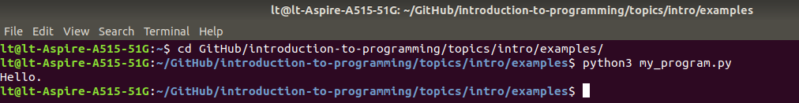
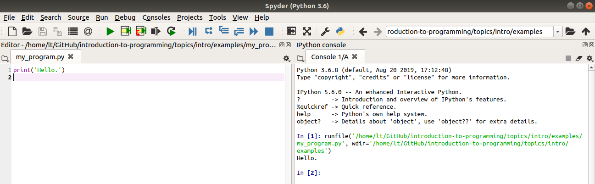
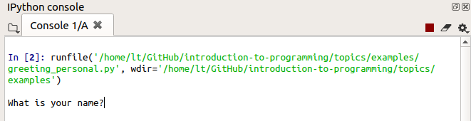
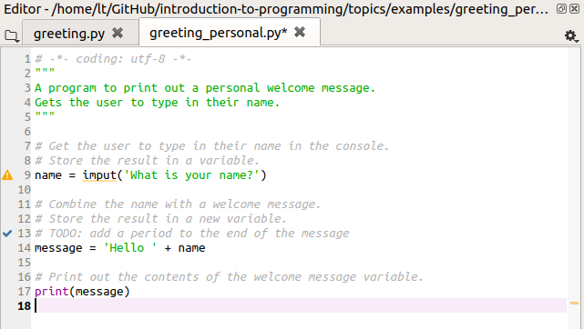

# Creating a computer program with Python

## Computer programs

A computer program is a sequence of instructions for a computer. Ultimately, these instructions take the form of numbers, each of which refers to one action that the computer can take. But in modern computer programming we rarely have to concern ourselves directly with this 'machine code'. Instead, modern computer programs begin their lives simply as one or more text files. These text files are entirely like any other text file; they contain human-readable characters, and have no special properties in themselves. We can open them in a normal text editor like Notepad.

An intermediate step is required in order to run these text files as a program. There are different ways in which this intermediate step can be accomplished. Python, the programming language that we will learn, works via an intermediate computer program called the [interpreter](extras/glossary.md#interpreter). The Python interpreter reads the lines of a text file one by one, turns them into instructions for the computer, and gets the computer to execute those instructions immediately. The interpreter program does its work by applying a particular set of rules to the contents of the text file, rules that convert text commands into computer commands. It is this set of rules that constitutes a particular programming language.

Most computer programs are organized as a collection of multiple such text files, each containing instructions for one aspect of the program's capabilities. There may be one or two main files that represent the starting point of the program, and these main files then refer to others. In addition, the program may include non-text files containing data needed by the program, such as images, sounds, database files, and so on.

Click [here](https://github.com/metabrainz/picard) to see an example of a fairly complex computer program organized as a collection of files. This program, called [MusicBrainz Picard](https://picard.musicbrainz.org/), allows a user to tag music files with information about the artist, song name, album, etc. Take a look at just one file in the program, called [album.py](https://github.com/metabrainz/picard/blob/master/picard/album.py). This is a text file containing instructions written in Python. Its contents are not easily understandable at a first glance, even for an experienced programmer, but notice that it does at least contain some instructions that take the form of everyday English words, such as `from`, `for`, and `if`. It also contains some preamble detailing the license information for the program, which is completely intelligible to a normal human being (or at least to a lawyer). Further down, the contents become too complex to understand by skim reading, but we may notice some regularities. For example, this file seems to refer to other files in the overall program (note a reference to [config.py](https://github.com/metabrainz/picard/blob/master/picard/config.py) on [line 33](https://github.com/metabrainz/picard/blob/64c4153801ed418c11033ad73981f7209b9cbf63/picard/album.py#L33)).

We won't create any programs that are as complex as Picard, which is the result of several programmers collaborating over a fairly long period of time. However, our programs will have approximately the same structure; they will be collections of text files containing instructions written according to the rules of the Python programming language.

## A Python program

A Python computer program can be as simple as a single file. This is what we will start with. Try opening up Notepad or your favorite text editor, and typing into it the Python command below. Make sure that you use a pure text editor like Notepad and not a word processor like Microsoft Word, because a word processor may not be able to save plain text or may insert additional unwanted content into a text file.

```python
print('Hello.')
```

The rules governing what counts as a valid command in a programming language are known as the [syntax](extras/glossary.md#syntax) of that programming language. Programming languages are strict about correct syntax, so make sure that you have put the right number of parentheses and quotation marks in the right places.

Now save your new text file somewhere on your computer with the file extension *.py*, for example as *my_program.py*. Note also that most programming languages do not cope well with files that have spaces in their names (the interpreter may think that a file name with a space refers to two separate files or commands), so avoid spaces in the filename and use the underscore character (`_`) to separate words instead.

The *.py* file extension does not alter the properties of the file in any special way; it is just a way of indicating that the file contains commands intended for Python. The file remains just a text file. We can now send it to the Python interpreter in order to run it. (To do this you will need a Python interpreter installed on your computer. Follow the installation instructions [here](../software) if you haven't already.)

There are various ways to run a *.py* file with the Python interpreter. For example, we can just run it the old-school way from the command line as shown below.



However, the steps for using the command line vary across different operating systems, so to avoid confusion we will omit this method here and instead go to the Spyder IDE for Python and open the file there. Make sure that you have first installed and [configured](../software/spyder.md) Spyder, then start it up. In Spyder, use the **Open** option from the **File** menu (or the 'open' icon 📂) to open the text file that you just created.

The green **Run** arrow (▶) will run the currently open Python file. Click on this arrow, and then look at the **Console** window to see the effects of running your program. Whereas the editor window displays the *contents* of the text file containing the program, just as any other text editor would, the console window shows the *effects* of running the program (or of running other Python commands).



You should see the contents of the quoted text in your program (e.g. `Hello.`) printed out in the console window like in the screenshot above. We have now created and run our first Python program.

What did this program do and how?

Python is designed to be a more or less human-readable programming language, so in a simple program like this, it is easy to see how the commands in the program are structured:

* `print` is a [built-in Python function](extras/glossary.md#builtin). It instructs Python to display a piece of text in the console window.
* The parentheses `()` following `print` provide the input (often termed the [argument](glossary.m#argument)) to the function. In this case the argument is the text that we want to print out.
* The quote marks `''` indicate to Python that the text that they enclose should be treated just as plain text (and not for example as a math formula, or a reference to another Python file or some other stored information).

What if we write a program that does not contain valid Python [syntax](extras/glossary.md#syntax)? For example, what if we forget to enclose the text that we would like to print in quote marks? Try editing your program so as to omit the quote marks, like this:

```python
print(Hello.)
```

If you save and run this new version of the program, you will see an [error message](extras/glossary.md#error) appear in the console, like the one below.

```
  File "my_program.py", line 1
    print(Hello.)
                ^
SyntaxError: invalid syntax
```

Error messages that complain of a `SyntaxError` tell us that some part of our program is not a valid Python command, and so the Python interpreter could not finish running the program. The message tells us which line of our program was responsible (in this case line 1, the only line in the program).

As the class progresses, we will cover more of the rules of Python syntax. Later we will also learn more about understanding and fixing errors in our programs. For now, we will look at a few more example programs to get a general idea of how Python works.

## More Python programs

### [greeting.py](examples/greeting.py)

Open the example program *greeting.py* in Spyder.

(You can find all the example programs [here](examples). The compressed file [intro_prog_examples.zip](examples/intro_prog_examples.zip) contains all the programs. Download this file and unzip it to the directory that you are working in.)

This program is functionally the same as the one we wrote above; it prints out a greeting. But it illustrates two non-functional but very important features of a Python program.

The first of these is the [docstring](extras/glossary.md#docstring) at the top of the program:

```python
"""
A program to print out a welcome message.
"""
```

Text placed in triple quotes at the top of a program (and in some other places, as we will learn later) provides extra information for other developers or users of our program. Use this space to describe briefly what your program does, and for more complex programs some indication of how to use it.

If you start a new Python text file in Spyder via **New file** in the **File** menu (or via the icon), you will see that Spyder inserts a docstring automatically. Something like this:

```python
# -*- coding: utf-8 -*-
"""
Created on Wed Oct  2 10:25:12 2019

@author: Mildred.Bonk
"""
```

The exact contents of this automatic starter text may vary a little depending on how Spyder is configured on your operating system. For now, you may ignore any lines that appear before the docstring (like `# -*- coding: utf-8 -*-`); just leave these as they are and we will learn about them later.

The second new feature in *greeting.py* is the [inline comment](extras/glossary.md#comment) on [line 8](examples/greeting.py#L8). This line is clearly not a Python command. It is instead written in plain English. Python will ignore any text that follows a hash symbol `#`. This allows us to use this symbol to introduce human-readable explanations of the workings of our program. In such a simple program as this, the comment on line 8 is somewhat superfluous; the command on the following line is clear enough on its own. However, as a beginner you should get into the habit of writing comments for most of the Python commands that you put into your program. This helps you to focus and remember how you created your programs, and helps others understand what you did or where you went wrong if your program doesn't work as you expected. Later when you have more experience you can save explanatory comments just for those sections of your program that are too complex to understand at a first glance.

Finally, on [line 6](examples/greeting.py#L6) we see an example of another use of comments: to make a 'note to self' of what still needs to be added to the program. It is conventional to mark such comments with the text `TODO`. Here we have noted that we would like to make the greeting personal by asking the user to type in their name. This is what the next example program achieves.

### [greeting_personal.py](examples/greeting_personal.py)

Open the *greeting_personal.py* program. Before you run it, read the Python commands that it contains and try to guess what the effect of running the program will be. Then run the program to check your guess.

This program requires the user to type in some information. As with *greeting.py*, all the action occurs over in the console window. After you click on the 'run' icon, look to the console window. You should see that the program has displayed a 'prompt', i.e. some text telling the user what they are expected to do, and is now waiting for the user to type something in.



Beware that when you run a program that requires user input, the program will wait indefinitely until it has received that input. While your program is still running, you won't be able to run it again or run any other program. You can tell that a program is currently running in the console if you see that the square 'stop' icon (■) above the console is lit red, like in the screenshot above. To finish your program and continue editing it or working on other programs, you must first let your running program finish. In this case, you can achieve this by doing as the program asks and typing in your name at the console where the input prompt is displayed.

(Alternatively, if you get stuck with a program running and you just want to break off, you can stop it by clicking on the red 'stop' icon. You should then see that the 'stop' icon is no longer red, and that the console once again displays something like `In [...]:` ready for the next program to run. Yet another alternative for stopping a running program is to press the key combination *ctrl* + *c*.)

You should have seen that *greeting_personal.py* responded with a greeting containing whatever name you typed in.

How does this program work?

The simplicity of the Python language makes it fairly easy to understand what is going on here. The program begins by using another [built-in](extras/glossary.md#builtin) Python function on [line 9](examples/greeting_personal.py#L9). Unlike the `print()` function that we saw in the preceding example, the `input()` function [returns](extras/glossary.md#return) some output. The output in this case is whatever piece of text the user types at the console. If we want to use the output of a function in our Python program we must [assign](extras/glossary.md#assignment) it into a [variable](extras/glossary.md#variable). The equals symbol `=` takes whatever output is generated on the right hand side and stores it under whatever name we have put on the left hand side. The name is then available for the rest of the program. Wherever we use this name in the remainder of the program, it stands for the contents that we assigned into it.

There are some important things to note about assigning variables. You can explore why these things are important by making some modifications to *greeting_personal.py* and checking their effects when you run the modified version of the program.

* Unlike in math, the two sides of an equation with `=` are not interchangeable. Instead, the result of the command on the right is first worked out (or [evaluated](extras/glossary.md#evaluate)) and then assigned into the name on the left. (Try swapping the two sides of the `=` command on [line 9](examples/greeting_personal.py#L9)).
* The order of lines in a Python program matters. Python runs each line in turn. So if our program uses a variable, that variable must be assigned *above* the line on which it is used. (Try placing [line 16](examples/greeting_personal.py#L16) at the top of the program file instead of at the bottom).
* We can use almost any name we like for a variable. We need only be consistent in using that same name throughout our program. (Try replacing both occurrences of the variable `name` with something arbitrary like `x` or `y`).
* There are however some limitations on valid variable names in Python. For example, they can contain numbers but cannot begin with a number (try replacing both occurrences of the variable `name` with either `name1` or `1name`), and they cannot contain spaces because Python would interpret this as the names of two separate variables (try replacing `name` with `my name`).
* It is possible to use the name of a built-in function (such as `print` or `input`) as a variable name in Python, but this is not a good idea as it will temporarily overwrite the function and prevent us from using it in the remainder of our program. (Try replacing both occurrences of the variable `name` with `print`).

In general, we should avoid choosing abstract variable names like `x` and try always to choose a variable name that describes the intended contents of the variable.

Now look at [line 13](examples/greeting_personal.py#L13) of *greeting_personal.py*. This line also assigns a new variable, called `message`. But in this case what is assigned is not the result of a function but an expression involving an [operator](extras/glossary.md#operator), the `+` symbol. When used with two pieces of text, the `+` operator just sticks them together as one ([concatenates](extras/glossary.md#concatenate) them). So this line creates a new piece of text with *Hello* and then whatever name the user typed in at the console.

Note that the text `'Hello '`  is enclosed in quote marks, but the variable `name` is not. This is important. *Hello* is not a variable but simply literal text, so it must be in quote marks. In contrast, `name` *is* a variable and so it should not be enclosed in quote marks. To check your understanding, try to predict what the program would do if `name` on line 13 were enclosed in quote marks, then make the change and run this new version of the program to check whether you were right.

Finally, the workings of [line 16](examples/greeting_personal.py#L16) should be clear if you have understood everything we have covered up to this point.

## Using an IDE

We have just introduced the basic workings of Python programs using a few simple examples. We have been editing and running these programs in the Spyder [IDE](extras/glossary.md#IDE). Let's finish by looking at a few tips for working with Spyder.

### The editor

The pane where you can edit and run Python programs is the editor. As we have seen, it is essentially just a text editor. But it adds a few useful features.

You may already have noticed that the Spyder editor performs some basic checks of your program even before you run it. Small icons along the left margin of the editing pane highlight parts of the program that might require our attention. For example in the screenshot below we are being warned about a mistake on line 9 and reminded of a *TODO* note that we made for ourselves on line 13.



Spyder also has an autocomplete feature. If you are typing a new part of your program, you can begin typing something, then press the tab key (↹) and the Spyder editor will attempt to autocomplete the word that you are typing. This works if you are typing the name of a Python [built-in function](extras/glossary.md#builtin), or of a [variable](extras/glossary.md#variable) that you have defined elsewhere in your program. This feature can save you a lot of typing errors once you start working with many different functions or with variables that have long names.

As well as running your whole program, Spyder allows you to run just parts of it. You can do this by highlighting the lines that you would like to run (or if it is just a single line then placing the cursor on this line is enough) and then selecting **Run selection or current line** from the **Run** menu. There is also a keyboard shortcut for this, which on most systems is *F9*. This feature is useful if you have written a new part or modified one part of your program and you want to test it in isolation. But don't be tempted to test your whole program this way, by selecting one section after another and running them in turn. Always test your program by running it as a whole via the 'run' icon. This ensures that you are really testing the whole program as a self-contained unit, which is also how your program's users will run it.

### The console

We have already encountered the console as the place where any printouts or interactions with our program occur once it is run. But there is more to the console than this. We can also type single Python commands into the console, and they will be sent to the Python interpreter and run immediately, as if they were part of a program. Try it out: go to the console, and where it is waiting with `In [...]:` type in a Python command (for example to print something out with `print()`) and press return. You should see the result, and then the `In [...]:` prompt will return, waiting for the next command.

It is important to bear in mind this distinction between the editor and the console. Notice that when we type new lines into a text file that is open in the editor, those lines are not run and we do not see their effects anywhere. Nothing that we type into the editor has any effect until we save the changes and run the text file as a Python program. By contrast, whatever we type into the console is run as soon as we finish typing and press return.

The console also 'remembers' what we have typed so far. For example, if you type `age = 37` into the console and press return, and then type `age + 1`, the console remembers that the first command defined a variable called `age` and will use whatever value we assigned into it if we use this same variable name in subsequent commands. We can therefore use the console to test out and explore Python's behavior. A common working pattern if you are working on a new task as a Python beginner is to try various commands in the console first and check how they work (or whether they work at all), and then once you have found out what you need to know you switch to the editor and incorporate the new commands into whatever program you are working on.

There are a few shortcuts for working with the console too. If you want to get back a command that you typed previously, put your cursor in the console and press the up arrow key (⬆). You should see again the last command that you entered. You can edit this command if you wish, and then run it again by pressing return. If you press the up arrow key repeatedly, you can search through all the commands that you have entered so far. These commands are also stored under the **History log** tab in Spyder.

The shortcut *Ctrl* + *l* will clear away any output that is currently in the console. It isn't especially necessary to do this, but if you are tidy-minded it can help make things clearer if you have lots of printouts left over in the console and you wish to start afresh.

Likewise, you can also erase the console's 'memory' of previous commands. This is a more useful feature. For example, if you would like to test out something completely new, you do not want to accidentally refer to variables that you have defined in previous commands while you were testing out something else. To 'reset' the console type in the command `%reset`. You will be prompted to confirm that you really want to delete all the variables you have defined so far:

```
Once deleted, variables cannot be recovered. Proceed (y/[n])?
```

Note that the `%reset` command (and others that begin with the percent character `%`) is for use in the console only; it is not a valid Python command that you can put in a Python program.

(If you have followed the instructions [here](../software/spyder.md) for configuring Spyder's behavior, the console's memory will also be reset every time you run a program. This is a good thing; it prevents any variables that you have defined in the console from interfering with the workings of your program.)

If you want to check what variables you have currently defined in the console (if any), and see some information about them, you can look in Spyder's **Variable explorer** tab.

That's it for this topic. Try the exercises below to get some practice.

## Exercises

### 1

Open the [greeting_personal.py](examples/greeting_personal.py) program. Save a new version called *greeting_personal_v2.py* (or whatever you like), and add the following small improvements:

* Improve the input part of the program so that it looks a little neater for the user when they type in their name. Add a space between the input prompt and the position where the user starts typing, so that when they type they see for example `What is your name? Mildred` instead of `What is your name?Mildred`.
* Add a dot to the end of the printed output so that it forms a correctly punctuated sentence. So the user sees for example `Hello Mildred.` instead of just `Hello Mildred`.

### 2

Write a new program. This program should begin by asking the user for their name just as *greeting_personal.py* does. But then it asks them for their favorite color, and addresses them by their name in the question. Finally, the program prints out confirmation of their name and favorite color. The program should look something like this in action in the console:

```
What is your name? Mildred
What is your favorite color Mildred? puce
Your name is: Mildred
Your favorite color is: puce
```
